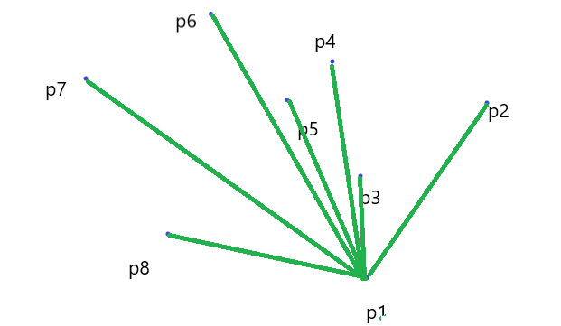
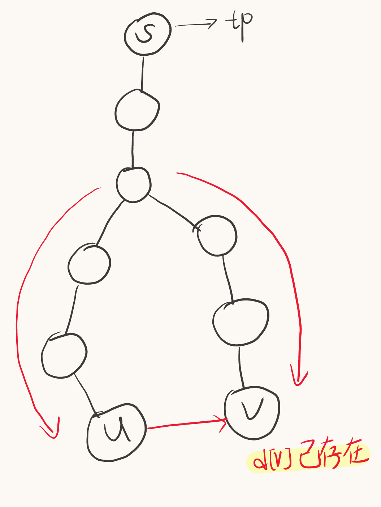

# $ACM$ 算法大全__$By$​​ 月雩

[TOC]


# 零. 快速确认模糊方法

图$\to$图论、贪心

字符串$\to dp$、字符串、贪心、图论

序列（or排列$\to$数据结构、$dp$、$stl$​、贪心

树$\to dfs$、树形$dp$、贪心

线段（区间）$\to$数据结构、贪心、$dp$​

## 常用数据结构

| 名称     | 关键词                                                       |
| -------- | ------------------------------------------------------------ |
| 线段树   | 区间问题，需要维护某个值                                     |
| 笛卡尔树 | 序列**最好为排列**，最值问题（**每次操作都需要区间最小/最大值**），跟区间沾点边 |
| 树状数组 | 区间不同元素个数，逆序对，区间第k大，差分序列的维护          |
|          |                                                              |

## 常用$DP$

注：$dp$其实很好看出来是不是$dp$

| 名称     | 关键词                           |
| -------- | -------------------------------- |
| 状压$dp$ | 某个数据特别小，比如$n\leq20$    |
| 树形$dp$ | 树                               |
| 区间$dp$ | 区间问题，其实还是比较容易看出来 |
| 背包$dp$ | 有某些限制条件情况下求最大价值   |


# 一. 基础

## 1. 一些定义

1. 子数组（$subarray$）：连续的一段
2. 子串：字符串连续的一段
3. 子序列（$subsequence$）：不用连续的一段

------

## 2. 寻找中位数（中位数相关问题）

寻找中位数有两种方法，两种方法各有用处

### 2.1 Method 1

常用于数据较多是二分找中位数

用二分，$\geq mid$ 的看成 $1$，$<mid$ 的看成 $-1$，区间和 $> 0$ 代表区间中位数 $>=mid$

时间复杂度 $O(NlogN)$

### 2.2 Method 2

用 $multiset$。一个储存较小的一半，一个储存较大的一半

保证较小的一半数量减去较大的一半数量 $\le1$

#### 2.2.1 Code

```c++
void Balance() {//保证 较小-较大<=1
	int s1 = ms1.size(), s2 = ms2.size();
	if(s1 - s2 >= 2) {
		auto it = ms1.end();
		it--;
		int now1 = (*it);
		ms2.insert(now1);
		ms1.erase(it);
	}
	else if(s2 > s1) {
		auto it = ms2.begin();
		int now2 = (*it);
		ms1.insert(now2);
		ms2.erase(it);
	}
}
for(int i = 1; i <= n; i++) {
    if(ms1.size() == 0) {
        ms1.insert(a[i]);
    }
    else {
        auto it = ms1.rbegin();
        if(a[i] <= (*it)) {
            ms1.insert(a[i]);
        }
        else {
            ms2.insert(a[i]);
        }
    }
    Balance();
}
```

注意，此方法时间复杂度常数可能较大。时间复杂度 $O(NlogN)$

**此方法还能维护数据，比如能满足删除元素并快速重新找到新的中位数**

**只需要判断需要删除的数和中位数的大小就能知道从哪个 $multiset$ 删数据**

------

## 3. 贪心策略

1. 对于两个数的贪心，常见如下：

   ```c++
   按照a+b, a-b, a*b, a/b 排序
   ```


------

## 4. 四舍五入的办法

### 4.1 使用 $Round$ 函数

对 $x$ 精确到第 $L$ 位：

```c++
double x;
int L, p = 1;
cin >> x >> L;//L意义如上
for(int i = 1; i <= L; i++) p *= 10;
x = round(x * p) / p;
//如果只需要输出，那么：cout << fixed << setprecision(L) << x;即可
```

### 4.2 注意事项

**$p$ 不能用 $pow$，会精度不够**

------

## 5. 双指针 $VS$ 二分

如果发现二分会 $TLE$，那么首先考虑 $check$ 是否有问题，如果没问题就考虑能否用双指针

**当「答案区间」或「指针移动方向」具有单调性（不回退）时，优先考虑双指针；**

### 5.1 Example

**1. 计算最长/最短长度**

**2. 满足某种条件的区间个数**

------

## 6. 并查集($DSU$)

### 普通并查集(常规题够用)

直接上操作

```c++
void GetFa(int x) {return x == fa[x]?x:fa[x] = GetFa(fa[x]);}
for(int i = 1; i <= n; i++) fa[i] = i, num[i] = 1;//num:并查集内节点数量
//合并
int fau = GetFa(u), fav = GetFa(v);
if(fau != fav) {
    fa[fau] = fav;
    num[fav] += num[fau];
}
```

**注意：** 最后求每个并查集的根节点之前需要先再 $GetFa$ 一次，因为可能并没有完全更新完成

```c++
for(int i = 1; i <= n; i++) {
    int Fa = GetFa(i);
    cout << Fa << " is " << i << "'s father\n";
}
//不能直接输出fa[i]!!!!
```

例题：[P4185 [USACO18JAN] MooTube G](https://www.luogu.com.cn/problem/P4185)

### 启发式合并·并查集

假设你需要保存每个并查集有哪些点，那每次合并时间复杂度就会多一维，显然不行

但是如果我们每次选择$cnt$较小的那个合并到较大的那个，那么每一次合并大小都会**翻倍**

所以总时间复杂度不超过$O(nlog\ n)$​

**注意：$DSU$中常常会用到各种$STL$，一般用$vector,\ map,\ multiset$，一定要判断清楚用哪个时间复杂度才能承受！**

**$vector$： 只记录编号或者大小，不能修改，但是时间复杂度低**

**$map$：可以当桶用，常用来记录出现多少次，可以修改，但是时间复杂度$log$非常高**

**$multiset$：记录编号或大小，能修改，读取时间复杂度平均$O(1)$，修改时间复杂度$log$**

**所以一般都是混用，需要修改对时间复杂度要求不高的用$map$**

**处于启发式合并核心算法的只能用$vector$和$multiset$来遍历**

```c++
vector<int> dsu[N];//并查集内id的集合
multiset<int> val[N];//并查集内点权值的集合，用multiset更好修改，如果不需要修改就用vector即可
map<int, int> mp[N];//记录并查集内某个权值出现的次数
for(int i = 1; i <= n; i++) {
    a[i] = read();
    fa[i] = i;
    cnt[i] = 1;
    dsu[i].push_back(i);//每个并查集的点集
    val[i].insert(a[i]);//
}
//合并操作
int fau = getfa(u), fav = getfa(v);
if(fau == fav) continue;
if(cnt[fau] > cnt[fav]) swap(fau, fav);//保证较小的为fau

for(auto u: dsu[fax]) or for(auto u: val[fax])//启发式合并核心算法，遍历小并查集内元素
//这都是可行的，具体看需要哪个

for(auto u: val[fax]) val[fay].insert(u);//multiset的插入方法
dsu[fav].insert(dsu[fav].end(), dsu[fau].begin(), dsu[fau].end());//用vector的直接插入法

cnt[fav] += cnt[fau];
fa[fau] = fav;//基本操作

//如果需要高效单个查询，可以改用set进行
//s[fav].insert(s[fau].begin(), s[fau].end());//set合并方法
```

#### 特殊操作

如果还需要遍历某个并查集内，每个点连接的点，比如如下所示

`````c++
int fau = getfa(u), fav = getfa(v);
for(auto u: dsu[fau]) {//遍历并查集内每个点
    for(int i = fi[u]; i; i = ne[i]) {//遍历这个点连接的边
        int v = to[i];
        //一系列操作...
    }
}
`````

这样总时间复杂度是$O(\sum |A|*deg(A)=Ave(deg)*\sum |A|=Ave(deg)*nlog\ n)$，即平均度数*总和

平均度数为：$Ave=m/n$，所以平均时间复杂度为$O(mlog\ n)$，完全可行（实际上通过数学证明可以证得时间复杂度确实为$O(mlog\ n)$​​，而并不是平均时间复杂度）

### 需要$DSU$内计数的问题

如果不仅需要并查集内有哪些点，还需要每个点的权值，可以用到$map$套$vector$

```c++
map<int, vector<int>> mp[N];
//mp[u][x]代表以u为根节点的并查集内，其中权值为x的节点编号有哪些
//注意，auto x: mp[u]，x相当于一个pair<int, vector<int>>

map<int, int> mp[N];
//mp[u][x]代表u为根节点的并查集内，权值为x的点出现过多少次
```

### 树上$DSU$

对于树上的$DSU$，从叶子节点往上合并，肯定需要用启发式合并，时间复杂度为$O(nlogn)$​，不证明了

### 搜寻最近的未使用坐标

假如你有一个数组，你已经使用了某些数，这些已经使用的不能再使用

那么对于$a_i$，要么它未被使用，你能使用它，要么你只能使用它右边最近的未使用的

如何加速搜寻过程？

显然用并查集。

初始状态令$fa_i=i$，假如使用了$i$，那么$merge(i,i+1)$，这样就能自动把$i$和最右侧未使用的坐标连起来


------

## 7. 基础操作

### 7.1 输入输出加速

```c++
ios::sync_with_stdio(false);
cin.tie(nullptr);
//不能使用endl
//不能使用快读和快输
```

### 7.2 开启 c++14

工具 $\to$ 编译选项 $\to$ 编译时加入以下命令中添加：

```c++
-std=c++14
```

### 7.3 $sort$改降序

```c++
sort(a + 1, a + n + 1, greater<int>());
```

### 7.4 $\_\_int128$使用方法

输入用快读，输出用快输

```c++
__int128 read() {
    __int128 x = 0;
    int f = 1;
    char ch = getchar();
    while(ch < '0' || ch > '9') {
        if(ch == '-') f = -1;
        ch = getchar();
    }
    while(ch >= '0' && ch <= '9') {
        x = x * 10 + ch - '0';
        ch = getchar();
    }
    return x * f;
}
void print(__int128 x) {
    if (x < 0) {
        putchar('-');
        print(-x);
        return;
    }
    if (x >= 10) print(x / 10);
    putchar(x % 10 + '0');
}
```

### 7.5 快读

```c++
int read() {
	int x = 0, f = 1; char ch = getchar_unlocked();
	while(ch < '0' || ch > '9') {
		if(ch == '-') f = -1;
		ch = getchar_unlocked();
	}
	while(ch >= '0' && ch <= '9') {
		x = x * 10 + ch - 48;
		ch = getchar_unlocked();
	}
	return x * f;
}//getchar_unlocked比getchar快了1/3
```


## 8.  负数进制转换方法

```c++
while(true) {
    int x = n % p;
    if(x < 0) {
        x -= p;
        n += p;
    } 
    ans[++cnt] = x;
    n /= p;
    if(!n) break;
}
```

## 9. 三角公式

### 1. 求极角

极角：$xy$坐标系中一点$P(x,y)$，$\vec{OP}$与$x$正半轴的夹角

```c++
double r = atan2(y, x);//先y后x
//范围[-π，π]
```

### 2. 反三角函数

$c$++中用的**弧度制**

```c++
//求π
long double pi = acosl(-1.0);//acos()是double
```

## 10. 三分

二分是枚举答案，用合法性来判断

三分是求最值，不能用合法性判断，只能和值比较

**两者都需要满足答案在区间内具有单峰性**

### 10.1 整点三分

#### Code（先增后减模板）

```c++
int calc(int x) {
	return 100 - (x - 37) * (x - 37);
}
void solve() {
	int l = 1, r = 100;
	while(r - l > 2) {//整点三分最后会剩1~3个点 
		int lmid = l + (r - l) / 3;
		int rmid = r - (r - l) / 3;
		if(calc(lmid) > calc(rmid)) r = rmid;
		else l = lmid;
	}
	//整点三分最后会剩1~3个点 
	int ans = -INF;
	for(int i = l; i <= r; i++) {
		ans = max(ans, calc(i));
	}
	cout << ans << endl;
}
```

### 浮点三分

#### Code

```c++
void solve() {
    double l = , r = ;
    double eps = 1e-9;
    while(r - l > eps) {
		double lmid = l + (r - l) / 3;
		double rmid = r - (r - l) / 3;
		if(calc(lmid) > calc(rmid)) r = rmid;
        else l = lmid;
    }
    printf("%.8lf\n", calc(l));//无需遍历
}
```

#### 黄金分割点优化（常数$/2$优化）

```c++
const double phi = (sqrt(5) - 1) / 2;   // 0.6180339887，黄金分割点
const double eps = 1e-9;
void solve() {
    int l = , r = ;
    double lmid = phi * l + (1.0 - phi) * r;
    double rmid = (1.0 - phi) * l + phi * r;
    double lval = calc(lmid);
    double rval = calc(rmid);
    while(r - l > eps) {
        if(lval > rval) {
            r = rmid;
            rmid = lmid;
            rval = lval;
            lmid = phi * l + (1.0 - phi) * r;
            lval = calc(lmid);
        }
        else {
            l = lmid;
            lmid = rmid;
            lval = rval;
            rmid = (1.0 - phi) * l + phi * r;
            rval = calc(rmid);
        }
    }
    l = (l + r) / 2.0;
    printf("%.8lf\n", calc(l));
}
```

## 11. 浮点数相关（浮点二分注意事项）

$double$精度为$1e-15$，$long\ double$精度为$1e-19$

需要注意！！

如果二分的时候浮点数很大，需要**限制二分次数**！！

while(r-l>eps){

​	if(num > Max) break;

}

## 12. 前缀和（二维+三维）

**先令$sum_{i,j}=f_{i,j}$**

### 12.1 二维前缀和

```c++
sum[i][j] = f[i][j]
sum[i][j] = sum[i - 1][j] + sum[i][j - 1] - sum[i - 1][j - 1]
```

### 12.1.5 二维差分前缀

给$n$个矩形，判断每个格子被多少矩形覆盖

```c++
//每个矩形左上角(l1,r1)，右下角(l2,r2)
dif[l1][r1]++;
dif[l2 + 1][r2 + 1]++;
dif[l1][r2 + 1]--;
dif[l2 + 1][r1]--;
//上述为差分过程

dif[i][j] = dif[i][j] + dif[i - 1][j] + dif[i][j - 1] - dif[i - 1][j - 1];
//如此dif[i][j]就为单点值，即(i,j)被多少格子覆盖
```


### 12.2 三维前缀和

```c++
sum[i][j] = f[i][j]
sum[i][j][k] = sum[i - 1][j][k] + sum[i][j - 1][k] + sum[i][j][k - 1] - sum[i - 1][j - 1][k] 
    	- sum[i - 1][j][k - 1] - sum[i][j - 1][k - 1] + sum[i - 1][j - 1][k - 1] + sum[i][j][k];
```

（两次容斥）

## 13 对拍(未完成)

### 13.1 随机数据生成

$long\ long$类型：

```c++
#include<bits/stdc++.h>
ll RandLL(ll L, ll R) {
    static std::mt19937_64 rng(std::random_device{}());
    std::uniform_int_distribution<ll> dist(L, R);
    return dist(rng);
}
int main() {
    cout << RandLL(-100, 33333333333333);
    return 0;
}
```

$double$类型：

```c++
#include<bits/stdc++.h>
double RandDouble(double L, double R) {   // [L, R] 闭区间
    static std::mt19937_64 gen(std::random_device{}());        // 只播种一次
    std::uniform_real_distribution<double> dist(L, R);         // 浮点分布
    return dist(gen);
}
int main() {
    cout << RandDouble(-12.3, 9.1);
    return 0;
}
```


# 二. $trick$(一些简单的技巧)

## 1. 衷心建议（踩过的坑）

| 1(★★★★★). 一定要考虑清楚！！不要想当然的做                   |
| ------------------------------------------------------------ |
| 2(★). 如果遇到 $WA$，就考虑是不是条件漏了，或者考虑少了      |
| 3(★). 如果是 $TLE$，那就是算法错了，或者**数组越界**，或者死循环了，或者常数大了（**把$\#define\ int\ long\ long$关了试试**） |
| 4(★★). 可以试着从小情况考虑到大情况                          |
| 5(★★★).不要使用 $pow$，不要使用 $pow$，不要使用 $pow$！！！精度非常非常低！！！ |
| 6(★★★★★). 如果遇到了交互题，一定不要用快读，可能会 $TLE$！   |
| 7(★★★★).如果遇到了觉得做对了但是 wa 了，请检查：是否有混用变量名，数组大小，范围问题等**尤其是开__int128试试** |
| 8(★★★★).对于变量名，最好用一个有区分度的名字                 |
| 9(★★★★★). 遇到需要取模的题目，一定要仔细检查每个数的范围，遇到 $a=x-y$ 的一定要改成 $a=(x-y+M)%M$！！！ |
| 10(★★★). 并查集的题，最后查询的时候不能直接用 $fa[i]$，要再 $get\_father$ 一次才是对的 |
| 11(★★★★). 不能令x=1e16+2之类的，存不了这么大，最后x=10000000000000000，+2不会被算进去，因为1e16是double，有误差 |
| 12(★★★★★).  1<<k中1是int，注意别爆了，记得写1ll<<k！！！     |
| 13(★★★★★).快速幂$a^b$记得先把$a$取模！！因为可能是负数       |
| 14(★★★★★).如果卡常$TLE$，把$define\ int\ long\ long$去掉再试试 |
| 15(★★★★).如果做不出来，但是过的人多，说明思路想复杂了！      |
| 16(★★★★★). 浮点二分的时候，如果浮点数很大，一定要限制二分次数，不然会$TLE$！ |
| 17(★★★). 函数内定义的时候，一定要初始化($vector$初始化见$stl$) |
| 18(★★★★★).快速幂中，遇到$0^0$需要额外注意，因为幂$0$可能实际上不为$0$，那应该返回$0$而不是$1$s |


------

## 2. $trick$

| **1. 二分的优化**，把 $\geq mid$ 的看成 $1$，$< mid$ 的看成 $0$（或者其他数也行），最后只需要计算这个 $01$ 序列即可（或者 $>mid$ 看成 $1$，$\le mid$ 看成 $0$）。即：**遇到二分的时候，如果无法直接求，那大概率把 $\geq mid$ 的看成某个数，再把 $< mid$ 的看成某个数，这样便能化简** |
| ------------------------------------------------------------ |
| 2. 遇到 **异或** 相关的问题，$80\%$ 和 **线性基** 有关       |
| 3. 遇到 **中位数** 相关的问题，**99%和二分** 有关（见第一条），$\geq mid$ 看作 $1$，$< mid$ 看作 $-1$，中位数条件：$\sum > 0$（具体条件具体分析） |
| 4. 经典问题：把数组变成相同元素，**最优方案为把所有数变为中位数**，如果是遇到 **$a_{i+1}-a_i=1\to a_{i+1}-(i+1)=a_i-i$**，即令 $b_i=a_i-i$，变为把数组 $b$ 变为相同元素 |
| 5. 对于一个问题，**如果求的是最大长度，如果用二分会 $TLE$**，不妨考虑能否 **用双指针** |
| 6. 计算答案数的题，或许可以用猜猜法？猜答案是 $C_{x}^{y}$    |
| 7. 对于一个变化的量，找到不变的东西或许能优化。比如数组 $a_i=b_i+x$（$x$不定），那么不变量就是差分 $d_i=a_i-a_{i-1}=b_i-b_{i-1}$，再根据不变量找关系。<br />同样的，把答案的式子退出来后，可以试着补全某一部分让它变为定值，这样不变的就少一部分。比如$\sum_1^l a_i+\sum_{l+1}^n b_i=\sum_1^n a_i+\sum_{l+1}^n (b_i-a_i)$ |
| 8. 对于数组的操作，如果与数的个数相关，那可以考虑拆分为两部分：一部分$num_x\leq \sqrt{n}$，另一部分$num_x\geq \sqrt{n}$，不同部分进行不同操作。被称为：$sqrt-trick$ |
| 9. 使用并查集时，“删除”很困难，那就反向思维改成“添加”        |
| 10. $map$被卡$log$，就尝试用$unordered\_map$                 |
| 11. 假设有$a<b<c，$那么，$gcd(a,b,c)=gcd(a,b-a,c-b)$         |
|                                                              |
|                                                              |
|                                                              |

------

## 3.  $2-sat$(并查集/$tarjan$，$m$对$bool$关系)

### 总思路

如果遇到：给你$m$对关系，那大概率就要用$2-sat$了。

如果关系是$A\ or\ B$，那么需要把$or$转变为$and$，这样一来就能连边了，一定是单向边

如果关系是$A\ and\ B$，那么就需要的是双向边

### 3.1 情况1

假设有$n$个$bool$型变量$p_i$，有$m$个条件，第$i$个条件要求：**要么第$a_i$个数为$0$要么第$b_i$个数为$1$**，或者**要么第$a_i$个数为$1$要么第$b_i$个数为$1$**等等等等。**即有$m$组关系，$(x_i\ or\ y_i)$，满足其中一个就行**

求是否有可行解，输出一组可行解

#### 经典思路

首先，$2-sat$用到的是图论，假设$1\sim n$号点代表$p_i$为0，$n+1\sim 2\cdot n$号点代表$p_{i}$为1

现在如果有一组条件是：$(X=\{p_{a_i}=1\}\ or\ Y=\{p_{b_i}=0\})$，注意$X,Y$是逻辑事件，那么需要建立两条边，$(\neg X\to Y)$和$(\neg Y\to X)$，代表如果$\neg X$的话就必须$Y$​，反之亦然

**注意，是单向边！！！**所以这种情况只能用$tarjan$

就如上例子，应该往$(a_i,\to b_i)$和$(b_i+n\to a_i+n)$分别建边，即如果满足了$p_{a_i}=0$那么$p_{b_i}$必须为$0$；如果$p_{b_i}=1$那么$p_{a_i}$必须为$1$​

#### 可行性判断

可行性可以用$tarjan$，如果发现某个$i$和$i+n$在一个连通块，说明有冲突，答案为$False$​，否则一定有解

(如果用$tarjan$，那么就判断$col_i=col_{i+n}?$，$col$是连通块编号，一定在tarjan中按照顺序来)

#### 一组可行解

如果有解，根据如下规则可以构造一组可行解：

假设$1\sim n$号点代表答案为$f1$，$n+1\sim 2n$代表答案为$f2$

如果$col_i>col_{i+n}$，那么$ans_i=f1$，反之$ans_i=f2$

**注意，这里的意思是，判断谁的拓扑序更大，谁更大就赋值为谁，$1\sim n$号点代表答案为$f1$，$n+1\sim 2n$代表答案为$f2$，谁的$col$​更大就赋值为谁**

```c++
#include<bits/stdc++.h>
#include<cmath>
#define ll long long
#define int long long
using namespace std;
const ll N = 4e6 + 10, M = 1e9 + 7, INF = 1e14;
// 注意所有东西都要开两倍空间，因为每个变量存了两次
int n, m, f[N], to[N], ne[N], num, dfn[N], scc[N], low[N];
int vis[N], st[N], tot, top, cntx;
ll read() {
	ll x = 0, f = 1; char ch = getchar();
	while(ch < '0' || ch > '9') {if(ch == '-') f = -1; ch = getchar();}
	while(ch >= '0' && ch <= '9') {x = x * 10 + ch - '0'; ch = getchar();}
	return x * f;
}
void add(int x,int y)
{
	ne[++num]=f[x];
	f[x]=num;
	to[num]=y;
}
void tarjan(int x)
{
	dfn[x]=low[x]=++tot;
	vis[x]=1;st[++top]=x;
	for(int i=fi[x];i;i=ne[i])
	{
		int v=to[i];
		if(!dfn[v])
		{
			tarjan(v);
			low[x]=min(low[x],low[v]);
		}
		else if(vis[v])low[x]=min(low[x],dfn[v]);
	}
	int temp;
	if(low[x]==dfn[x])
	{
        ++cntx;//一定要从0开始加，这样才是拓扑序
		while((temp=st[top--]))
        {
            vis[temp]=0;
            scc[temp]=cntx;//此处scc为连通块编号
            if(x==temp)break;
        }
	}
}
void solve() {
	n = read(), m = read();
	for(int i = 1; i <= m; i++) {
		int x = read(), f1 = read();
		int y = read(), f2 = read();
		if(f1 && f2) {
			add(x, y + n);
			add(y, x + n);
		}
		if(f1 && !f2) {
			add(x, y);
			add(y + n, x + n);
		}
		if(!f1 && f2) {
			add(x + n, y + n);
			add(y, x);
		}
		if(!f1 && !f2) {
			add(x + n, y);
			add(y + n, x);
		}
	}
	for(int i = 1; i <= 2 * n; i++) {
		if(!dfn[i]) tarjan(i);
	}
    //注意scc是从0开始的
	for(int i = 1; i <= n; i++) {
		if(scc[i] == scc[i + n]) {
			cout << "IMPOSSIBLE";
			exit(0);
		}
	}
	cout << "POSSIBLE\n";
	for(int i = 1; i <= n; i++) {
		if(scc[i] > scc[i + n]) cout << 1 << " ";//谁大选谁
		else cout << 0 << " ";
	}
}
signed main() {
	solve();
	return 0;
}
//月雩·薇嫭 
```


### 3.2 情况2

有一种伪$2-sat$问题，同样给你$m$组关系，**但是每组关系需要满足：$(x_i\ \&\ y_i)$或$(\neg x_i\ \&\ \neg y_i)$**（情况1是$(x_i\ or\ y_i)$）

这样一来，需要的就是**双向边**，就能用**并查集或者$tarjan$**

连边方法：$(x_i-y_i)$和$(\neg x_i-\neg y_i)$

#### 可行性判断

并查集和$tarjan$皆可

#### 答案数计

那么答案数就为$2^{c/2}$，$c$是连通块数量（**显然连通块一定是有对称性的**）

### 例题1（伪$2-sat$求答案数）

见 $2023ICPC济南\to G$

大致题意：

有一个 $01$ 矩阵，有多少种翻转方案，使得选择一些行进行翻转之后每一列至多只有一个 $1$？

假设对于第 $i$ 行和第 $j$ 行它们在某一列（或者中心对称的列上）上都有 $1$，如果它们的 $1$ 在同一列，那么这两行翻转关系应该一致，即 $(i,j)$ 和 $(i+n,j+n)$ 连边

否则则不一致，即 $(i,j+n)$ 和 $(i+n,j)$ 连边

最后计算即可

------

## 4. $n$ 个取 $k$ 个最快时间方法

在一个 $01$ 串取恰好 $k$ 个为 $1$，最快生成时间复杂度为 $O(C_n^k)$

### Code

枚举第 $t$ 个 $1$ 在哪个位置即可

同时注意第 $t$ 个最远到 $n-(k-t)+1$ 这个位置取，否则取不满

```c++
#include<bits/stdc++.h>
#include<cmath>
#define ll long long
#define int long long
using namespace std;
const ll N = 2e6 + 10, M = 998244353, INF = 1e18;
int n, k;
ll read() {
	ll x = 0, f = 1; char ch = getchar();
	while(ch < '0' || ch > '9') {if(ch == '-') f = -1; ch = getchar();}
	while(ch >= '0' && ch <= '9') {x = x * 10 + ch - '0'; ch = getchar();}
	return x * f;
}
void dfs(int t, int now) {
	if(t == k) {
		return;
	}
	for(int i = now; i <= n - (m - t) + 1; i++) {
		dfs(t + 1, i + 1);
	}
} 
signed main() {
	n = read(), k = read();
	dfs(0, 1);
	return 0;
}
//月雩·薇嫭 
```

------

## 5. 快速判断树上节点 $u$ 是否为 $v$ 的祖先

### Solution

先用 $dfs$ 跑一遍整个图，记录每个点第一次访问的时间戳 $in[u]$ 和离开的时间戳 $out[u]$

假如 $in[u]\le in[v]$ 并且 $out[u]\geq out[v]$，那么 $u$ 是 $v$ 的祖先节点（相等的时候 $u=v$）

（祖先节点：$u=fa[fa[...fa[v]]]$）

### Proof

假设 $u,v$ 不是祖先关系，那么必定能找到最近公共祖先 $s$

假设 $dfs$ 的时候先从 $s$ 进入 $u$ 这一支，那么 $in[u]\le in[v]$，但肯定会先结束回溯，所以 $out[u]\le out[v]$

反之亦然

### Code

```c++
int in[N], out[N], tm;
void dfs(int u, int fa) {
    in[u] = ++tm;
    for(int i = fi[u]; i; i = ne[i]) {
        int v = to[i];
        if(v == fa) continue;
        dfs(v, u);
    }
    out[u] = ++tm;
}
bool query(int u, int v) {
    if(in[u] <= in[v] && out[u] >= out[v]) return true;
    return false;
}
```

------

## 6. 判断任意子集求和构成的答案集合

有$n$​个数，任选任意个求和，求答案集合的大小

### 方法1

用$dp$，$f_i$代表$i$​是否能被组合得到

时间复杂度$O(N*S)$

```c++
f[0] = 1;//边界
for(int i = 1; i <= n; i++) {//外层 枚举序列
    for(int j = Max; j >= 0; j--) {
        f[j + a[i]] |= f[j];
    }
}
```

### 方法2

用$bitset$优化。如果数的总和$<=1e5$左右则可以用

$bs$代表答案集合，即$bs_i=1$代表可以组合为$i$​，反之不能

时间复杂度$O(N*S/w)$

```c++
for(int i = 1; i <= n; i++) bs |= (bs << a[i]);
//bs是当前答案集合，往左移a[i]位则代表+a[i]之后的集合，再OR一下则是总集合
```

## 7.构造**排列**$a$，有$(\Pi_{i=1}^xa_i) \%\ n$在$x$不同时互不相同

### 7.1 构造条件

$n$为质数（或者$n=1或4$）

### 7.2 构造方法

假设$(\Pi_{i=1}^x a_i) \%\ n=x$，那么显然有$\Pi_{i=1}^x a_i \equiv x(mod\ n)$

那么有：$a_x\cdot \Pi_{i=1}^{x-1} a_i\equiv x(mod\ n)$

可以得到$a_x\equiv x\cdot (\Pi_{i=1}^{x-1}a_i)^{-1}(mod\ n)$

可以验证发现$a_i$恰为一个排列

# 三. $STL$

## 1. $BitSet$

$bitset$ 本质是一个 $01$ 串

但是 **可以进行位运算**

### 可替代场景：

记录某个数出现过没有？同时需要 $a<=1e7$

### 具体用法：

```c++
bitset<N> bs1, bs2;
bs1[1] = bs1[100] = bs1[4] = 1;
bs2[1] = bs2[5] = 1;
bitset<N> b3 = b1 & b2;
b3 = b1 | b2; b3 = b1 ^ b2;//位运算都能进行
b3 = b1 >> 1;
cout << b3.count() << endl;//1出现的数量
b1.reset();//清空(置零)

b1.test(x);//检查第x位是否为1，O(1)
b1.flip(x);//重要！相当于b1^(1<<x)，或者翻转某一位，O(1)

```

**位运算时间复杂度：$O(N/w)$，其中 $w=64$（对于 64 位电脑）**

------

## 2. $complex$

应该只有在多项式里面才会用到？

### 用法

```c++
complex<double> a{0,1};//定义
complex<double> b[N];//定义
a.real();//实数
a.imag();//虚数系数
double pi = acos(-1.0);//代表π

//输入实部的方法：
cin >> a;
//或者
double x; cin >> x; a.real(x);

//输入虚部只有一种方法
double x; cin >> x; a.imag(x);
```

------

## 3. $map$

$map$​ 自动按照第一维进行排序

**$unordered\_map$整体更优**，如果$map$被卡，只能尝试$unordered\_map$

```c++
map<int, int> mp;
mp[2] = 100;
mp[5] = 103;
mp[3] = 109;
auto it = lower_bound(4);
//查询的*it=103
//即map的lower_bound/upper_bound按照的是第一个值查询，因为第一个值是有序的
for(const auto& x: mp) {
    cout << x.first << " " << x.second << endl;//查询方法
}

//map套set
map<int, vector<int>> mp[N];
//mp[u][x]代表以u为根节点的并查集内，其中权值为x的节点编号有哪些
//注意，auto x: mp[u]，x相当于一个pair<int, vector<int>>
```

------

## 3$Plus$. $unordered\_map$

整体来说，$unordered\_map$优于$map$

```c++
unordered_map<int, int> ump;
//ump的平均时间复杂度是O(1)，最坏会被卡到O(n)
//如果map被卡，就只能试着用unordered_map
//注意，unordered_map不能用lower_bound
```


## 4. $multiset$

$set$ 升级版，能重复储存

```c++
multiset<int> ms;
ms.insert(x);
ms.clear();
auto it = ms.find(x);//第一个为x的地址
ms.erase(x);//擦除**所有**为x的数据
ms.erase(it);//擦除地址为it的数据
auto it = ms.upper_bound(x);//找到第一个大于x的地址
ms.count(x);//为x数据有多少个，时间复杂度为(O(logn+k)，n是大小，k是x的个数)
ms.size();//总大小(时间复杂度O(1))
ms.begin()/ms.end();
//注意，和别的一样，end()是最后一个地址+1
//上述所有操作时间复杂度<=log(n)，除count
multiset<int> ms2(ms);//拷贝构造
swap(ms2, ms);//交换
```

**注意，$erase(int)$ 会把所有等于 $int$ 的都删掉，而 $erase(it)$ 删除地址则只会删除一个**

要查询最后一个地址：

```c++
auto it = ms.end(); it--;
cout << (*it);
```

------

## 5. $priority\_queue$

### 自定义比较器

```c++
struct Time {
    int id, time;
};
struct cmp {
  bool operator()(const Time& x, const Time& y) {
      if(x.time == y.time) return x.id > y.id;//time相同，以id从小到大
      return x.time < y.time;//以time从大到小
      //priority的比较和一般的是反过来运用的★
  }  
};
priority_queue<Time, vector<Time>, cmp> q;
priority_queue<int, vector<int>, less<int>> q1;//大根堆
priority_queue<int, vector<int>, greater<int>> q2;//小根堆
```

------

## 6. $set$

$set$ 主要用途：**去重+自动排序**

存入 $set$ 的数据没有重复的，自动去重

并且会按照 **从小到大** 的顺序自动排序（$logn$）

### 用法：

```c++
struct cmp{
    bool operator()(int x, int y) {
        return x > y;
    }
}
set<int, cmp> s;

//插入：
s.insert(10);//插入
s.insert(20);//排序
s.insert(10);//去重
auto it = s.find(10);//找到10这个元素的指针地址
it++;/it--;//10元素前一个元素/后一个元素

//删除：
s.erase(20);//删除20这个元素
s.erase(it);//同时也能通过指针删除元素

cout << s.size() << endl;//set的大小，时间复杂度O(1)
for(const auto& a : s) cout << a;//普通循环输出
for(set<int>::iterator it = s.begin(); it!=s.end(); it++)//迭代器循环
    cout << *it;

it = s.lower_bound(x)/s.upper_bound(x);//set也可以用lower/upper,时间复杂度O(logn)
//注意，不能用lower_bound(s.begin(),s.end(),x);时间复杂度O(n)!!
if(it != s.end()) cout << *it;//若存在则可以输出

set<pair<int, int>> sp;

s[i].insert(s[j].begin(), s[j].end());//set合并方法
```

自定义比较器形式和 $priority\_queue$ 的一样

但是 $set$ 中 $<$ 就代表从小到大，$>$ 就代表从大到小

而 $priority\_queue$ 中的是反过来

------

## 7. $vector$

### 定义

```c++
vector<int> v;//一维vector
vector<vector<int> > v;//二维vector
```

$vector$ 一定要定义大小

```c++
v.resize(n + 1, 0);//一维定义大小 记得+1（也可以用这个就定义二维vector的第一维大小）
v.resize(n + 1, vector<int>(m + 1, 0));//二维定义大小
v[i].push_back(x);//或者也不用定义大小，直接pushback
//注意！！分配空间之后相当于直接填充了，就不能push_back了！
```

定义大小之后就和数组一样了

```c++
v.size();
//以下操作一定要v[i]不为空才能操作
sort(v[i].begin(), v[i].end());//排序
v[i].clear()//清空数据
v[i].shrink_to_fit();//清除空间
v[i].insert(v[i].end(), v[j].begin(), v[j].end());//把v[j]插入v[i]
for(const auto& x: v[i]) {
    cout << x;//查询
}
auto it = upper_bound(v.begin(), v.end(), value);//也不一定是v.begin,视情况而定

vector<vector<vector<int>>> (
    n, vector<vector<int>>(
        m, vector<int>(k, 0))); //三维定义
```


# 四. $DP$

## 1. 一般 $DP$ 常用套路

**忠告：如果发现思路很混乱，那一般都是状态弄错了，记得及时止损**

以下我会列出见过的比较常用的套路：

| 1. $f_{i,j}$ 或者 $f_i$ 表示从假设 **以 $i,j$ 结尾**（$1\sim i\ \ and\ \ 1\sim j$）的最优解（$i/j$ 也可以代表体积，价值等） |
| ------------------------------------------------------------ |
| 2. $f_{i,j}$ 表示 **从 $1\sim i$ 中选取 $j$ 个** 的最优解（$j$ 也可以代表体积，价值等） |
| 3. $f_{i,j}$ 表示 **区间 $[i,j]$** 的最优解                  |
| 4. **树形 $DP$**：$f_{i,j}$ 表示从 $i$ 的子树选 $j$ 个的最优解(或者表示在$i$的叶子结点中选$j$个的最优解) |
| 5. **状压 $DP$**：$f_i$ 表示状态为 $i$ 时候的最优解          |
| 6. $f_{i,j...}$代表状态为$i,j,...$的时候，是否满足某种状态($f$为$bool$变量) |
| 7. 如果$n$很大，可以考虑矩阵快速幂加速，参见矩阵快速幂章节   |
|                                                              |
|                                                              |
|                                                              |

**注意，如果转移方程为：$f_i=f_{i-x}$之类的，要从大往小搜，这样才能保证次序性！！**

## 2. 状压$DP$

是不是状压$DP$其实很好分辨

如果碰到某个值$n\le20$之类的，非常小，$90\%$概率是状压

状压有两种情况

### 2.1 情况1(99%用这种，无脑用就行，除非wa了)

如果发现所有状态都会用到($2^n$个状态都会用到，没有不用的)，那么外层**必须枚举状态数**

`````
for(int i = 0; i < (1 << n); i++) {
	....
}

`````

### 2.2 情况2(一般不考虑这种)

如果发现**下一层状态是由这一层推出来的**，那么就用队列储存状态，而且第一次访问的就是最佳答案

`````
queue<int> q;
q.push(initial_mask);
dp[initial_mask] = 0;//初始状态

while (!q.empty()) {
    int mask = q.front(); q.pop();
    for (int i = 0; i < n; ++i) {
        if (!(mask & (1 << i))) {
            if(...) q.push(...)
        }
    }
}
`````

### 例题

#### [$CF: Prime\ Gaming$](https://codeforces.com/contest/2140/problem/E1)

- n 堆石头，每堆 1 或 2 颗（m=2），给定 good 下标集合；只能删 good 位置的堆。  
- Alice 与 Bob 轮流删一堆，Alice 先手，都最优，剩最后一堆时，其数值为 x：Alice 要 x 最大，Bob 要 x 最小。  

**任务：** 对 **所有 2ⁿ 种初始配置**，求 **最终 x 之和**（mod 1e9+7）。

##### Solution

显然要用状压，但是这题用的是$bool$形$dp$。$f_{0/1,i,mask}$代表当前一共还剩$i$堆，当前以$0\to Bob/1\to Alice$开始选择，初始状态为$mask$，以最优解进行，是否最后剩的一堆为$2$​，是$\to f=1$，否(最后剩$1$)$\to f=0$。$mask$代表当前剩余的$i$堆里面每一堆是几个石头。

转移方程：

$f_{1,i,mask}= OR_{lmask}f_{0,i-1,lmask}$

$f_{0,i,mask}= AND_{lmask}f_{1,i-1,lmask}$

其中$lmask$是在$mask$的基础上选择某一堆去掉后得到

对于$Bob(0)$来说，如果在$f_{1,i-1,lmask}$中有为$0$的，说明这样选择能使得最终剩余$1$个，那当前的$f$也就为$0$

对于$Alice(1)$来说，如果在$f_{0,i-1,lmask}$中有$1$的，说明这样选择能使得最终剩余$2$个，那当前$f$也就为$1$​

##### 关键代码

`````c++
for(int i = 1; i <= n; i++) {
    if(i == 1) {
        for(int j = 0; j <= 1; j++) {
            for(int k = 0; k <= 1; k++) {
                f[j][i][k] = k;
            }
        }
        continue;
    }
    for(int j = 0; j < (1 << i); j++) {
        int s1 = 0, s0 = 1;
        for(int k = 1; k <= p; k++) {
            if(vis[k] > i) break;
            int las = GetLas(j, i, vis[k] - 1);//lmask
            s0 &= f[1][(i - 1) % 2][las];
            s1 |= f[0][(i - 1) % 2][las];
        }
        f[0][i % 2][j] = s0;
        f[1][i % 2][j] = s1;
    }
}
`````


## 3. 树形$DP$

顾名思义，在树上进行的$DP$叫树形$DP$，一般通过$DFS$进行。

### 例题

#### 1. 有线电视网

**题意：**有一棵树，每条边有一个权值，每个叶子节点也有权值。非叶子节点可以选择把它和它的子树全部砍掉，最终收益为剩下树的边权和减去叶子节点权值和，要求收益$\geq 0$，求叶子节点最多能有多少

**$solution$**：考虑$f_{u,i}$表示从$u$节点中选$i$个叶子节点能得到最大收益，对于$u$的某一个叶子节点$v$，我们可以有如下的状态转移：**$f_{u,i}=max(f_{u,i-j}+f_{v,j}-w_{u,v},\ f_{u,i});$**

即假设从$v$中选$j$​​个叶子节点，那么转移方程就显而易见了

**需注意的是，$i$需要从大往小搜，否则不满足次序性**

最后答案即为$max_{f_{1,i}\geq0}(i)$

时间复杂度$\sum cd_u^2(枚举ij)= O(N*M)$


# 五. 数据结构

## 1. 线段树

### 1.1 基础线段树

#### 1.1.1 引入

线段树是常用的用来维护 **区间信息** 的数据结构。

线段树可以在  的时间复杂度内实现单点修改、区间修改、区间查询（区间求和，求区间最大值，求区间最小值)等操作。

#### 1.1.(1.5)

对于线段树的$init$操作，记得开大一点
```c++
void init() {
    for(int i = 0; i <= 4 * (n + 1) + 100; i++)//若线段树是[0, n]那就必须开(n+1)
//或者
	for(int i = 0; i <= 8 * n + 5; i++) 
}
```


#### 1.1.2 基本结构&建树

不过多赘述

```c++
void build(int l, int r, int p) {
    if(l == r) {
        tr[p] = a[l];
        return;
    }
    int mid = (l + r) >> 1;
    build(l, mid, p * 2);
    build(mid + 1, r, p * 2 + 1);
    tr[p] = max(tr[p * 2], tr[p * 2 + 1]);
    //或者
    tr[p] = tr[p * 2] + tr[p * 2 + 1];
}
```

注意空间开 **O(4N)**

#### 1.1.3 查询

依旧不过多赘述

```c++
ll query(int l, int r, int lx, int rx, int p)  {
    //[lx,rx]是查询区间，[l,r]是当前区间
    if(rx < l || r < lx) return; //我更喜欢写在这里，更好想（不在区间直接退出）
    if(lx <= l && r <= rx) { 
        //若当前区间包含查询区间，有很多不需要的部分，所以不能直接输出
        return tr[p];
    }
    int mid = (l + r) >> 1;
    ll ans = 0;
    ans += max(ans, ask(l, mid, lx, rx, p * 2));
    ans += max(ans, ask(mid + 1, r, lx, rx, p * 2 + 1));
    //判断是否需要查询这两个区间（是否有交集）
    return ans;
}
```

#### 1.1.4 区间修改（懒标记）

并不是所有修改都有必要

只要对区间进行改变，然后需要的时候再改变即可大幅度优化

**$query$ 和 $update$ 的时候都需要 $pushdown$**

```c++
void Lazy(int p, int l, int r, int c) {
    tr[p] += (r - l + 1) * c;
    tag[p] += c;//p的子树需要改变的值
}
void pushdown(int p, int l, int r) {
    int mid = (l + r) >> 1;
    Lazy(p * 2, l, mid, tag[p]);
    Lazy(p * 2 + 1, mid + 1, r, tag[p]);
    tag[p] = 0;
}
void update(int p, int l, int r, int lx, int rx, int c) {
    //[lx,rx]是修改区间，[l,r]是当前区间，c是改变值
    if(rx < l || r < lx) return;//我更喜欢写在这里
    pushdown(p, l, r);
    if(lx <= l && r <= rx) {
        Lazy(p, l, r, c);//简化代码
        return;
    }
    int mid = (l + r) >> 1;
    update(p * 2, l, mid, lx, rx, c);
    update(p * 2 + 1, mid + 1, r, lx, rx, c);
    tr[p] = tr[p * 2] + tr[p * 2 + 1];
}
ll query(int p, int l, int r, int lx, int rx)  {
    if(rx < l || r < lx) return 0;
    pushdown(p, l, r);
    if(lx <= l && r <= rx) return tr[p];
    int mid = (l + r) >> 1;
    ll ans = 0;
    ans += query(p * 2, l, mid, lx, rx);
    ans += query(p * 2 + 1, mid + 1, r, lx, rx);
    return ans;
}
```

**ACM 小助手提醒您，不开 $long\ \ long$ 见祖宗！**

**提醒：** $pushdown$ 是对于整个区间的修改的下传，就算你本次操作不涉及区间的所有范围也要全部修改，否则传递不及时，会出问题

**提醒 2：** $pushdown$ 只需要传递即可，而真正的修改是在 $if(lx<l \&\&\ r<=rx)$ 里面通过 $Lazy$ 函数修改

#### 1.1.5 例题

P3373 【模板】线段树 2

**题目地址：**[P3373 【模板】线段树 2

##### 1.1.5.1 Code

```c++
#include<bits/stdc++.h>
#define ll long long
using namespace std;
const ll N = 4e5 + 100, M = 998244352, M2 = 998244353;
ll n, m, q, tr[N], mul[N], add[N], a[N];
ll read() {
	ll x = 0, f = 1; char ch = getchar();
	while(ch < '0' || ch > '9') {if(ch == '-') f = -1; ch = getchar();}
	while(ch >= '0' && ch <= '9') {x = x * 10 + ch - '0'; ch = getchar();}
	return x * f;
}
void build(int l, int r, int p) {
	mul[p] = 1;//初始化 
	if(l == r) {
		tr[p] = a[l] % m;
		
		return;
	}
	int mid = (l + r) >> 1;
	build(l, mid, p * 2);
	build(mid + 1, r, p * 2 + 1);
	tr[p] = tr[p * 2] + tr[p * 2 + 1];
	tr[p] %= m;
}
void Lazy(int l, int r, int p, ll mulx, ll addx) {
	tr[p] = tr[p] * mulx + addx * (r - l + 1);
	mul[p] *= mulx;
	add[p] = add[p] * mulx + addx;
	mul[p] %= m; add[p] %= m; tr[p] %= m;
}
void pushdown(int l, int r, int p) {
	int mid = (l + r) >> 1;
	Lazy(l, mid, p * 2, mul[p], add[p]);
	Lazy(mid + 1, r, p * 2 + 1, mul[p], add[p]);
	mul[p] = 1;
	add[p] = 0;
}
void update(int l, int r, int lx, int rx, int op, ll c, int p) {
	if(lx <= l && r <= rx) {
		if(op == 1) Lazy(l, r, p, c, 0);
		else Lazy(l, r, p, 1, c);
		return;
	}
	pushdown(l, r, p);
	int mid = (l + r) >> 1;
	if(lx <= mid) update(l, mid, lx, rx, op, c, p * 2);
	if(mid + 1 <= rx) update(mid + 1, r, lx, rx, op, c, p * 2 + 1);
	tr[p] = tr[p * 2] + tr[p * 2 + 1];
	tr[p] %= m;
}
ll query(int l, int r, int lx, int rx, int p) {
	if(lx <= l && r <= rx) return tr[p];
	pushdown(l, r, p);
	ll mid = (l + r) >> 1, ans = 0;
	if(lx <= mid) ans = (ans + query(l, mid, lx, rx, p * 2)) % m;
	if(mid + 1 <= rx) ans = (ans + query(mid + 1, r, lx, rx, p * 2 + 1)) % m;
	return ans;
}
signed main() {
	n = read(), q = read(), m = read();
	for(int i = 1; i <= n; i++) a[i] = read();
	build(1, n, 1);
	for(int i = 1; i <= q; i++) {
		int op = read(), l = read(), r = read();
		if(op == 1 || op == 2) {
			int k = read();
			update(1, n, l, r, op, k, 1);
		}
		else printf("%lld\n", query(1, n, l, r, 1));
	}
	return 0;
}
```

### 1.2 线段树的动态开点

对于要用几个甚至更多个的线段树，如果每个都全开那空间复杂度肯定承受不住

所以需要用到动态开点。顾名思义，为有多少开多少

首先，每一个点有如下状态：

```c++
p:当前点的编号
s[x]:第x颗线段树第一个点的编号（与p同价）
sl[p]:p节点左子树的编号(与p同价)
sr[p]:p节点右子树的编号(与p同价)
tr[p]:存放需要求的东西
```

具体代码如下：

#### 1.2.1 Code

```c++
int build(int l, int r, int p) {
    if(!p) p = ++cnt;
    if(l == r) {
        tr[p] = a[l];
        return p;
    }
    int mid = (l + r) >> 1;
    sl[p] = build(l, mid, sl[p]);
    sr[p] = build(mid + 1, r, sr[p]);
    tr[p] = tr[sl[p]] + tr[sr[p]];
}
```

**注意：**对于**动态开点**，$build\ \&\ update$操作都**需要返回值**

**注意：**对于$update$操作，如果不在区间不应该返回$0$，应该返回$p$

具体如下：

```c++
int update(int l, int r, int lx, int rx, int c, int p) {
    if(rx < l || r < lx) return p;
    sl[p] = update();
    sr[p] = update();
}
```

**如果不返回$p$，那么前面的$sl_p$和$sr_p$​可能被除名**

### 1.3 线段树合并

对于某些特殊问题，需要把两颗线段合并到一起

首先，**对于线段树合并，必须要用到动态开点，见动态开点板块**

合成方法：

一棵树为主树，另一颗为需要被合并的树（但不需要删除内容）（称为子线段树，子树）

如果查询到区间$[l,r]$，若子树在这一区间上为空，那直接返回，不需要操作

如果主树为空，那么直接把主树接到子树上（令主树这一区间编号等于子树这一区间编号）

否则继续往下搜

**线段树合并出现场景：**

有$n$个点，每个点都有$m$种物品/颜色等会进行增加or减少操作，但是$n*m$非常大不可能全部存下，这个时候就需要用线段树动态开点存放，最终通过线段树合并求答案

#### 1.3.1 Code

```c++
void merge(int x, int y, int l, int r) {
    //x为主树当前区间编号，y为子树当前区间编号
    if(!x) return y;//若主树不存在，返回子树编号，自动连接
    if(!y) return x;//若子树不存在，不进行操作
    if(l == r) {
        //do something
        return x;
    }
    int mid = (l + r) >> 1;
    sl[x] = merge(sl[x], sl[y], l, mid);
    sr[y] = merge(sr[x], sr[y], mid + 1, r);
    //主树和子树区间操作应当一致
    update_tr(p);//对需要求的值进行更新，例如tr[p]=tr[sl[p]]+tr[sr[p]]
}
```

#### 1.3.2 线段树合并例题

**题目地址：**[P4556 [Vani有约会] 雨天的尾巴](https://www.luogu.com.cn/problem/P4556)

##### 1.3.2.1 solution

首先$n^2$不是能承受的空间复杂度，但是由于总修改次数并不高，所以考虑用线段树维护

对于每个点单独开一棵线段树来维护这些物资

最后我们从叶子结点往上进行合并即可

相当于求一个差分，对于路径$x-y$

在$x,y$上各加$1$，然后在$LCA(x,y)$和$father[LCA(x,y)]$上各减$1$

这样能最后相加时，路径$x-LCA(x,y)-y$上每个点恰好增加一次（差分思想）

**线段树合并和树上差分一起出现是很常见的类型，需注意**

**树上的问题运用$LCA$是很常见的，需熟知**

##### 1.3.3 Code

```c++
#include<bits/stdc++.h>
#define ll long long
using namespace std;
const ll N = 1e5 + 100, M = 998244353, CN = 1e5;
int cnt, num, ne[2 * N], to[2 * N], fi[2 * N];
int sl[50 * N], s[50 * N], sr[50 * N];
int n, m, f[N][22], sum[50 * N], col[50 * N], ans[N], dep[N];
ll read() {
	ll x = 0, f = 1; char ch = getchar();
	while(ch < '0' || ch > '9') {if(ch == '-') f = -1; ch = getchar();}
	while(ch >= '0' && ch <= '9') {x = x * 10 + ch - '0'; ch = getchar();}
	return x * f;
}
void add(int u, int v) {
	ne[++num] = fi[u];
	fi[u] = num;
	to[num] = v;
}
void dfs(int u, int fa, int d) {
	dep[u] = d; f[u][0] = fa; 
	for(int i = fi[u]; i; i = ne[i]) {
		int v = to[i];
		if(v == fa) continue;
		dfs(v, u, d + 1);
	}
}
void init() {
	dfs(1, 0, 1); //计算深度和father节点 
	for(int j = 1; j <= 20; j++) {
		for(int i = 1; i <= n; i++) {
			f[i][j] = f[f[i][j - 1]][j - 1];
			//LCA预备工作 
		}
	}
}
void update_sum(int p) { //如果相同取编号小的，下标即为种类编号 
	if(sum[sr[p]] > sum[sl[p]]) {
		sum[p] = sum[sr[p]];
		col[p] = col[sr[p]];
	}
	else {
		sum[p] = sum[sl[p]];
		col[p] = col[sl[p]];
	}
}
int update(int l, int r, int p, int c, int val) {
	if(r < c || l > c) return p;
	//注意！！！这里返回值一定是编号p，以保持一致性 
	if(!p) p = ++cnt;
	if(l == r) {
		sum[p] += val;
		col[p] = c;
		return p;
	}
	int mid = (l + r) >> 1;
	sl[p] = update(l, mid, sl[p], c, val);
	sr[p] = update(mid + 1, r, sr[p], c, val);
	update_sum(p);
	return p;
}
int lca(int x, int y) {//求LCA
	if(dep[x] < dep[y]) swap(x, y);
	for(int i = 20; i >= 0; i--) {
		if(dep[f[x][i]] >= dep[y]) {
			x = f[x][i];
		}
	}
	if(x == y) return x;
	for(int i = 20; i >= 0; i--) {
		if(f[x][i] != f[y][i]) {
			x = f[x][i];
			y = f[y][i];
		}
	}
	return f[x][0];
}
int merge(int x, int y, int l, int r) {//合并
	if(!x) return y;
	if(!y) return x;
	if(l == r) {
		sum[x] += sum[y];
		return x;
	}
	int mid = (l + r) >> 1;
	sl[x] = merge(sl[x], sl[y], l, mid);
	sr[x] = merge(sr[x], sr[y], mid + 1, r);
	update_sum(x);
	return x;
}
void calc(int u, int fa) {//差分求答案
	for(int i = fi[u]; i; i = ne[i]) {
		int v = to[i];
		if(v == fa) continue;
		calc(v, u);
		s[u] = merge(s[u], s[v], 1, CN);
	}
	ans[u] = col[s[u]]; 
	//注意，因为是差分计算的，中途sum<=0都计算了颜色，所以需要特判 
	if(!sum[s[u]]) ans[u] = 0;//只有sum=0才能说明 ans不存在 
}
int main() {
	n = read(), m = read(); 
	for(int i = 1; i < n; i++) {
		int u = read(), v = read();
		add(u, v); add(v, u);
	}
	init(); 
	for(int i = 1; i <= m; i++) {
		int x = read(), y = read(), c = read();
		int F = lca(x, y); int FF = f[F][0];//FF为F的father
		s[x] = update(1, CN, s[x], c, 1);//x的线段树上c的数量+1
		s[y] = update(1, CN, s[y], c, 1);//y的线段树上c的数量+1
		s[F] = update(1, CN, s[F], c, -1);//F的线段树上c的数量+1
		s[FF] = update(1, CN, s[FF], c, -1);//FF的线段树上c的数量+1
	}
	calc(1, 0); //从下到上计算，用差分的思想计算
	for(int i = 1; i <= n; i++) cout << ans[i] << endl;
	return 0;
}
```

### 1.4 线段树例题

#### P12846 [蓝桥杯 2025 国 A] 翻转硬币

见[!比赛题目合集]--->[蓝桥杯]--->[2025蓝桥杯CA国赛]--->[G]

链接：[文件地址](C:\Users\19442\Desktop\ACM学习记录\!比赛题目合集\蓝桥杯\2025蓝桥杯CA国赛)

#### P1502 窗口的星星

**题目地址：**[P1502 窗口的星星](https://www.luogu.com.cn/problem/P1502)

##### Solution

和扫描线差不多的思路，从下往上进行扫描合并，并计算最值

**注意！**$cmp$里面第一关键字为$r$，第二关键字为$c$，从大到小，这样才能求到最大值！

##### Code

```c++
#include<bits/stdc++.h>
#define ll long long
using namespace std;
const ll N = 1e6 + 100, M = 998244353, CN = 1e6 + 10;
ll n, m, ls[N], fr[N];
ll tr[N << 2], pd[N << 2];
ll read() {
	ll x = 0, f = 1; char ch = getchar();
	while(ch < '0' || ch > '9') {if(ch == '-') f = -1; ch = getchar();}
	while(ch >= '0' && ch <= '9') {x = x * 10 + ch - '0'; ch = getchar();}
	return x * f;
}
map<ll, int> mp;
struct Point {
	ll l1, l2;
	ll r, c;
} s[N << 2];
bool cmp(Point x, Point y) {
	if(x.r == y.r) return x.c > y.c; //特别注意！一定要正确排序
	return x.r < y.r;
}
void build(int l, int r, int p) {
	tr[p] = pd[p] = 0;
	if(l == r) return;
	int mid = (l + r) >> 1;
	build(l, mid, p * 2);
	build(mid + 1, r, p * 2 + 1);
}
void Lazy(int p, int c) {
	tr[p] += c;
	pd[p] += c;
}
void pushdown(int p) {
	Lazy(p * 2, pd[p]);
	Lazy(p * 2 + 1, pd[p]);
	pd[p] = 0;
}
void update(int l, int r, int lx, int rx, int p, int c) {
	if(rx < l || r < lx) return;
	if(lx <= l && r <= rx) {
		Lazy(p, c);
		return;
	}
	int mid = (l + r) >> 1;
	pushdown(p);
	update(l, mid, lx, rx, p * 2, c);
	update(mid + 1, r, lx, rx, p * 2 + 1, c);
	tr[p] = max(tr[p * 2], tr[p * 2 + 1]);
}
int main() {
	int T = read();
	while(T--) {
		memset(fr, 0, sizeof(fr));
		memset(ls, 0, sizeof(ls));
		memset(s, 0, sizeof(s));
		n = read(); ll W = read(), H = read();
		for(int i = 1; i <= n; i++) {
			int x = read(), y = read(), c = read();
			s[i].l1 = x; s[i].l2 = x + W - 1;
			s[i + n].l1 = x; s[i + n].l2 = x + W - 1;
			s[i].r = y; s[i + n].r = y + H - 1;
			s[i].c = c, s[i + n]. c = -c;
			ls[i] = x, ls[i + n] = x + W - 1;
		}
		n *= 2;
		sort(ls + 1, ls + n + 1);
		sort(s + 1, s + n + 1, cmp);
		int cnt = 0;
		mp.clear();
		for(int i = 1; i <= n; i++) {
			if(!mp[ls[i]]) mp[ls[i]] = ++cnt;
			fr[mp[ls[i]]] = ls[i];
		}
		for(int i = 1; i <= n; i++) {
			s[i].l1 = mp[s[i].l1];
			s[i].l2 = mp[s[i].l2];
		}
		build(1, cnt, 1);
		ll ans = 0;
		s[n + 1].r = s[n].r;
		for(int i = 1; i <= n; i++) {
			update(1, cnt, s[i].l1, s[i].l2, 1, s[i].c);
			ans = max(ans, tr[1]);
		}
		cout << ans << endl;
	}
	return 0;
}
//月雩·薇嫭 
```


#### P2824 [HEOI2016/TJOI2016] 排序

考思维的一道题

##### Solution

假设如果数组$a$是一个$01$串，那这两个操作我们很好进行维护

假设最后的数是$x$，那么我们把$>=x$的设为$1$，反之设为$0$

再模拟维护一下，最后判断第$p$位，如果$p$位上面的数为$0$那肯定假设有误

如果为$1$，那就有可能正确

用二分查找一下即可

**尤其注意$pushdown$和$Lazy$的维护！要首先判断需不需要下传**

##### Code

```c++
#include<bits/stdc++.h>
#define ll long long
using namespace std;
const ll N = 1e6 + 100, M = 998244353, CN = 1e6 + 10;
int n, m, q, pd[N], num[N], x[N], y[N], a[N], op[N];
ll read() {
	ll x = 0, f = 1; char ch = getchar();
	while(ch < '0' || ch > '9') {if(ch == '-') f = -1; ch = getchar();}
	while(ch >= '0' && ch <= '9') {x = x * 10 + ch - '0'; ch = getchar();}
	return x * f;
}
void build(int l, int r, int p, int c) {
	pd[p] = 0;
	if(l == r) {
		if(a[l] >= c)  {
			num[p] = 1;
		}
		else num[p] = 0;
		return;
	}
	int mid = (l + r) >> 1;
	build(l, mid, p * 2, c);
	build(mid + 1, r, p * 2 + 1, c);
	num[p] = num[p * 2] + num[p * 2 + 1];
}
void Lazy(int l, int r, int p, int c) {
	int cx = 1;
	if(c == -1 || !c) c = 0, cx = -1;
	num[p] = (r - l + 1) * c;
	pd[p] = cx;
}
void pushdown(int l, int r, int p) {
	if(!pd[p]) return;
	int mid = (l + r) >> 1;
	Lazy(l, mid, p * 2, pd[p]);
	Lazy(mid + 1, r, p * 2 + 1, pd[p]);
	pd[p] = 0;
}
void update(int l, int r, int p, int lx, int rx, int c) {
	if(lx > rx) return;
	if(rx < l || r < lx) return;
	if(lx <= l && r <= rx) {
		Lazy(l, r, p, c);
		return;
	}
	pushdown(l, r, p);
	int mid = (l + r) >> 1;
	update(l, mid, p * 2, lx, rx, c);
	update(mid + 1, r, p * 2 + 1, lx, rx, c);
	num[p] = num[p * 2] + num[p * 2 + 1];
}
int query(int l, int r, int p, int lx, int rx) {
	if(rx < l || r < lx) return 0;
	if(lx <= l && r <= rx) return num[p];
	int ans = 0;
	int mid = (l + r) >> 1;
	pushdown(l, r, p);
	ans += query(l, mid, p * 2, lx, rx);
	ans += query(mid + 1, r, p * 2 + 1, lx, rx);
	num[p] = num[p * 2] + num[p * 2 + 1];
	return ans;
}
bool check(int mid) {
	build(1, n, 1, mid);
	for(int i = 1; i <= m; i++) {
		int t = query(1, n, 1, x[i], y[i]), Len = y[i] - x[i] + 1; 
		if(op[i] == 0) {
			t = Len - t;
			update(1, n, 1, x[i], x[i] + t - 1, 0);
			update(1, n, 1, x[i] + t, y[i], 1);
		}
		else {
			update(1, n, 1, x[i], x[i] + t - 1, 1);
			update(1, n, 1, x[i] + t, y[i], 0);
		}
	}
	if(query(1, n, 1, q, q)) return true;
	return false;
}
int main() {
	n = read(), m = read();
	for(int i = 1; i <= n; i++) a[i] = read();
	for(int i = 1; i <= m; i++) {
		op[i] = read();
		x[i] = read();
		y[i] = read();
	}
	q = read();
	int l = 1, r = n;
	while(l < r) {
		int mid = (l + r + 1) >> 1;
		if(check(mid)) l = mid;
		else r = mid - 1;
	}
	cout << l;
	return 0;
}
//月雩·薇嫭 
```

## 2. 笛卡尔树

**前提：每次操作都需要某个区间的最小/最大值，最好是一个排列**

假设有一个序列，需要满足以下性质：

1. 左儿子节点编号$<$当前节点$<$右儿子节点编号
2. 当前节点权值$<\ or\ >$​左右儿子权值（小根堆 或者 大根堆）

性质：

1. **这样的树建树方式是唯一的**
2. **每个点的左子树的节点编号集合是一个完整的区间**，右子树同理。比如：

```c++
      2
    /  \
   1    3
          \
           4
            \
             5
```

对于$2$来说右子树节点编号的集合为$[2,5]$，左子树节点编号为$[1,2]$

### 建树方法(以小根堆为例)

节点的权值分别为$p_1\sim p_n$(一个排列)

按照节点编号从$1\sim n$插入。记当前需要插入的是$i$，现在判断到了$u$节点。假如$p_i<p_u$那么说明$i$需要在$u$的上面，令$u=fa_u$，如果$fa_u$不存在，则直接令$i$为根节点。如果$p_i>p_u$说明$i$应该当作$u$的右儿子，而$u$原先的（如果有）右儿子接到$i$的左儿子

```c++
void build() {
    //l[i]代表i的左儿子节点编号
    //r[i]代表i的右儿子节点编号
	int u = 1;//首先插入节点1
	for(int i = 2; i <= n; i++) {
		while(true) {
			if(p[u] > p[i]) {//这里是小根堆，如果是大根堆就改成'<’
				if(!fa[u]) {//如果u是根节点，那么i当作根节点
					fa[u] = i;
					l[i] = u;
					u = i;//状态更新
					break;
				}
				else u = fa[u];//否则继续往上搜
			}
			else {
				int rs = r[u];
				r[u] = i;
				fa[i] = u;
				if(rs) {//如果u有右儿子
					fa[rs] = i;
					l[i] = rs;
				}
				u = i;//状态更新
				break;
			}
		}
	}
}
```

## 3. 树状数组

树状数组常应用于：

1. 维护差分序列
2. 区间内不同元素个数
3. 求逆序对
4. 区间第k小

**如果需要区间修改，那还是老实的用线段树吧，树状数组优点只有代码简单**

### 3.1 基本结构

```c++
#include<bits/stdc++.h>
#define int long long
using namespace std;
const int N = 1e6 + 100, M = 998244353, INF = 1e9 + 10;
int n, a[N], m, tr[N];
int read() {
	int x;
	scanf("%lld", &x);
	return x;
}
int lowbit(int x) {
	return x & (-x);
}
void add(int x, int y) {
	while(x <= n) {
		tr[x] += y;
		x += lowbit(x);
	}
}
int query(int x) {
	int ans = 0;
	while(x) {
		ans += tr[x];
		x -= lowbit(x);
	}
	return ans;
}
signed main() {
	n = read(); m = read();
	for(int i = 1; i <= n; i++) {
		a[i] = read();
		add(i, a[i]);
	}
	for(int i = 1; i <= m; i++) {
		int op = read();
		int x = read(), y = read();
		if(op == 1) {
			a[x] += y;
			add(x, y);
		}
		else cout << query(y) - query(x - 1) << endl;
	}
	return 0;
}
```

### 3.2 区间内不同元素个数

假设询问你$m$个区间，求每个区间内不同元素个数，可离线处理

步骤如下：

1. 对区间排序，按照$r$从小到大排序
2. 将$[r_{i-1}+1,r_i]$区间内所有元素$a_x$进行$add(las[a_x], -1)$和$add(x,1)$，$las[a_x]$代表$a_x$上一次出现的位置

这样一来整个区间的和就只有到$r_i$为止，每个数最后出现位置有一个$1$

#### Code

`````c++
#include<bits/stdc++.h>
#define int long long
using namespace std;
const int N = 1e6 + 100, M = 998244353, INF = 1e9 + 10;
int n, m, a[N], tr[N], las[N], ans[N];
int read() {
	int x;
	scanf("%lld", &x);
	return x;
}
struct Qu {
	int l, r, id;
} s[N];
bool cmp(Qu x, Qu y) {
	return x.r < y.r;
}
int lowbit(int x) {
	return x & (-x);
}
int query(int x) {
	int ans = 0;
	while(x) {
		ans += tr[x];
		x -= lowbit(x);
	}
	return ans;
}
void add(int x, int y) {
	while(x <= n) {
		tr[x] += y;
		x += lowbit(x);
	}
}
signed main() {
	n = read();
	for(int i = 1; i <= n; i++) {
		a[i] = read();
	}
	m = read();
	for(int i = 1; i <= m; i++) {
		s[i].l = read();
		s[i].r = read();
		s[i].id = i;
	}
	sort(s + 1, s + m + 1, cmp);
	for(int i = 1; i <= m; i++) {
		for(int j = s[i - 1].r + 1; j <= s[i].r; j++) {
			add(j, 1);//当前位+1
			if(las[a[j]]) add(las[a[j]], -1);//上一个位置-1
			las[a[j]] = j;
		}
		ans[s[i].id] = query(s[i].r) - query(s[i].l - 1);
	}
	for(int i = 1; i <= m; i++) cout << ans[i] << '\n';
	return 0;
}
`````

### 3.3 逆序对个数

```c++
for(int i = 1; i <= n; i++) {
    add(a[i], 1);//在a[i]位置上+1
    cout << query(a[i] - 1);//从[1, a[i]-1]的和
}
```

### 3.4 维护差分序列

如果真要用区间修改，单点查询

$d_i=a_i-a_{i-1}$，那么区间$[l,r]+k$即为$d_l+k,d_{r+1}-k$（两次单点修改）

而$a_x=\sum_{i=1}^x d_i$，即一次区间查询$[1,x]$

```c++
for(int i = 1; i <= m; i++) {
    int l = 1, r = n, k = read();
    //区间[l,r]+k，即差分序列d[l]+k, d[r+1]-k
    add(l - 1, -k);
    add(r, k);
}
int x = read();
cout << qeury(x);
```

## 4. 树链剖分

树链剖分，把一棵树分解为若干重链，于是可以对链用数据结构维护从而做到维护这棵树

如果只需要单点修改+区间查询，尽量用树状数组维护，否则只能用线段树

### 4.1 剖分

剖分完成之后，每个点有一个$dfs$序，有以下性质：

1. 每条重链$dfn$连续
2. 每个点的子树的$dfn$序编号都在$[dfn[u],dfn[u]+sz[u]-1]$​内

**注意，$dfs2$开始的时候$ftop$是根节点！即$dfs2(s,s)$而不是$dfs2(s,0)$！！**

```c++
void dfs1(int u, int f) {
	sz[u] = 1;//记录子树大小
	fa[u] = f;//记录father节点
	dep[u] = dep[f] + 1;//记录深度
	int Max = 0;
	for(int i = fi[u]; i; i = ne[i]) {
		int v = to[i];
		if(v == f) continue;
		dfs1(v, u);
		if(sz[v] > Max) {
			Max = sz[v];
			son[u] = v;
		}
		sz[u] += sz[v];
	}
}
void dfs2(int u, int ftop) {//ftop:记录当前重链上的根节点 
	dfn[u] = ++idx;
	rk[idx] = u;//rk代表dfn序对应哪个点 
	top[u] = ftop; 
	if(son[u]) dfs2(son[u], ftop);//有重儿子，ftop继承 
	for(int i = fi[u]; i; i = ne[i]) {
		int v = to[i];
		if(v == fa[u] || v == son[u]) continue;
		//这里改成v!=fa[u]，因为ftop不是fa[u]了
		dfs2(v, v);//其他点，ftop不继承，以自身开头 
	}
	//注意，dfn在每颗子树上也是连续的
	//[ dfn[u],dfn[u]+sz[u]-1 ]代表u的子树 
}
void solve() {
    dfs1(s, 0);
    dfs2(s, s);//注意，这里是dfs2(s, s)!!
}
```

### 4.2 修改+查询

注意，不加上数据结构维护的时间复杂度，重链向上跳的时间复杂度是$O(logn)$

```c++
void tr_update(int x, int y, int t) {
	//x-y链上所有点权值+t 
    //从x，y不停往上跳，直到跳到在一条重链上
	while(top[x] != top[y]) {
		if(dep[top[x]] < dep[top[y]]) swap(x, y);
		//把x换成 重链根节点 更深的点 
		update(1, 1, n, dfn[top[x]], dfn[x], t);
		//线段树以dfn序建立，所以更新时用dfn序 
		x = fa[top[x]];//每次 让 x=fa[top[x]]，跳到下一条链 
	}//每次跳完之后，所在子树大小至少减半，所以最多logn次跳完
	//当前x，y在同一条重链上
	if(dep[x] > dep[y]) swap(x, y);
	//dep[x] < dep[y]且x，y在一条重链的时候，dfn[x]<dfn[y] 
	update(1, 1, n, dfn[x], dfn[y], t);
}
int tr_query(int x, int y) {
	//求x-y链上所有点权值和 
	int ans = 0;
	while(top[x] != top[y]) {
		if(dep[top[x]] < dep[top[y]]) swap(x, y);
		ans += query(1, 1, n, dfn[top[x]], dfn[x]);
		ans %= mod;
		x = fa[top[x]];
	}
	if(dep[x] > dep[y]) swap(x, y);
	ans += query(1, 1, n, dfn[x], dfn[y]);
	ans %= mod;
	return ans;
}
```

### 4.3 Code

```c++
#include<bits/stdc++.h>
//#define getchar getchar_unlocked
#define int long long
using namespace std;
const int N = 1e6 + 10, M = 1e9 + 7;
int n, m, mod, r, fa[N], ne[N], to[N], fi[N], num;
int idx, sz[N], son[N], dfn[N], dep[N], rk[N], a[N];
int top[N], tr[N * 2], tag[N * 2];
int read() {
	int x = 0, f = 1; char ch = getchar();
	while(ch < '0' || ch > '9') {
		if(ch == '-') f = -1;
		ch = getchar();
	}
	while(ch >= '0' && ch <= '9') {
		x = x * 10 + ch - 48;
		ch = getchar();
	}
	return x * f;
}
void add(int u, int v) {
	ne[++num] = fi[u];
	fi[u] = num;
	to[num] = v;
}
void dfs1(int u, int f) {
	sz[u] = 1;
	fa[u] = f;
	dep[u] = dep[f] + 1;
	int Max = 0;
	for(int i = fi[u]; i; i = ne[i]) {
		int v = to[i];
		if(v == f) continue;
		dfs1(v, u);
		if(sz[v] > Max) {
			Max = sz[v];
			son[u] = v;
		}
		sz[u] += sz[v];
	}
}
void dfs2(int u, int ftop) {//ftop:记录当前重链上的根节点 
	dfn[u] = ++idx;
	rk[idx] = u;//rk代表dfn序对应哪个点 
	top[u] = ftop; 
	if(son[u]) dfs2(son[u], ftop);//有重儿子，ftop继承 
	for(int i = fi[u]; i; i = ne[i]) {
		int v = to[i];
		if(v == fa[u] || v == son[u]) continue;
		//这里改成v!=fa[u]，因为ftop不是fa[u]了
		dfs2(v, v);//其他点，ftop不继承，以自身开头 
	}
	//注意，dfn在每颗子树上也是连续的
	//[ dfn[u],dfn[u]+sz[u]-1 ]代表u的子树 
}
void pushup(int p) {
	tr[p] = tr[p * 2] + tr[p * 2 + 1];
	tr[p] %= mod;
}
void build(int p, int l, int r) {
	//线段树以dfn序建树
	//因为每条重链的dfn序都是连续的，可以很好的维护 
	//注意，dfn在每颗子树上也是连续的
	//[ dfn[u],dfn[u]+sz[u]-1 ]代表u的子树 
	if(l == r) {
		tr[p] = a[rk[l]];//rk代表dfn序对应哪个点 
		return;
	}
	int mid = (l + r) >> 1;
	build(p * 2, l, mid);
	build(p * 2 + 1, mid + 1, r);
	pushup(p);
}
void Lazy(int p, int l, int r, int t) {
	tr[p] += (r - l + 1) * t;
	tr[p] %= mod;
	tag[p] += t;
	tag[p] %= mod;
}
void pushdown(int p, int l, int r) {
	int mid = (l + r) >> 1;
	Lazy(p * 2, l, mid, tag[p]);
	Lazy(p * 2 + 1, mid + 1, r, tag[p]);
	tag[p] = 0;
}
void update(int p, int l, int r, int x, int y, int t) {
	if(y < l || r < x) return;
	pushdown(p, l, r);
	if(x <= l && r <= y) {
		Lazy(p, l, r, t);
		return; 
	}
	int mid = (l + r) >> 1;
	update(p * 2, l, mid, x, y, t);
	update(p * 2 + 1, mid + 1, r, x, y, t);
	pushup(p);
}
int query(int p, int l, int r, int x, int y) {
	if(y < l || r < x) return 0;
	pushdown(p, l, r);
	if(x <= l && r <= y) return tr[p];
	int mid = (l + r) >> 1;
	int ans = query(p * 2, l, mid, x, y);
	ans = (ans + query(p * 2 + 1, mid + 1, r, x, y)) % mod;
	return ans;
}
void op1(int x, int y, int t) {
	//x-y链上所有点权值+t 
	while(top[x] != top[y]) {
		if(dep[top[x]] < dep[top[y]]) swap(x, y);
		//把x换成 重链根节点 更深的点 
		update(1, 1, n, dfn[top[x]], dfn[x], t);
		//线段树以dfn序建立，所以更新时用dfn序 
		x = fa[top[x]];//每次 让 x=fa[top[x]]，跳到下一条链 
	}//每次跳完之后，所在子树大小至少减半，所以最多logn次跳完
	//当前x，y在同一条重链上
	if(dep[x] > dep[y]) swap(x, y);
	//dep[x] < dep[y]且x，y在一条重链的时候，dfn[x]<dfn[y] 
	update(1, 1, n, dfn[x], dfn[y], t);
}
int op2(int x, int y) {
	//求x-y链上所有点权值和 
	int ans = 0;
	while(top[x] != top[y]) {
		if(dep[top[x]] < dep[top[y]]) swap(x, y);
		ans += query(1, 1, n, dfn[top[x]], dfn[x]);
		ans %= mod;
		x = fa[top[x]];
	}
	if(dep[x] > dep[y]) swap(x, y);
	ans += query(1, 1, n, dfn[x], dfn[y]);
	ans %= mod;
	return ans;
}
//注意，dfn在每颗子树上也是连续的
//[ dfn[u],dfn[u]+sz[u]-1 ]代表u的子树 
void op3(int x, int t) {
	update(1, 1, n, dfn[x], dfn[x] + sz[x] - 1, t);
	//x的子树所有点权值+t 
} 
int op4(int x) {
	//求x子树所有点权值 
	int ans = 0;
	ans = query(1, 1, n, dfn[x], dfn[x] + sz[x] - 1);
	return ans;
}
void solve() {
	n = read(), m = read(), r = read(), mod = read();
	for(int i = 1; i <= n; i++) {
		a[i] = read();
		a[i] %= mod;
	}
	for(int i = 1; i < n; i++) {
		int u = read(), v = read();
		add(u, v); add(v, u);
	}
	dfs1(r, 0);
	dfs2(r, r);//注意这里是r,r ！
	build(1, 1, n);
	for(int i = 1; i <= m; i++) {
		int op = read();
		if(op == 1) {
			int x = read(), y = read(), z = read();
			op1(x, y, z);
		} 
		else if(op == 2) {
			int x = read(), y = read();
			cout << op2(x, y) << '\n';
		}
		else if(op == 3) {
			int x = read(), y = read();
			op3(x, y);
		}
		else {
			int x = read();
			cout << op4(x) << '\n';
		}
	}
}
signed main() {
	int T = 1;
	while(T--) solve();
	return 0;
}

/*

*/
```

## 5. 主席树（可持久化线段树，区间第k大）

**主席树：静态区间前$k$大**

**平衡树：动态维护前$k$大**


## 6. 平衡树（第k大）

**主席树：静态区间前$k$大**

**平衡树：动态维护前$k$大**


# 六. 数学相关

## 1. 一些常用结论

| 1. $\sum_{i=1}^N \frac{1}{i} \approx lnN \to \sum_{i=1}^N \frac{N}{i} \approx N*lnN$ |
| ------------------------------------------------------------ |
| 2. $\sum_{i\in P}^N \frac{1}{i} \approx ln(ln(N)) \to \sum_{i\in P}^N \frac{N}{i} \approx N*ln(ln(N))$ （$P$是质数集，此条结论可以用于筛素数，时间复杂度略次于线性筛） |
| 3. $[1,N]$的质数个数大约为$\frac{N}{ln(N)}$                  |
| 4. n个盒子放k个球，方案数为$C_{n+k-1}^{k}$。如果不允许空盒，方案数是$C_{k-1}^{n-1}$（每个盒子都先放了$1$个球） |
| 5. n个盒子，放的球的数量单调不增（或者单调不减），每个盒子能放$[0,k]$个，方案数为$C_{n+k}^{n}$ |
| 6. $\sum_{m=0}^{k}\ C_{n+m-1}^m=C_{n+m}^m$，即分别能放$0\sim k$个球的方案 |
| 7. 假设有$a<b<c，$那么，$gcd(a,b,c)=gcd(a,b-a,c-b)$          |
| 8. $\sum_{i=1}^n \frac{n}{i^2}\approx \frac{\pi^2\cdot n}{6}$ |
|                                                              |
|                                                              |

## 2. 线性基(异或相关问题)

**重要！！！！！特殊判断，若线性基经过高斯消元结束后秩$r<n$则能找到一个子集$XOR\ a_i=0$**

通常在做**异或**相关问题的时候（异或和最大，异或和第k大，图上异或和等等）

会用到异或线性基

异或线性基是一个长度为$log(W)$的数组$p={p_1,...,p_n}$

假设原数组为$a={a_1,...a_n}$

有以下特性：

1. 任意子集的异或和不为$0$。在下述构造中，第$i$位线性基在二进制中为$1$的最高位为第$i$位，这样就保证了任意子集异或和一定不为$0$
2. $a_i=p_{k_1}\oplus p_{k_2}...\oplus p_{k_m}$恒成立（$ a_i$能由线性基某个子集表示）
3. $p_i=a_{k_1}\oplus a_{k_2}...\oplus a_{k_m}$恒成立（$p_i$能由原数组某个子集表示）

$2 \& 3$特性表示：

**原数组的任意子集的异或和等于线性基某个子集异或和**

**同时，线性基的任意一个子集的异或和也等于原数组某个子集的异或和**

**总结：线性基异或和集合 与 原数组异或和集合 完全相等**

### 2.1 构造方法

对于$a_i$，从最高位找到最低位

若二进制下第$x$位为$0$，则无影响

若二进制下第$x$位为$1$，那么判断，如果$p_x=0$，则令$p_x=a_i$

如果$p_x!=0$，那么令$a_i =a_i \oplus p_x$

如果最后$a_i=0$说明$a_i$能通过现在的线性基构造出来

反之就一定能找到一位$p_x=a_i$

最后反推回去一定能使得满足上述构造条件：异或和的集合相同，能相互构造出来

```c++
void insert(int x) {
	for(int i = 63; i >= 0; i--) {
		int f = (x >> i) & 1;
		if(!f) continue;
		if(!p[i]) {
			p[i] = x;
			return;
		}
		x = x ^ p[i];
	}
}
int main() {
    n = read();
    for(int i = 1; i <= n; i++) {
        a[i] = read();
        insert(a[i]);
    }
}
```

### 2.2 线性基合并

如果知道数组$a$的线性基为$p1$

数组$b$的线性基为$p2$

这个时候数组$c=a+b$，那么$c$的线性基可以直接由$p1$和$p2$合并

把$p1$和$p2$的数再做一次$insert$即可

时间复杂度$O(log^2W)$

```c++
void merge(int *c, int *a, int *b) {//c是合并后的
	for(int i = 0; i <= 63; i++) c[i] = a[i];//先把a的值传给c
	for(int i = 0; i <= 63; i++) {//枚举b 
		int now = b[i];
		for(int j = 63; j >= 0; j--) {
			if(!(now >> j & 1)) continue;
			if(c[j]) now ^= c[j];
			else {
				c[j] = now;
				break;
			}
		}
	}
}
merge(p, p1, p2);
```

### 2.3 常用方法

#### 2.3.-1 查找是否能$XOR=k$

只需要判断$k$的每一位为$1$的是否有线性基即可

#### 2.3.0 高斯消元

```c++
void rebuild() {//高斯消元重构线性基
    for(int i = 63; i >= 0; i--) {
        for(int j = i - 1; j >= 0; j--) {
            if((p[i] >> j) & 1) p[i] ^= p[j];
        }
    }
    for(int i = 0; i <= 63; i++) 
		if(p[i]) b[cnt++] = p[i];//重构新的没有0的线性基
   	//注意，是cnt++，因为要从第0位开始
}
```

#### 2.3.1 查询原数组子集的最大异或和

从线性基最高位开始找，初始化为$ans=0$

如果当前位为$0$，并且线性基这一位存在值，那么令$ans=ans\oplus p_x$

反之继续往下找

如果求的是原数组子集的异或和与某个数$c$异或的最大值，那么$ans=c$即可

#### 2.3.2 查询原数组子集的最小异或和

直接从二进制低位往高位查找，查找到第一个存在值的$p_x$即为答案（更高位都为$0$）

#### 2.3.3 寻找第$k$小值和第$k$大值（从小到大第$k$个）

把原线性基经过高斯消元后得到新的“阶梯状”线性基

比如原线性基为：（不是阶梯状）

```c++
1001111001
0100110000
0011010011
0001111010
0000000000
0000010000
```

高斯消元后为：（是阶梯状，并且把为$0$的去掉）

```c++
1000000011
0100100000
0010101001
0001101010
0000010000
```

这样一来如果$res=p_x\oplus p_y...$

那么$res$就是从小到大第$2^x + 2^y...$个

那么就显而易见该怎么做了

##### Code

```c++
void rebuild() {//高斯消元重构线性基
    for(int i = 63; i >= 0; i--) {
        for(int j = i - 1; j >= 0; j--) {
            if((p[i] >> j) & 1) p[i] ^= p[j];
        }
    }
    for(int i = 0; i <= 63; i++) 
		if(p[i]) b[cnt++] = p[i];//重构新的没有0的线性基
   	//注意，是cnt++，因为要从第0位开始
}
int find_kmin(int k) {//找的是第k小
    //最多只能构造2^{cnt}-1个（包括0（空集）的话就是2^{cnt}个）
    if(k >= (1 << cnt)) return -1;
    int ans1 = 0, ans2 = 0;
    for(int i = 0; i < cnt; i++) {//只有cnt个所以是小于
        if((k >> i) & 1) ans1 ^= b[i];
    }
    return ans;
}
int find_kmax(int k) {//找的是第k大
    //最多只能构造2^{cnt}-1个（包括0（空集）的话就是2^{cnt}个）
    k = (1 << cnt) - 1 - k + 1;//第k大则为2^{cnt}-1-k+1小
    //如果空集要算入的话，k=(1<<cnt)-k+1;
    if(k >= (1 << cnt)) return -1;
    int ans1 = 0, ans2 = 0;
    for(int i = 0; i < cnt; i++) {//只有cnt个所以是小于
        if((k >> i) & 1) ans1 ^= b[i];
    }
    return ans;
}
void insert(int x) {//线性基构造
	for(int i = 63; i >= 0; i--) {
		int f = (x >> i) & 1;
		if(!f) continue;
		if(!p[i]) {
			p[i] = x;
			return;
		}
		x = x ^ p[i];
	}    
}
insert->rebuild->find_k
```

#### 2.3.4 求$XOR$和为$0$的子集个数

子集个数为$2^{n-r}$（包含空集）

其中$r$是高斯消元结束后矩阵的秩，源代码中$r=cnt$（注意不是$cnt-1$，因为$base\ 0$）

很神奇的定理！！

**注意，答案包括了空集！！！！！！**

#### 2.3.5 图上最大异或和

求带权无向图从$s$到$t$所有路径中最大的异或和（可以绕环走）

首先，路径可以拆分为两部分，一条链和$m$个环，再加上$m$条过渡链，即把链和环连接起来的一条链

假设某条路径如下：

```c++
s->s1(链)
s1->s2(过渡链)
s2->s2(环)
s2->s1(过渡链)
s1->t(链)
```

那么可以发现过渡链贡献为$0$，因为经过了两次

所以只需要考虑任意一条链的值为$A$，异或上任意个环，使得其值最大（过渡链不用考虑）

又发现假如从$s$到$t$有多条链（$A$的值有很多选择），那么同样这些链也可以构成很多环，最后可以发现**无论选哪条链作为$s$到$t$的链都一样**，因为起点到终点也是环最后可以异或回来

那么把所有链的异或和存入线性基，再随便找一条从$s$到$t$的链的值为$A$

接下来就是求最简单的异或和最大问题了

##### Code

```c++
void dfs(int u, int res) {
	d[u] = res;
	vis[u] = true;
	for(int i = fi[u]; i; i = ne[i]) {
		int v = to[i];
		if(!vis[v]) dfs(v, res ^ w[i]);
		else insert(res ^ w[i] ^ d[v]);//存入线性基
        //如果已经找过了说明存在环
       //res^d[v]意思是把共同走过的路消掉，剩下的就是环上的路了，再加上(u,v)这条边，即res^d[v]^w[i]
	}
}
```

#### 2.3.6 树上最大异或和

如果有$q$条路径，每次询问从某条路径上选一些点权，使得异或和最大，如何做？

首先一遇到树上问题，十有八九需要用倍增

$g[u][i][0\to63]$表示**从$u$的父亲节点开始**到$u$往上$2^i$节点这条路径上点权的线性基

(注意，是从父亲节点开始，因为$f[i][0]$​为父亲节点，所以后续使用要注意本身的点权没有算入)


## 3. 求质因数

### 3.1 单个数求质因数

假设一个数$X\in [1,10^{14}]$，如何求它的质因数？

把所有质数保存下来显然是不可能

可以发现，$X$必定不可能是两个$>10^{7}$的**因数**相乘

否则就会超过范围

那么我们只需要找到$[1,10^7]$范围内的质因数即可

每找到一个质因数我们就除干净

最后剩的那一部分在单独判断是否为质数即可

时间复杂度$O(\sqrt{N})$

#### Code

```c++
void is_prime(int x) {
    if(x == 1) return false;//注意为1的不是质数，要特判
    for(int i = 2; i <= sqrt(x); i++)
        if(x % i == 0) return false;
	return true;
}
ll nx = n;
for(int i = 2; i <= sqrt(n); i++) {
    if(n % i != 0) continue;
    if(vis[i]) continue;//不是质数
    d[++cnt] = i;//记录质因数
    while(true) {
        if(nx % i != 0) break;
        nx /= i;
    }
}
if(is_prime(nx)) d[++cnt] = nx;//判断最后一部分是否为质数，暴力判断即可
//注意判断的时候，1要特判！！
```

### 3.2 多个数求质因数

假设现在有$n=1e6$个数，每个数$a_i\le 5e6(V)$

如何求这些数的质因数？

首先预处理，用$sp[i]$表示数$i$的某一个质因数（为了方便这里取最小或者最大的质因数）

对于需要分解的数$x$，不断递归分解它的质因数即可

时间复杂度：$O((N+V)*log(V))$

#### Code

```c++
int N = 5e6;
/*预处理*/
void init() {
    sp[1] = 0;
    for(int i = 2; i <= N; i++) {
        if(!sp[i]) {//i为质数
            for(int j = 1; ; j++) {
                if(i * j > N) break;
                sp[i * j] = i;//最大质因数
            }
        }
    }
}
/*分解*/
void factorize(int x) {
    while(true) {
        if(x == 1) break;
        int nowp = sp[x], numx = 0;
        while(true) {
            if(x % nowp == 0) {
                x /= nowp;
                numx++;
            }
            else break;
        }
        //nowp是一个质因数，且不会重复
        //numx是这个质因数的个数
    }
}
n = read();
for(int i = 1; i <= n; i++) {
    a[i] = read();
    factorize(a[i]);
}
```


## 4. 线性筛&埃氏筛

### 4.1 线性筛（欧拉筛）

时间复杂度$O(N)$

```c++
for(int i = 2; i <= 1e7; i++) {
	if(!vis[i]) p[++num] = i;
	for(int j = 1; j <= num; j++) {
		if(i * p[j] > 1e7) break;
		vis[i * p[j]] = true;
		if(i % p[j] == 0) break;
	}
}
```

**实际上对于$N<10^8$而言，线性筛和埃氏筛在性能上表现接近，都可以用**

### 4.2 埃氏筛

时间复杂度$O(N*ln(lnN))$（时间复杂度证明见**一些结论**）

```c++
int N0 = 1e7 + 100;
for(int i = 2; i <= N0; i++) {
    if(!vis[i]) {
        p[++cnt] = i;
        for(int j = 2; j <= N0; j++) {
            if(i * j > N0) break;
            vis[i * j] = i;
        }
    }
}
```

## 5. 欧拉函数&欧拉降幂


### 5.1 欧拉函数

欧拉函数$\varphi (n)$为$[1,n-1]$中与$n$互质的数的个数

比如$\varphi (6)=2(gcd(1,6)=gcd(5,6)=1)$

**特别的，若$n$为质数，则$\varphi (n)=n-1$**

### 5.2 前置：欧拉定理

伟大的公式：$a^{\varphi (M)} \equiv 1\ (mod\ M)$

（**当$gcd(a,M)=1$的时候成立**）

### 5.3 欧拉降幂

众所周知，当$a^b$非常大的时候，可以运用快速幂计算

但若是$b$也非常大呢？

假设我们需要求一个式子：$a^b\ mod\ M=?$

假设$gcd(a,M)=1$，那么显然$a^b mod\ M=a^{b\%\varphi (M)} mod\ M$

若$gcd(a,M)!=1$，那么直接给出答案（我也不会推）

通项公式：**$a^b mod\ M=a^{b\%\varphi (M) + \varphi (M)} mod\ M$​**

特殊情况（一般都是特殊情况）：**当$M$为质数的时候，$a^b mod\ M = a^{b\%(M-1)} mod\ M$**

```c++
\varphi 欧拉函数
```

### 5.4 例题

[[蓝桥杯 2025 国 A] 斐波那契数列](https://www.luogu.com.cn/problem/P12847)

思路：矩阵快速幂+欧拉降幂

## 6. 逆元的多种求法

**6.6 进阶版可以处理几乎所有情况！**

### 6.1 Method 1

正序线性求逆元，时间复杂度$O(n)$

适用：预处理，$n$不是很大的时候

```c++
inv[1] = 1;
for (int i = 2; i <= n; i++) {
    inv[i] = (Mod - Mod / i) * inv[Mod % i] % Mod;
}
```

### 6.2 Method 2

逆序线性求逆元

**但是注意，此处逆元求的是  阶乘  的逆元！！**

**只有在求组合数才会用到**

时间复杂度$O(n)$

```c++
fac[0] = 1;
for(int i = 1; i <= n; i++) fac[i] = (fac[i -1] * i) % mod;
inv_fac[n] = ksm(fac[n], Mod - 2); //费马小定理求逆元
for (int i = n - 1; i >= 0; i--) {
    inv_fac[i] = inv_fac[i + 1] * (i + 1) % Mod;
}
```

### 6.3 Method 3

求单个逆元，时间复杂度$O(log(n))$

**条件：Mod为质数**

```c++
inv = ksm(a, Mod - 2);//a的逆元
```

$a^{\varphi (M)} \equiv 1\ (mod\ M)$​

所以通项为：$inv=ksm(a,\varphi (M)-1)$，条件：$gcd(a,M)=1$

### 6.4 Method 4

**如果模数不为质数，那只能用$method4$或者$method3$的通项公式！**

求单个逆元，时间复杂度$O(log(n))$

**适用于所有情况**

求$a$在$Mod$意义下的逆元

用$Exgcd$求：$a*x+Mod*y = gcd(a,Mod)$令$t=gcd(a,Mod)$，$x$即为逆元

**注意，若t不等于1则a在Mod意义下无逆元**

```c++
void ExGcd(ll a, ll b, ll &x, ll &y) {
    if (b == 0) {
        x = 1;
        y = 0;
        return;
    }
    ll x1, y1;
    ExGcd(b, a % b, x1, y1);
    x = y1;
    y = x1 - (a / b) * y1;
}
ll GetInv(ll a, ll Mod) {
    ll x, y
    ExGcd(a, Mod, x, y);
    if(x < 0) x += Mod;
    return x;
}
```

### 6.5 Method 5

如果需要求$a^0,a^1...a^n$对于$M$(质数)的逆元

```c++
inv[0] = 1;
inv[1] = ksm(a, M - 2);
for(int i = 2; i <= n; i++) {
    inv[i] = inv[i - 1] * inv[1];
    inv[i] %= M;
    //逆元可以相乘
}
```

### 6.6 进阶版：$O(n)$​求$n$个数的逆元

求$n$个数在$mod$意义下的逆元（$n=1e7$​）

现在计算前 n 个数的前缀积， 记为 $s_i= \prod_{j=1}^ia_j=s_{i - 1}*a_i$

然后使用快速幂或扩展欧几里得法计算求 $s_n$ 的逆元，记为 $sv_n$

因为 $sv_n$ 是 $n$ 个数的积的逆元，所以当我们把它乘上 $a_n$ 时，就会和 $a_n$ 的逆元抵消，于是就得到了 $a_i$ 到 $a_{n-1}$ 的积的逆元，记为 $sv_{n-1}$

同理我们可以依次计算出所有的 $sv_i$ 于是 $a_i^{-1}$ 就可以用 $s_{i-1} \times sv_{i}$ 求得

时间复杂度：$O(n+\log(mod))$

```c++
for(int i = 1; i <= n; i++) cin >> a[i];
s[0] = 1;
for (int i = 1; i <= n; ++i) s[i] = s[i - 1] * a[i] % p;
sv[n] = ksm(s[n], p - 2);
for (int i = n; i >= 1; --i) sv[i - 1] = sv[i] * a[i] % p;
for (int i = 1; i <= n; ++i) inva[i] = sv[i] * s[i - 1] % p;
```


## 7. 快速乘&快速幂

### 7.1 快速乘

又称：龟速乘

#### 7.1.1 用途

- 大数乘法
- 模运算优化
- 避免数值溢出

#### 7.1.2 代码

```cpp
long long fast_multiply(long long a, long long b, long long p) {
    long long res = 0;
    a = (a + p) % p;//十分重要！！！
    while (b > 0) {
        if (b & 1) res = (res + a) % p;
        a = (a + a) % p;
        b >>= 1;
    }
    return res;
}
```

### 7.2快速幂

#### 7.2.1 用途

- 大数幂运算
- 模幂运算优化
- 提高幂运算效率

#### 7.2.2 代码

```cpp
ll ksm(ll x, ll y) {
    ll ans = 1;
    x = (x + M) % M;
    while(y) {
        if(y & 1) ans = (ans * x) % M;
        x = (x * x) % M;
        y >>= 1;
    }
    return ans;
}
```

## 8. 矩阵快速幂（矩阵加速）

如何快速的求一个矩阵的$y$次方？

如：
$$
\begin{bmatrix}
1 & 2
\end{bmatrix}
\begin{bmatrix}
1 & 2\\
0 & 1 
\end{bmatrix}^y
$$
其中$[1\ 2]$是初始答案矩阵，即答案矩阵初始值为$[1\ 2]$

其实和快速幂是一个道理，只有在二进制下为1的才需要操作

$A^0=I$（单位矩阵）

### 8.1 Code

```c++
void getf() {
    for(int i = 1; i <= nf; i++)
        for(int j = 1; j <= mf; j++)
            now[i][j] = 0;//重置过渡矩阵
    for(int i = 1; i <= nf; i++)
        for(int j = 1; j <= mf; j++) 
            for(int k = 1; k <= nf; k++) {
                now[i][j] += f[i][k] * f[k][j];
                now[i][j] %= M;
                now[i][j] = (now[i][j] + M) % M;
            }
    for(int i = 1; i <= nf; i++) 
        for(int j = 1; j <= mf; j++)
            f[i][j] = now[i][j];//重新赋值
}
void getans() {
    for(int i = 1; i <= na; i++)
        for(int j = 1; j <= ma; j++)
            now[i][j] = 0;//重置过渡矩阵
    for(int i = 1; i <= na; i++)
        for(int j = 1; j <= mf; j++) 
            for(int k = 1; k <= ma; k++) {
            	now[i][j] += ans[i][k] * f[k][j];
                now[i][j] %= M;
            	now[i][j] = (now[i][j] + M) % M;
        	}
    for(int i = 1; i <= na; i++) 
        for(int j = 1; j <= ma; j++)
            ans[i][j] = now[i][j];//重新赋值
}
void ksm_matrix(int y) {//y次幂
    while(y) {
        if(y & 1) getans();//更新ans矩阵
        getf();//更新f矩阵
        y >>= 1;
    }
}
signed main() {
    int y = read();
    na = read(), ma = read();
    nf = read(), mf = read();
    //ma=nf=mf
    for(int i = 1; i <= nf; i++) 
        for(int j = 1; j <= mf; j++)
            f[i][j] = read();//初始矩阵f，求的也是这个矩阵的y次方再乘ans
    for(int i = 1; i <= na; i++) 
        for(int j = 1; j <= ma; j++)
            ans[i][j] = read();//初始答案矩阵
   ksm_matrix(y);
    return 0;
}
```

### 8.2 特殊矩阵快速幂

如果遇到类似于下述情况，可能就需要用到**特殊矩阵快速幂**

例如，推出来$dp$转移方程为（$i\le R$）：

$dp_{i,s}=max(dp_{i-1,t}+f_{s})$

或

$dp_{i,s}=max(dp_{i-1,t}+f_{t,s})$​

（可以把$f_s$写成$f_{t,s}$）

即：**转移方程至于上一次有关，且$R$非常大**

那么，定义矩阵乘法为：$(A\cdot B)_{i,j}=max(A_{i,k}+B_{k,j})$

然后求出$f_{t,s}^{R-2}$（特判$R=1$​）

初始化：$ans_{i,j}=f_{i,j}$，求的是$ans\cdot f^{R-2}$

最后$dp_{R,i}=max(dp_{1,j}+ans_{j,i})$​

**注意，如果用的是状压$dp$，那矩阵乘法是从$0$开始的！**

**Code**

```c++
void getf() {
    //注意，如果用的是状压dp，那矩阵乘法是从0开始的！
    for(int i = 1; i <= nf; i++)
        for(int j = 1 j <= mf; j++)
            now[i][j] = -INF;//重置过渡矩阵，记得重置为-INF
    //求min的话重置为INF
    for(int i = 1; i <= nf; i++)
        for(int j = 1; j <= mf; j++) 
            for(int k = 0; k <= nf; k++)
            	now[i][j] = max(now[i][j], f[i][k] + f[k][j]);
			//新定义下的矩阵乘法
    for(int i = 1; i <= nf; i++) 
        for(int j = 1; j <= mf; j++)
            f[i][j] = now[i][j];//重新赋值
}
void getans() {
    for(int i = 1; i <= na; i++)
        for(int j = 1; j <= ma; j++)
            now[i][j] = -INF;//重置过渡矩阵，记得重置为-INF
     //求min的话重置为INF
    for(int i = 1; i <= na; i++)
        for(int j = 1; j <= mf; j++) 
            for(int k = 1; k <= ma; k++)
            	now[i][j] = max(now[i][j], ans[i][k] + f[k][j]);
        //新定义下的矩阵乘法
    for(int i = 1; i <= na; i++) 
        for(int j = 1; j <= ma; j++)
            ans[i][j] = now[i][j];//重新赋值
}
void ksm_matrix(int y) {//y次幂
    while(y) {
        if(y & 1) getans();//更新ans矩阵
        getf();//更新f矩阵
        y >>= 1;
    }
}
void solve() {
    na = ma = nf = mf = read();
    R = read();
    for(int i = 1; i <= na; i++) {
        for(int j = 1; j <= na; j++) {
            ans[i][j] = f[i][j] = read();
        }
    }
    if(R >= 2) {
        ksm_matrix(R - 2);
    }
}
```


## 9. 矩阵的积和式（二分图完美匹配方案数）

已知行列式$det(A) = \sum_{i=1}^n (-1)^{i+j}a_{i,j}M_{i,j}$，对于行列式，有符号变换$(-1)^{i+j}$

对于积和式，$perm(A)=\sum_{i=1}^n a_{i,j}*perm(A_{i,j})$（$A_{i,j}$是删掉$i$行$j$列的子矩阵 ），积和式没有符号变化

**特别的，在$mod\ =\ 2$的情况下，$det(A)=perm(A)$**

### 9.1 二分图完美匹配

假设$Alice$有$n$个物品要和$Bob$的$n$个物品一一对应

对应关系为一个矩阵$A$，$a_{i,j}=1$表示$Alice$的第$i$个物品能和$Bob$的第$j$个对应，反之代表不能与之对应

那么$perm(A)$即为答案数

### 9.2 求解方法

对于$perm(A)$，目前没有好的方法，最佳方案时间复杂度为$O(n*2^n)$

#### Code(在$mod=1e9+7$的意义下)

```c++
const int MOD = 1e9 + 7;

int permanent_mod(const vector<vector<int>>& A) {//矩阵A
    int n = A.size();//A的大小
    long long res = 0;

    for (int mask = 0; mask < (1 << n); ++mask) {
        long long prod = 1;
        int bits = __builtin_popcount(mask);
        for (int i = 0; i < n; ++i) {
            long long sum = 0;
            for (int j = 0; j < n; ++j) {
                if (mask & (1 << j))
                    sum = (sum + A[i][j]) % MOD;
            }
            prod = prod * sum % MOD;
        }
        if (bits % 2 == 0)
            res = (res + prod) % MOD;
        else
            res = (res - prod + MOD) % MOD;
    }

    return res;
}
```

### 其他适用情况（实际例子）

假如$Alice$第$i$个物品能对应$Bob$第$[l_i,r_i]$个物品，在$mod=2$的意义下计算$perm(A)$的奇偶性

那么只需要**建一张图，$(l_i-1)$向$(r_i)$连一条边**，$n+1$个点($0\to n$)，$n$条边

**如果构成一棵树，说明线性无关，$perm(A)=det(A)=1(mod\ =\ 2)$**

反之，线性相关，$perm(A)=0$


## 10. 超高效求质因数：Pollard-Rho 算法

通过随机化能在$O(N^{\frac{1}{4}}*logN)$时间内求出数$N$的所有质因数

此为最坏时间复杂度，实际情况可能更快

并不用记住

### 10.1 Code

```c++
#include<bits/stdc++.h>
#define ll long long
using namespace std;
ll read() {
	ll x = 0, f = 1; char ch = getchar();
	while(ch < '0' || ch > '9') {if(ch == '-') f = -1; ch = getchar();}
	while(ch >= '0' && ch <= '9') {x = x * 10 + ch - '0'; ch = getchar();}
	return x * f;
}

//大数乘法取模 (防止溢出)
//用龟速乘的话时间复杂度可能不行，但是下面这个函数精度可能不够
//视情况而定用哪个，或者直接开__int128 
ll multiply_mod(ll a, ll b, ll mod) {
    return (a * b - (ll)((long double)a / mod * b + 0.5) * mod + mod) % mod;
}

// 快速幂取模
ll ksm(ll x, ll y, ll mod) {
    ll ans = 1 % mod;
    x %= mod;
    while (y > 0) {
        if (y & 1) {
            ans = multiply_mod(ans, x, mod);
        }
        x = multiply_mod(x, x, mod);
        y >>= 1;
    }
    return ans;
}

// Miller-Rabin 素性测试使用的基
const int test_bases[] = {2, 3, 5, 7, 11, 13, 17, 19, 23, 31};
const int test_bases_count = 9;
//如果答案不对，这里可以再扩张一点

// Miller-Rabin 素性测试
bool is_prime(ll n) {
    if (n == 1) return false;
    if (n == 2) return true;
    if (n % 2 == 0) return false;
    
    // 检查小素数
    for (int i = 0; i < test_bases_count; i++) {
        if (n == test_bases[i]) return true;
        if (n % test_bases[i] == 0) return false;
    }
    
    // 分解 n-1 = d * 2^s
    ll d = n - 1;
    int s = 0;
    while (d % 2 == 0) {
        d /= 2;
        s++;
    }
    
    // 对每个基进行测试
    for (int i = 0; i < test_bases_count; i++) {
        ll a = test_bases[i];
        ll x = ksm(a, d, n);
        if (x == 1 || x == n - 1) continue;
        
        bool composite = true;
        for (int j = 0; j < s - 1; j++) {
            x = multiply_mod(x, x, n);
            if (x == n - 1) {
                composite = false;
                break;
            }
        }
        if (composite) return false;
    }
    return true;
}

// 随机数生成
ll get_random(ll n) {
    return (ll)rand() << 32 | rand();
}

// Pollard-Rho 算法的迭代函数
ll pollard_rho_function(ll x, ll c, ll mod) {
    return (multiply_mod(x, x, mod) + c) % mod;
}

// Pollard-Rho 算法实现
ll pollard_rho(ll n) {
    if (n % 2 == 0) return 2;
    if (n % 3 == 0) return 3;
    if (n % 5 == 0) return 5;
    
    while (true) {
        ll c = get_random(n - 1) % (n - 1) + 1;
        ll x = get_random(n) % n;
        ll y = x;
        ll d = 1;
        
        for (int cycle_size = 1; d == 1; cycle_size *= 2) {
            ll x_saved = x;
            for (int i = 0; i < cycle_size && d == 1; i++) {
                x = pollard_rho_function(x, c, n);
                y = pollard_rho_function(pollard_rho_function(y, c, n), c, n);
                d = __gcd(abs(x - y), n);
            }
            if (d != 1 && d != n) return d;
            x = x_saved;
        }
    }
}

vector<ll> factors;

// 分解质因数
void factorize(ll n) {
    if (n == 1) return;
    if (is_prime(n)) {
        factors.push_back(n);
        return;
    }
    
    ll divisor = pollard_rho(n);
    factorize(divisor);
    factorize(n / divisor);
}

int main() {
    srand(time(0));
    int T = read();
    while (T--) {
        ll n;
        cin >> n;
        if (is_prime(n)) {
            cout << "Prime" << endl;
            continue;
        }
        factors.clear();
        factorize(n);
        
        // 排序并输出质因数
        sort(factors.begin(), factors.end());
        for (size_t i = 0; i < factors.size(); i++) {
            if (i > 0) cout << " ";
            cout << factors[i];
        }
        cout << endl;
    }
    
    return 0;
}
```

## 11. 多项式乘法$FFT$

问题：求$A(x)*B(x)=?$

$A(x),B(x)$都是多项式，一个是$n$阶，一个是$m$阶

如果正常求肯定是$O(n*m)$时间复杂度

如何优化？

### 11.1 Solution

**已知：**

1. 一个$n$阶多项式可以被$n+1$个点确定，即如果知道$n+1$个点可以推出多项式表达式（正常推时间复杂度也是$o(n^2)$）
2. $C(x_i)=A(x_i)*B(x_i)$，即点$(x_i,A(x_i))*(x_i,B(x_i))=(x_i,C(x_i))$

那么我们可以高效预处理$>=n+m+1$个点，求出$A(x_i)$以及$B(x_i)$

再高效转换为$C(x_i)$即可

如何做到？这里就不证明了，，，

$a. $ 通过傅里叶变化可以变成分治求答案（需要运用到复数，即把坐标用复数表示，$complex$类）

$b. $ 再加上一个优化过程即可做到$nlog(n)$求答案

横坐标为$N=2^M$个$x_0...x_{N-1}$，其中$x_i=(cos(\pi/(2*len)),sin(\pi/(2*len)))$(用复数表示)

（**分为$2^M$个点原因是这样能更好的分治，使得每次都能完美分治**）

逆转换时，$x_i=(cos(\pi/(2*len)),-sin(\pi/(2*len)))$

直接给代码

### 11.2 Code

**非必要不要手写$STL,complex$类，除非卡你$STL$ **

```c++
#include<bits/stdc++.h>
#include<cmath>
#define ll long long
using namespace std;
const ll N = 4e6 + 100, M = 1e9 + 7, INF = 1e13;
int f[N], Max = 1, cnt;
const double pi = acos(-1.0);//计算 π的值 
complex<double> a[N], b[N]; //stl的complex类
ll read() {
	ll x = 0, f = 1; char ch = getchar();
	while(ch < '0' || ch > '9') {if(ch == '-') f = -1; ch = getchar();}
	while(ch >= '0' && ch <= '9') {x = x * 10 + ch - '0'; ch = getchar();}
	return x * f;
}
void FFT(complex<double> *a, int type) {//type 代表类型，同时也是系数 
	for (int i = 0; i < Max; i++) {
        if(i < f[i]) swap(a[i], a[f[i]]);
        //提前变换区间简化操作
    }
    for(int mid = 1; mid < Max; mid <<= 1) { //mid代表长度长度len的一半 
    	double wx = pi / (double)mid;
        //正常来说wx=pi/(len/2), len=mid*2, 这里简化了
    	complex<double> W(cos(wx), type * sin(wx));
    	int len = mid << 1;//区间长度 
    	for(int j = 0; j < Max; j += len) { //枚举每个区间起点 
    		complex<double> w(1, 0);
    		for(int k = 0; k < mid; k++, w = w * W) {//每个区间枚举前一半 
    			complex<double> u = a[j + k];
    			complex<double> v = w * a[j + k + mid];
    			a[j + k] = u + v;
    			a[j + k + mid] = u - v;
			}
		}
	}
}
int main() {
	int n = read(), m = read(); 
	for(int i = 0; i <= n; i++) a[i] = read();
	for(int i = 0; i <= m; i++) b[i] = read();
    Max = 1, cnt = 0;//恢复初始值
	while(Max <= (n + m)) Max <<= 1, cnt++;
	for(int i = 0; i < Max; i++)
		f[i] = (f[i >> 1] >> 1) | ((i & 1) << (cnt - 1));
	FFT(a, 1);//正运算求点坐标 
	FFT(b, 1);//对b正运算换成坐标
	for(int i = 0; i <= Max; i++) a[i] = a[i] * b[i];
	FFT(a, -1);//逆运算 计算系数
	for(int i = 0; i <= n + m; i++) {
		printf("%d ", (int)(a[i].real() / Max + 0.5));
        //最后答案记得除以 2^M
        //以防精度不够，最后 + 0.5
	} 
	return 0;
}
//月雩·薇嫭 
```

讲一下$f_i$如何$swap$来做到优化的

首先$FFT$通过分治来求解，通过区分奇偶幂来分治（即下标区分，$i$代表$x^i$）

其次$FFT$需要$2^M>(n+m+1)$个点，求出最小的$M$

比如说最开始下标分别为$0,1,2,3,4,5,6,7$

那么就分为两组，$0,2,4,6$和$1,3,5,7$（共$8$个点）

下标都重新排为$0,1,2,3$

由此推下去，顺序如果变为$0,4,1,3,1,5,3,7$

这样不用排序，直接从左往右扫一遍就行

## 12. 多项式乘法NTT

### 12.1 Solution

假设模数满足生成原根的条件

那么我们可以用$g_1,g_2...g_{2^M}$来替代$FFT$中的$w_n^1,w_n^2...w_n^{2^M}$

**需特别注意，$(p-1)\%2^M$必须为1**

例如，对于常见模数$998244353=119*2^{23}+1$

所以长度$2^M<=2^{23}$

其中$g_i=g^{(p-1)/2^i}$

($g$是原根，$w$是复数)

**相比于$FFT$，$NTT$的无须担心精度问题，但前提条件是模数能生成原根**

具体步骤：

1. 生成原根（参见原根知识点，可以提前求出来）及其单位根和它们的逆元
2. 正运算
3. $C(x)=A(x)*B(x)$
4. 逆运算
5. 归一化：除以$2^M$得到实际答案（**实际上乘上$2^M$的逆元**）

**注意！$NTT$的逆运算用的是乘上$g^i$的逆元，正运算直接乘$g^i$​**

**注意！$NTT$的模数最好只能是$998244353$，且$mod\ \%\ D= 1$（$D$含义见代码），$g$是原根**

**只要存在这样一个$D$​，且有原根，那么这个模数就是友好模数**

**如果不是友好模数，则需要用任意模数$FFT$**

### 12.2 Code

```c++
#include<bits/stdc++.h>
#include<cmath>
#define ll long long
using namespace std;
const ll N = 4e6 + 100, M = 1e9 + 7, INF = 1e13;
const ll D = pow(2, 15);

ll mod, f[N], wx[N], inv_w[N], g = 3, a[N], b[N];
ll n, m, Max, cnt;

ll read() {
	ll x = 0, f = 1; char ch = getchar();
	while(ch < '0' || ch > '9') {if(ch == '-') f = -1; ch = getchar();}
	while(ch >= '0' && ch <= '9') {x = x * 10 + ch - '0'; ch = getchar();}
	return x * f;
}
ll ksm(ll x, ll y) {
	ll ans = 1;
	while(y) {
		if(y & 1) ans = (ans * x) % mod;
		x = (x * x) % mod;
		y >>= 1;
	}
	return ans;
}
void init() {
	for(int i = 1; i <= 40; i++) {
		wx[i] = ksm(g, (mod - 1) / (1 << i));
		inv_w[i] = ksm(wx[i], mod - 2);
	}
} 

void NTT(ll *a, int type) {
	for (int i = 0; i < Max; ++i) {
	    if(i < f[i]) swap(a[i], a[f[i]]);
	}
    for(int mid = 1, tx = 1; mid < Max; mid <<= 1, tx++) { 
    	ll W = 0;
    	if(type == 1) W = wx[tx];
    	else W = inv_w[tx];
    	ll len = mid << 1;//区间长度 
    	for(int j = 0; j < Max; j += len) { 
    		ll w = 1;
    		for(int k = 0; k < mid; k++) {//每个区间枚举前一半 
    			ll u = a[j + k];
    			ll v = (w * a[j + k + mid]) % mod;
    			a[j + k] = (u + v) % mod;
    			a[j + k + mid] = (u - v + mod) % mod;
    			w = (w * W) % mod;
			}
		}
	}
    if(type == -1) {
        ll inv_n = ksm(Max, mod - 2);
        for(int i = 0; i <= n + m; i++) a[i] = (a[i] * inv_n) % mod;
    }
}
int main() {
	n = read(), m = read(); mod = read();
	for(int i = 0; i <= n; i++) a[i] = read();
	for(int i = 0; i <= m; i++) b[i] = read();
	Max = 1;
	while(Max <= (n + m)) Max <<= 1, cnt++;
	for(int i = 0; i < Max; i++)
		f[i] = (f[i >> 1] >> 1) | ((i & 1) << (cnt - 1));
	
	//g = Root(mod); //求原根，也可以提前求出来，略过这一步骤
	//详情参见 原根知识点 
	g=xxxxxxx;//原根 g 需要初始化，通过Root(mod)求 
	//如果mod=998244353，g=3
	init();//初始化单位根 
	
	NTT(a, 1); NTT(b, 1);
	for(int i = 0; i <= Max; i++) a[i] = (a[i] * b[i]) % mod;
	NTT(a, -1);
	ll inv_M = ksm(Max, mod - 2);
	for(int i = 0; i <= n + m; i++) {
		cout << a[i] << " ";
	}
	return 0;
}
//月雩·薇嫭 
```

一定要保证$mod$​满足以上条件

## 13. 多项式乘法逆

### 13.1 Solution

已知$F(x)$，找到一个函数使得$F(x)*G(x)\equiv 1(mod\ x^n)$

经过一系列推算，得到

$G(x)\equiv 2G^{'}(x)-F(x)G^{'2}(x)\ (mod\ x^n)$

其中，$F(x)*G^{'}(x)\equiv 1(mod\ \ x^{\frac{n}{2}})$

那么我们从最下面递推上来即可

其中$G(x)$中常数系数为$F(x)$常数系数的逆元

### 13.2 Code

一定要注意本篇代码里面原函数$n$代表的是阶数，总体输入数量为$n+1$

```c++
#include<bits/stdc++.h>
#include<cmath>
#define ll long long
using namespace std;
const ll N = 4e6 + 100, mod = 998244353, INF = 1e13;
const ll D = pow(2, 15);
ll f[N], wx[N], inv_w[N], g = 3, a[N], b[N];
ll n, m, ans[N], now[N];
ll c[N], d[N], e[N];
ll read() {
	ll x = 0, f = 1; char ch = getchar();
	while(ch < '0' || ch > '9') {if(ch == '-') f = -1; ch = getchar();}
	while(ch >= '0' && ch <= '9') {x = x * 10 + ch - '0'; ch = getchar();}
	return x * f;
}
ll ksm(ll x, ll y) {
	ll ans = 1;
	while(y) {
		if(y & 1) ans = (ans * x) % mod;
		x = (x * x) % mod;
		y >>= 1;
	}
	return ans;
}
void init() {
	for(int i = 1; i <= 25; i++) {//最多23个 
		wx[i] = ksm(g, (mod - 1) / (1 << i));
		inv_w[i] = ksm(wx[i], mod - 2);
	}
} 
void initx(int Max) {
	int cnt = log2(Max);
	for(int i = 0; i < Max; i++)
		f[i] = (f[i >> 1] >> 1) | ((i & 1) << (cnt - 1));
}

void NTT(ll Max, ll *b, ll *a, int type) {
	for(int i = 0; i < Max; i++) a[i] = b[i];
	for (int i = 0; i < Max; ++i) {
	    if(i < f[i]) swap(a[i], a[f[i]]);
	}
    for(int mid = 1, tx = 1; mid < Max; mid <<= 1, tx++) { 
    	ll W = 0;
    	if(type == 1) W = wx[tx];
    	else W = inv_w[tx];
    	ll len = mid << 1;//区间长度 
    	for(int j = 0; j < Max; j += len) { 
    		ll w = 1;
    		for(int k = 0; k < mid; k++) {//每个区间枚举前一半 
    			ll u = a[j + k];
    			ll v = (w * a[j + k + mid]) % mod;
    			a[j + k] = (u + v) % mod;
    			a[j + k + mid] = (u - v + mod) % mod;
    			w = (w * W) % mod;
			}
		}
	}
	if(type == -1) {
		ll inv_M = ksm(Max, mod - 2);
		for(int i = 0; i < Max; i++) a[i] = (a[i] * inv_M) % mod;
	}
}
void Multi(int Max, ll *a, ll *b, ll *c) {
	initx(Max);//重新计算交换数组f
	NTT(Max, a, d, 1); NTT(Max, b, e, 1);
    //分别令d=a正运算，e=b正运算
	for(int i = 0; i < Max; i++) {
		d[i] = (d[i] * e[i]) % mod;
	}
	NTT(Max, d, c, -1);//用c保存d的逆运算
	for(int i = 0; i < Max; i++) d[i] = e[i] = 0;//置零
}
void Solve(int x) {
	int len = 1, Max = 4;
	b[0] = a[0];//用b表示a，代表F系数
	ans[0] = ksm(a[0], mod - 2);//常数系数
	while(len <= n) {
		for(int i = 0; i < Max; i++) now[i] = ans[i];
		Multi(Max, ans, ans, c);//求G(x)*G(x)，用c存下来
		for(int i = len; i < (len << 1); i++) b[i] = a[i];
        //每次区域扩张，b也更新
		Multi(Max, c, b, c);//求F(x)*(G(x)*G(x)),用c存下来
		for(int i = 0; i < (len << 1); i++) {
			ans[i] = (2ll * ans[i] - c[i] + mod) % mod;
            //整体计算
		}
		len <<= 1; Max <<= 1;
	}

}
int main() {
	n = read(); n--; 
	//注意此处代表的为 多少阶的多项式 ！！！ 
	for(int i = 0; i <= n; i++) a[i] = read();
	g = 3;
	init();
	Solve(n);
	for(int i = 0; i <= n; i++) cout << ans[i] << " "; 
	return 0;
}
//月雩·薇嫭 
```

## 14. 分治FFT/NTT

1. $P(x)=\prod_{i=1}^n P_i(x)$，其中$P_i(x)$阶数很小（最多阶数不超过$10$），如何求？（计算$n$个选$i$个的概率）
2. 已知序列$g={g_1,g_2...g_n}$以及$f_0$，求序列$f$，其中$f_i=\sum_{j=1}^if_{i-j}g_j$

### 14.1 Solution-1

对于第一个问题，很好想到

直接分治来求，假设我们已知$\prod_l^{mid}P_i(x)$以及$\prod_{mid + 1}^rP_i(x)$

那么直接相乘便能得到$\prod_l^rP_i(x)$。用$FFT$或者$NTT$​加速

**注意！如果模数$mod=1e9+7$，那么需要把中间$NTT$过程改成任意模数$FFT$！（去抄模板即可，稍微理解一下任意模数$FFT$）**

#### Code

**例题：**[百度之星2023·课件设计](https://www.matiji.net/exam/brushquestion/16/4347/179CE77A7B772D15A8C00DD8198AAC74?from=1)

**Multi()的len一定不要忘了，否则可能会超时**

```c++
#include<bits/stdc++.h>
#include<cmath>
#define ll long long
#define int long long
using namespace std;
const ll N = 4e6 + 100, mod = 998244353, INF = 1e13;
const ll D = 1ll << 15;//pow(2,15)
ll f[N], wx[N], inv_w[N], g = 3;
ll n, m;
vector<vector<int>> fx;
ll read() {
	ll x = 0, f = 1; char ch = getchar();
	while(ch < '0' || ch > '9') {if(ch == '-') f = -1; ch = getchar();}
	while(ch >= '0' && ch <= '9') {x = x * 10 + ch - '0'; ch = getchar();}
	return x * f;
}
ll ksm(ll x, ll y) {
	ll ans = 1;
	while(y) {
		if(y & 1) ans = (ans * x) % mod;
		x = (x * x) % mod;
		y >>= 1;
	}
	return ans;
}
void init() {
	for(int i = 1; i <= 40; i++) {
		wx[i] = ksm(g, (mod - 1) / (1 << i));
		inv_w[i] = ksm(wx[i], mod - 2);
	}
}
void NTT(vector<ll> &a, int type, int Max) {
	for (int i = 0; i < Max; ++i) {
	    if(i < f[i]) swap(a[i], a[f[i]]);
	}
    for(int mid = 1, tx = 1; mid < Max; mid <<= 1, tx++) { 
    	ll W = 0;
    	if(type == 1) W = wx[tx];
    	else W = inv_w[tx];
    	ll len = mid << 1;//区间长度 
    	for(int j = 0; j < Max; j += len) { 
    		ll w = 1;
    		for(int k = 0; k < mid; k++) {//每个区间枚举前一半 
    			ll u = a[j + k];
    			ll v = (w * a[j + k + mid]) % mod;
    			a[j + k] = (u + v) % mod;
    			a[j + k + mid] = (u - v + mod) % mod;
    			w = (w * W) % mod;
			}
		}
	}
	if(type == -1) {
		ll inv_M = ksm(Max, mod - 2);
		for(int i = 0; i < Max; i++) {
			a[i] = (a[i] * inv_M) % mod;
		}
	}
}
vector<ll> Multi(vector<ll> a, vector<ll> b, int len) {
	int Max = 1;
	int cnt = 0;
	while(Max <= len) Max <<= 1, cnt++;
	a.resize(Max + 3); b.resize(Max + 3);
	for(int i = 0; i < Max; i++) 
		f[i] = (f[i >> 1] >> 1) | ((i & 1) << (cnt - 1));
	NTT(a, 1, Max); NTT(b, 1, Max);
	for(int i = 0; i < Max; i++) a[i] = (a[i] * b[i]) % mod;
	NTT(a, -1, Max);
	return a;
}
pair<int, vector<ll>> Solve(int l, int r) {
    //注意！如果模数$mod=1e9+7$，那么需要把中间$NTT$过程改成任意模数$FFT$！
	if(l == r) return {fx[l].size() - 1, fx[l]};//这里注意可能会改成别的值
	int mid = (l + r) >> 1;
	pair<int, vector<int>> ansl = Solve(l, mid);
	pair<int, vector<int>> ansr = Solve(mid + 1, r);
	int len = ansl.first + ansr.first;
	vector<int> ansx = Multi(ansl.second, ansr.second, len);
	ansx.resize(len + 1);
	return {len, ansx};
    //Multi的len一定不要忘了，否则可能会超时
}
signed main() {
	g = 3; init();
	n = read();
	fx.resize(n + 5);
	for(int i = 1; i <= n; i++) {
		int sz = read();
		for(int j = 1; j <= sz; j++) {
			int x = read();
			fx[i].push_back(x);//第i个多项式是f[i]=\sum fx[i][0]*x^i
            //顺序别弄反了!!!，从小到大项数增大
			//可能不是直接输入，可能是需要自己构造
		}
	}
	vector<int> ans = Solve(1, n).second;
	for(int i = 0; i < ans.size(); i++) cout << ans[i] << " ";
	return 0;
}
//月雩·薇嫭 
```

### 14.2 Solution-2

假设一个区间$[l,r]$我们已经知道了$f_{l\to mid}$

那么这一部分对于$f_{mid+1\to r}$中每一个系数的贡献为

$△f_i=\sum_{j=l}^{mid}f_j*g_{i-j}$，其中$i\in [mid+1,r]$

$g:[1,r-l]$（$g$的范围）

所以求出来区间$[l,mid]$之后可以更新$[mid+1,r]$中$f$的值


列两个多项式：$A(x)$系数为${f_l,f_{l+1}...f_{mid}}$

$B(x)$系数为${g_1,g_2...g_{r-l}}$

假设$A(x)*B(x)=\sum_{i=0}^{r-l+mid}c_ix^x$（$c_i$为系数）

那么最后$f_i+=c_i$（$i\in [mid+1,r]$）


用$NTT$实现多项式乘法

然后依次分治求即可

优化方法：$Multi$函数里面长度不用$r-l+mid=1.5(r-l)$，只需要$0.66(r-l)$即可，因为本来$NTT$或者$FFT$就会把长度扩大到两倍左右（我没验证过，谨慎使用）

#### 伪代码：

```c++
void Solve(int l, int r) {
    if(l == r) return {
        if(!l) f[l] = 1;//规定的f[0]=1
        return;
    }
    int mid = (l + r) >> 1;
    Solve(l, mid);//先预处理[l,mid]
    Multi(f:[l->mid], g:[1->r-l],r-l+1+mid);//伪代码，[]代表计算区间，需要用一个新的vector存下来再计算
    merge();//合并新增值
    Solve(mid + 1, r);//再计算[mid+1,r]
    return;
}
```

## 15. 任意模数多项式乘法(高精度$FFT$)

假设多项式系数特别大（最后对其取模），并且模数不固定（**即无法确定是否能生成原根**，所以不能用$NTT$），直接用$FFT$​必定掉精度，所以需要用特别的方法

### 15.1 Solution

假设$F(x)=A(x)+d*B(x),\ G(x)=C(x)+d*D(x)$

（即$A(x)$系数为$F(x)\%d$，$B(x)$系数为$F(x)/d$）

那么$F(x)*G(x)=A(x)C(x)+d*(A(x)D(x)+B(x)C(x))+d^2*B(x)D(x)$

若令$T(x)=C(x)+i*D(x)$

那么通过$A(x)*T(x),\ B(x)*T(x)$便是能得到上述式子需要的四个表达式

那么就很简单了

1. 对$A(x),B(x),T(x)$各做一次$DFT$（即$FFT$正运算）
2. $A(x)*=T(x),\ B(x)*=T(x)$
3. 对$A(x),\ B(x)$各做一次$IDFT$（即$FFT$逆运算）
4. 归一化，$A[i].real() / 2^M + 0.5$，其他三个亦是如此
5. $ans[i]=ar+(ai+br)*d+bi*d^2$，其中$ar,ai,br,bi$含义见$code$

**注意！！记得用$long double$，否则精度仍然有问题**

$d$的取值，一般取到$2^{15}$，再大精度可能不准，非必要不取大

### 15.2 Code

```c++
#include<bits/stdc++.h>
#include<cmath>
#define ll long long
#define int long long
using namespace std;
const ll N = 4e6 + 100, M = 1e9 + 7, INF = 1e13;
const ll D = pow(2, 15);

ll mod, f[N], a[N];
int n, m, Max, cnt;
const long double pi = acos(-1.0);//计算 π的值 
//记得用long double
ll read() {
	ll x = 0, f = 1; char ch = getchar();
	while(ch < '0' || ch > '9') {if(ch == '-') f = -1; ch = getchar();}
	while(ch >= '0' && ch <= '9') {x = x * 10 + ch - '0'; ch = getchar();}
	return x * f;
}

complex<long double> A[N], B[N], T[N];
void FFT(complex<long double> *a, int type) {//FFT模板
	for (int i = 0; i < Max; ++i) {
        if(i < f[i]) swap(a[i], a[f[i]]);
    }
    for(int mid = 1; mid < Max; mid <<= 1) {
    	complex<long double> W(cos(pi / mid), type * sin(pi / mid));
    	int len = mid << 1;
    	for(int j = 0; j < Max; j += len) { 
    		complex<long double> w(1, 0);
    		for(int k = 0; k < mid; k++, w = w * W) {
    			complex<long double> u = a[j + k];
    			complex<long double> v = w * a[j + k + mid];
    			a[j + k] = u + v;
    			a[j + k + mid] = u - v;
			}
		}
	}
}
complex<long double> Get(complex<long double> x) {
	long double xr = x.real(), xi = x.imag();
	xr = xr / Max + 0.5;
	xi = xi / Max + 0.5;
	//先用long double计算，以免掉精度 
	
	ll xrr = xr, xii = xi;
	xrr %= mod, xii %=mod;
	//+0.5之后能转换为整型，再取模 
	
	x.real(xrr); x.imag(xii);//重新赋值 
	return x;
}
signed main() {
	n = read(), m = read(), mod = read();
	for(int i = 0; i <= n; i++) {
		int x = read();
		A[i].real((x % D));
		B[i].real((x / D));
        //初始化
	}
	for(int i = 0; i <= m; i++) {
		int x = read();
		T[i].real((x % D));
		T[i].imag((x / D));
	}
	Max = 1;
	while(Max <= (n + m)) Max <<= 1, cnt++;
	for(int i = 0; i < Max; i++)
		f[i] = (f[i >> 1] >> 1) | ((i & 1) << (cnt - 1));	
	FFT(A, 1); FFT(B, 1); FFT(T, 1);//正运算

	for(int i = 0; i < Max; i++) {
		A[i] = A[i] * T[i];
		B[i] = B[i] * T[i];
	}
	FFT(A, -1); FFT(B, -1);//逆运算
	for(int i = 0; i <= n + m; i++) {
		A[i] = Get(A[i]);//归一化
		B[i] = Get(B[i]);
		ll ar = A[i].real(), ai = A[i].imag();
		ll br = B[i].real(), bi = B[i].imag();
		ll ans = (ai + br) * D; ans %= mod;
		ans = (ans + ar) % mod;
		ans = (ans + (bi * D * D)) % mod;//计算答案(ans即当前^i的系数)
         a[i] = ans;//记录答案
		cout << ans << " ";//这里不一定需要，视情况而定
	}
	return 0;
}
//月雩·薇嫭 
```

## 16. 多项式中的一些概念

**$DFT$：多项式由系数表示法转为点值表示法的过程（正运算）**

**$IDFT$：把一个多项式的点值表示法转化为系数表示法的过程（逆运算）**

**$FFT$：就是通过取某些特殊的x的点值来加速DFT和IDFT的过程（$DFT+IDFT$结合以及加速运算）**

**$NTT:$ 和$FFT$类似。也是通过$DFT+IDFT$来求答案。区别在于$NTT$通过原根等操作可以避免$FFT$复数出现的精度问题，不过求原根的局限性比较大，时间复杂度也无法确定。一般来说如果模数不固定就只能用$FFT$​**。

（原根相关可以看一下相关知识以及局限性）

## 17. 原根

假设有一个模数$p$

$a.$ $g^{p-1}\equiv 1(mod\ p)$（即$g$一定是和$p$互质，**这里就假设$g$为质数**）

$b.$ $g^1,g^2...g^{p-1} mod\ p$的集合为${1,2,3...p-1}$

$c.$ $p=a*P_0^{k}$，其中$a=1$或$2$，$P_0$为质数，$k\in N^*$，**这里假设$p$就是质数**

那么称$g$为$p$的原根

### 17.1 求解方法

1. 求解${p-1}$的所有质因数${q_1,q_2...q_k}$
2. 令$g$从$2\to p-1$，若有$j=1\to k$全都有$g^{(p-1)/q_j}\ \%\ p!= 1$，那么$g=q_i$就是原根

时间复杂度$O(N log^2N)$

**注意，对于固定的模数，可以提前求出来原根直接用而不用每次都单独求**

### 17.2 Code

```c++
#include<bits/stdc++.h>
#include<cmath>
#define ll long long
using namespace std;
const ll N = 4e6 + 100, M = 1e9 + 7, INF = 1e13;
ll d[N], P[N];
ll read() {
	ll x = 0, f = 1; char ch = getchar();
	while(ch < '0' || ch > '9') {if(ch == '-') f = -1; ch = getchar();}
	while(ch >= '0' && ch <= '9') {x = x * 10 + ch - '0'; ch = getchar();}
	return x * f;
}
void init() {//筛质数
	int Nx = 1e6;
	for(int i = 2; i <= Nx; i++) {
		if(!vis[i]) {}
		for(int j = 1; j <= tot; j++) {
			if(i * P[j] > Nx) break;
			vis[i * P[j]] = true;
			if(i % P[j] == 0) break;
		}
	}
}
bool is_prime(ll x) {
	if(x == 1) return false;//特判 1 不是质数！！ 
	for(int i = 2; i <= sqrt(x); i++) {
		if(x % i == 0) return false;
	}
	return true;
}
ll ksm(ll x, ll y, ll mod) {
	ll ans = 1;
	while(y) {
		if(y & 1) ans = (ans * x) % mod;
		x = (x * x) % mod;
		y >>= 1; 
	}
	return ans;
}
void GetRoot(ll n) {//求质因数以及原根 
	n--; //求的是n-1的质因数 
	ll nx = n, cnt = 0;
	for(int i = 2; i <= sqrt(n); i++) {
		if(vis[i]) continue; //保证是质数 
		if(n % i != 0) continue;
		d[++cnt] = i;//记录质因数 
		while(true) {
			if(nx % i != 0) break;
			nx /= i;
		}
	}
	if(is_prime(nx)) d[++cnt] = nx;//最后剩下的暴力判断即可 
	//上面为求质因数
	for(int i = 2; i <= n; i++) {
		bool F = true;
		for(int j = 1; j <= cnt; j++) {
			if(ksm(i, n / d[j], n + 1) == 1) {
				F = false;
				break;
			}
		}
		if(F) {
			cout << i << " is a YuanGen\n"; 
			break;//找到一个就退出，只需要一个
		}
	}
}
int main() {
	init();
	ll n = read();
	GetRoot(n);
	return 0;
}
//月雩·薇嫭 
```

## 18. 拉格朗日插值（多项式求值）

假设已知多项式函数$f(x)$的$n$个点$(x_i,y_i)$，$f(x)$最高项为$x^n$，且对于$i\ne j,\ x_i\ne x_j$，那$f(x)$表达式唯一确定，我们需要求的是$f(k)=?$

使用高斯消元时间复杂度为$O(n^3)$且有精度问题，而拉格朗日插值可以把时间复杂度降到$O(n^2)$甚至是$O(n)$，因为求$f(k)$并不用求出系数

### Solution

首先，已知$n$个点一定能推出这个多项式，那么我们只需要构造一个式子，使得$k=x_i$的时候式子恰好等于$y_i$，那这个式子就是$f(x)$

很容易想到$f(x)=\sum_{i=1}^n y_i \cdot \Pi_{j=1,j\ne i}^n \frac{(x-x_j)}{x_i-x_j}$

当$x=x_c$的时候，除了$i=c$的时候，其它项都包含$x-x_c$，所以其它项为0

那么$f(x_c)=y_c\cdot \Pi_{j=1,j\ne c}^n \frac{(x_c-x_j)}{x_c-x_j}=y_c$

**所以这个式子即为$f(x)$，即$f(k)=\sum_{i=1}^n y_i \cdot \Pi_{j=1,j\ne i}^n \frac{(k-x_j)}{x_i-x_j}$**​

直接求的时间复杂度为$O(n^2)$（应该不需要给代码了吧，够简洁了，多算一次$Inv$就行了）

### 特殊优化$O(n)$

**注意，当且仅当$x_i=i$时可以优化**

当满足上述条件的时候，原式变为$\Pi_{j=1,j\ne i}^n \frac{k-j}{i-j}$，很显然可以发现是一个关于前缀积，后缀积以及阶乘有关问题，需要注意的是要考虑$i-j\leq0$的时候的奇偶性，需不需要乘以$-1$

### 快速拉格朗日插值·一般优化$O(nlog^2 n)$

考虑另一个多项式$P(x)=\Pi_{i=1}^n (x-x_i)$

那么显然有$P'(x_k)=\Pi_{i=1,i\ne k}^n (x_k-x_i)$

对于$P(x)$显然可以用**分治$FFT$来做**，时间复杂度$O(nlogn)$

**<span style=" color: red; padding: 2px 2px; border-radius: 3px;">后面需要用到多项式多点求值，暂时不会，以后补充</span>**

#### Code

````c++
#include<bits/stdc++.h>
#include<cmath>
#define ll long long
#define int long long
using namespace std;
const ll N = 4e6 + 100, mod = 998244353, INF = 1e13;	
ll read() {
	ll x = 0, f = 1; char ch = getchar();
	while(ch < '0' || ch > '9') {if(ch == '-') f = -1; ch = getchar();}
	while(ch >= '0' && ch <= '9') {x = x * 10 + ch - '0'; ch = getchar();}
	return x * f;
}
int ksm(int x, int y) {
	int ans = 1;
	x = (x + mod) % mod;
	while(y) {
		if(y & 1) ans = (ans * x) % mod;
		x = (x * x) % mod;
		y >>= 1; 
	}
	return ans;
}
struct DC_FFT {
	static const ll mod = 998244353, g = 3, D = (1ll << 15);
	static vector<int> work(int n, const vector<vector<int>> &_fx) {
		DC_FFT sl;
		fx = _fx;
		wx.resize(42);
		inv_w.resize(42);
		sl.init();
		vector<int> ans = sl.Solve(1, n).second;
		return ans;
	}
	private:
		static vector<int> wx, inv_w;
		static vector<vector<int>> fx;
		static ll ksm(ll x, ll y) {
			ll ans = 1;
			while(y) {
				if(y & 1) ans = (ans * x) % mod;
				x = (x * x) % mod;
				y >>= 1;
			}
			return ans;
		}
		static void init() {
			for(int i = 1; i <= 40; i++) {
				wx[i] = ksm(g, (mod - 1) / (1 << i));
				inv_w[i] = ksm(wx[i], mod - 2);
			}
		}
		static void NTT(vector<ll> &a, int type, int Max, vector<int> &f) {
			for (int i = 0; i < Max; ++i) {
			    if(i < f[i]) swap(a[i], a[f[i]]);
			}
		    for(int mid = 1, tx = 1; mid < Max; mid <<= 1, tx++) { 
		    	ll W = 0;
		    	if(type == 1) W = wx[tx];
		    	else W = inv_w[tx];
		    	ll len = mid << 1;//区间长度 
		    	for(int j = 0; j < Max; j += len) { 
		    		ll w = 1;
		    		for(int k = 0; k < mid; k++) {//每个区间枚举前一半 
		    			ll u = a[j + k];
		    			ll v = (w * a[j + k + mid]) % mod;
		    			a[j + k] = (u + v) % mod;
		    			a[j + k + mid] = (u - v + mod) % mod;
		    			w = (w * W) % mod;
					}
				}
			}
			if(type == -1) {
				ll inv_M = ksm(Max, mod - 2);
				for(int i = 0; i < Max; i++) {
					a[i] = (a[i] * inv_M) % mod;
				}
			}
		}
		static vector<ll> Multi(vector<ll> a, vector<ll> b, int len) {
			int Max = 1;
			int cnt = 0;
			while(Max <= len) Max <<= 1, cnt++;
			a.resize(Max + 3); b.resize(Max + 3);
			vector<int> f;
			f.resize(Max + 1);
			for(int i = 0; i < Max; i++) 
				f[i] = (f[i >> 1] >> 1) | ((i & 1) << (cnt - 1));
			NTT(a, 1, Max, f); NTT(b, 1, Max, f);
			for(int i = 0; i < Max; i++) a[i] = (a[i] * b[i]) % mod;
			NTT(a, -1, Max, f);
			return a;
		}
		static pair<int, vector<ll>> Solve(int l, int r) {
			if(l == r) return {fx[l].size() - 1, fx[l]};//这里注意可能会改成别的值
			int mid = (l + r) >> 1;
			pair<int, vector<int>> ansl = Solve(l, mid);
			pair<int, vector<int>> ansr = Solve(mid + 1, r);
			int len = ansl.first + ansr.first;
			vector<int> ansx = Multi(ansl.second, ansr.second, len);
			ansx.resize(len + 1);
			return {len, ansx};
		    //Multi的len一定不要忘了，否则可能会超时
		}
};
vector<int> DC_FFT::wx;
vector<int> DC_FFT::inv_w;
vector<vector<int>> DC_FFT::fx;

//Poly begin
int rev[N], lim, g[20][N], Max, vv;
void upd(int& a){a += a >> 31 & mod;}
void init(int n){
    int l = -1;
    for(lim = 1; lim < n; lim <<= 1) ++l; Max = l + 1;
    for(int i = 1; i < lim; ++i)
		rev[i] = (rev[i >> 1] >> 1) | ((i & 1) << l);
	vv = ksm(lim, mod - 2);
}
void NTT(int*a,int f){
    for(int i=1;i<lim;++i)if(i<rev[i])std::swap(a[i],a[rev[i]]);
    for(int i=0;i<Max;++i){
        const int*G=g[i],c=1<<i;
        for(int j=0;j<lim;j+=c<<1)
        for(int k=0;k<c;++k){
            const int x=a[j+k],y=a[j+k+c]*(ll)G[k]%mod;
            upd(a[j+k]+=y-mod),upd(a[j+k+c]=x-y);
        }
    }
    if(!f){
        for(int i=0;i<lim;++i)a[i]=(ll)a[i]*vv%mod;
        std::reverse(a+1,a+lim);
    }
}
void INV(const int*a, int*B, int n){
    if(n == 1){
        *B = ksm(*a, mod - 2);
        return;
    }
    INV(a, B, n + 1 >> 1);
    init(n << 1);
    static int A[N];
    for(int i = 0; i < n; ++i) A[i] = a[i];
    for(int i = n; i < lim; ++i) A[i]=0;
    NTT(A, 1), NTT(B, 1);
    for(int i = 0; i < lim; ++i)
		B[i] = B[i] * (2 - (ll)A[i] * B[i] % mod + mod) % mod;
    NTT(B, 0);
    for(int i = n; i < lim; ++i) B[i] = 0;
}
void REV(int*A, int n) {std::reverse(A, A + n + 1);}
void MOD(const int*a, const int*b, int*R, int n, int m){
    static int A[N], B[N], D[N];
    for(int i = 0; i < n << 1; ++i) D[i] = 0;
    for(int i = 0; i <= m; ++i) B[i] = b[i];
    REV(B, m);
    for(int i = n - m + 1; i < n << 1; ++i) B[i] = 0;
    INV(B, D, n - m + 1);
    init(n - m + 1 << 1);
    for(int i = 0; i <= n - m + 1; ++i) A[i] = a[n - i];
    for(int i = n - m + 2; i < lim; ++i) A[i] = 0;
    NTT(A, 1), NTT(D, 1);
    for(int i = 0; i < lim; ++i) D[i] = (ll)D[i] * A[i] % mod;
    NTT(D, 0);
    REV(D, n - m);
    init(n + 1 << 1);
    for(int i = n - m + 1; i < lim; ++i) D[i] = 0;
    for(int i = 0; i < lim; ++i) A[i] = B[i] = 0;
    for(int i = 0; i <= m; ++i) B[i] = b[i];
    for(int i = 0; i <= n; ++i) A[i] = a[i];
    NTT(B, 1), NTT(D, 1);
    for(int i = 0; i < lim; ++i) B[i] = (ll)B[i] * D[i] % mod;
    NTT(B, 0);
    for(int i = 0; i < m; ++i) upd(R[i] = A[i] - B[i]);
}
//Poly end
int A[N], a[N], *P[N], len[N];
void solve(int l, int r, int o){
    if(l == r){
        len[o] = 1;
        P[o] = new int[2];
        upd(P[o][0] =- a[l]), P[o][1] = 1;
        return;
    }
    const int mid = l + r >> 1, L = o << 1, R = L | 1;
    solve(l, mid, L), solve(mid + 1, r, R);
    len[o] = len[L] + len[R];
    P[o] = new int[len[o] + 1];
    init(len[o] + 1 << 1);
    static int A[N], B[N];
    for(int i = len[L]; ~i; --i) A[i] = P[L][i];
    for(int i = len[L] + 1; i < lim; ++i) A[i] = 0;
    for(int i = len[R]; ~i; --i) B[i] = P[R][i];
    for(int i = len[R] + 1; i < lim; ++i) B[i] = 0;
    NTT(A, 1), NTT(B, 1);
    for(int i = 0; i < lim; ++i) A[i] = (ll) A[i] * B[i] % mod;
    NTT(A, 0);
    for(int i = len[o]; ~i; --i) P[o][i] = A[i];
}
int cnt = 0;
vector<int> gxx;
void solve(int l, int r, int o, const int*A){
    if(l == r) {gxx.push_back(*A);return;}
    const int mid = l + r >> 1, L = o << 1, R = L | 1;
    int B[len[o] + 2 << 1];
    MOD(A, P[L], B, len[o] - 1, len[L]);
    solve(l, mid, L, B);
    MOD(A, P[R], B, len[o] - 1, len[R]);
    solve(mid + 1, r, R, B);
}
void work(int _n, int _m, vector<int>& fx, vector<int> x) {
	int n = 0, m = 0;
    for(int i = 0; i < 19; ++i){
        int* G = g[i];
        G[0] = 1;
        const int gi = G[1] = ksm(3, (mod - 1) / (1 << i+1));
        for(int j = 2; j < 1 << i; ++j)
			G[j] = (ll) G[j - 1] * gi % mod;
    }
    n = _n - 1, m = _m;
    for(int i = 0; i <= n; i++){
    	A[i] = fx[i];
	}
    for(int i = 1; i <= m; i++){
    	a[i] = x[i];
	}
    solve(1, m, 1);
    if(n >= m) MOD(A, P[1], A, n, m);
    solve(1, m, 1, A);
}

void Deri(vector<int> &gx) {
	for(int i = 0; i < gx.size() - 1; i++) {
		gx[i] = ((i + 1) * gx[i + 1]) % mod;
	//	cout << gx[i] << " ";
	}//cout << endl;
}
int calc(int k, vector<int> &gg) {
	int sum = 0;
	for(int i = 0; i < gg.size(); i++) {
		int now = 0;
		now = ksm(k, i);
		now = (now * gg[i]) % mod;
		sum = (sum + now) % mod;
	}
	return sum;
}
signed main(){
	//freopen("1.in", "r", stdin);
	int n = read(), k = read();//已知n个点，求f(k) 
	vector<int> x, y;
	x.resize(n + 5);
	y.resize(n + 5);
	vector<vector<int>> fx;
	fx.resize(n + 5);
	for(int i = 1; i <= n; i++) {
		x[i] = read();//输入n个点对(xi,yi) 
		y[i] = read();
		fx[i].push_back(-x[i]);
		fx[i].push_back(1); 
	}
	DC_FFT sol;
	vector<int> gg = sol.work(n, fx);//分治FFT 
	vector<int> gx = gg;
	Deri(gx);//求导 
	gx.resize(gx.size() - 1);
	work(gx.size(), n, gx, x);//多项式多点求值 
	//gxx是g'的具体值
	//f(k)=gg(k)*\sum (yi/gxx(i))*inv(k-xi)
	int ggk = calc(k, gg);//gg(k) 

	int ANS = 0;
	for(int i = 1; i <= n; i++) {//O(nlogn)求和 
		int inv1 = ksm(k - x[i], mod - 2);
		int inv2 = ksm(gxx[i - 1], mod - 2);
		int now = (y[i] * inv2) % mod;
		now = (now * inv1) % mod;
		ANS = (ANS + now) % mod;
	}
	ANS = (ANS * ggk) % mod;
	cout << ANS;
    return 0;
}
//月雩·薇嫭 
/*
941094
*/
````

## 19. 二维凸包

**定义：**二维平面上$n$个点，用一根橡皮筋把它们包围住（即使得面积最小且能包住所有点）的多边形称为凸包

显然凸包由这$n$个点的某些点构成

**注意，凸包的边在某些情况下可能是圆弧**

### 方法1. 模拟法

找到$y$值最小的一个点，以它为中心展开一条$k=0$的直线，然后不断逆时针旋转，以碰到的第一个点为新的中心，继续旋转，知道$p_{new}=p_1$为止。如果同时有$\geq 2$个点都是同时出现，选择离当前点最远的点为新的中心。

缺点：代码复杂度极高，且遇到$k=INF$则基本上没办法正常工作

### 方法2. $Graham$算法

$step1:$去重

$step2:$选取$y$最小（若有多个，选$x$最小）的点设为$P_1$

$step3:$其它的点按照对于$P_1$的[极角](# 1. 求极角)排序，依此为$p_{2...n}$​，如下：

​	**即，令其它点坐标为$(p_{ix}-p_{1x},p_{iy}-p_{1y})$，然后计算$atan2(y,x)$（极角）**



$step4:$按照顺序依次加入（入栈）。不难发现，若当前搜寻到$i$，那第$i$​个点一定会成为凸包上的一个点

$step5:$假设当前把第$i$个点加入凸包，假设现在栈内如下：$[p_i,p_j,p_k]$，如果发现$p_j$在$p_i$和$p_k$所连的线的下面，则说明$p_j$不应该在凸包上，将$p_j$删掉（判断$\mathbf{\vec{p_k p_j}} \times \mathbf{\vec{p_j p_i}}$的大小，$\leq0$代表需要弹出栈）

$step6:$​不断搜寻，直至结束，栈内即为凸包上的点

**时间复杂度：$O(NlogN)$**

#### Code

```c++
#include<bits/stdc++.h>
#include<cmath>
#define ll long long
#define int long long
using namespace std;
const ll N = 1e5 + 100, M = 1e9 + 7, INF = 1e16;	
int n;
ll read() {
	ll x = 0, f = 1; char ch = getchar();
	while(ch < '0' || ch > '9') {if(ch == '-') f = -1; ch = getchar();}
	while(ch >= '0' && ch <= '9') {x = x * 10 + ch - '0'; ch = getchar();}
	return x * f;
}
struct Point {//点集都用结构体存 
	double x, y;
} s[N], st[N];
//st: 栈 
double calc_Len(Point a, Point b) {//计算两点距离 
	double dx = a.x - b.x;
	double dy = a.y - b.y;
	return sqrt(dx * dx + dy * dy);
}
double calc_S(Point a, Point b) {
	double ans = (a.x * b.y - a.y * b.x);
	ans = ans / 2.0;
	return ans;
}
double check(Point a1, Point a2, Point b1, Point b2) {
	//向量a1->a2和向量b1->b2 
	double ux = a2.x - a1.x;
	double uy = a2.y - a1.y;
	double vx = b2.x - b1.x;
	double vy = b2.y - b1.y;
	return ux * vy - uy * vx;
	//返回向量叉乘积 
}
bool cmp(Point a, Point b) {
	double now = check(s[1], a, s[1], b);//这里顺序不要错了！！ 
	//通过叉乘来替代极角，避免浮点误差 
	if(now > 0) return true;
	else if(now < 0) return false;
	//如果共线 
	return calc_Len(s[1], a) < calc_Len(s[1], b);//近的排前面 
}
void Printf(double x, int L) {
	cout << fixed << setprecision(L) << x << endl;
}
signed main(){
	n = read();	
	int new_n = 0, num = 0;
	double Minx = 1e18, Miny = 1e18;//这里记得根据实际情况调整！！！！！
	for(int i = 1; i <= n; i++) {
		double x, y;
		cin >> x >> y;
		
		//将(x,y)压入s 
		s[++new_n].x = x;
		s[new_n].y = y;
		if(new_n >= 2) {//令s[1]为基准点，找到符合条件基准点 
			if(s[new_n].y < s[1].y) {
				swap(s[new_n], s[1]);
			}
			else if(s[new_n].y == s[1].y) {
				if(s[new_n].x < s[1].x) {
					swap(s[new_n], s[1]);
				}
			}
		}
	}
	n = new_n;
	sort(s + 2, s + n + 1, cmp);//按照极角排序
	//从第二个开始，第一个是基准点 
	
	s[0].x = s[1].x - 1;//保证不同 
	for(int i = 1; i <= n; i++) {//依次入栈 
		if(s[i].x == s[i - 1].x && s[i].y == s[i - 1].y) 
			continue;//去重 
		while(num >= 2) {
			if(check(st[num - 1], st[num], st[num], s[i]) <= 0) {
				num--;
				//这里check顺序不要写错了！！！！！ 
			} 
			else break;
		}
		st[++num] = s[i];
	}
	st[++num] = s[1];//最后一个和第一个相同，形成循环 
	double C = 0, S = 0;//周长 和 面积 
	for(int i = 1; i < num; i++) {
		C += calc_Len(st[i], st[i + 1]);//计算凸包周长
		S += calc_S(st[i], st[i + 1]);
	}
	Printf(C, 2);//四舍五入两位输出 
	cout << endl;
	printf("%.2lf\n", S);//保留两位输出
	return 0;
}
//月雩·薇嫭 
```


## 20. 向量叉积

有两个向量$\vec{a}=(ax,ay),\vec{b}=(bx,by)$

令$p=\mathbf{\vec{a}} \times \mathbf{\vec{b}}=ax\cdot by+ay\cdot bx$​

### 表示含义

1. 表示三角形面积
2. 若$p>0$，代表$\vec{a}$通过顺时针旋转$(0,\pi)$的角度到$\vec{b}$;      $p=0$，$\vec{a},\vec{b}$​共线;       $p<0$，$\vec{a}$通过逆时针旋转$(0,\pi)$的角度到$\vec{b}$​


# 七. 图论

## 1. 网络流

### 1.1 网络流-最大流

假设存在一张图，每条边有容量限制

现在增加起始点（源点）和终点（汇点）

起点可以流出无限量的流量，终点最终能得到多少？

最优解为：**$HLPP$预流推进算法，时间复杂度$O(N^2\sqrt{m})$**

#### 1.1.1 使用条件

遇到：**不能超过**、**容量**等有限制类型的词的时候，大概率就是网络流

#### 1.1.2 Solution

##### Edmonds–Karp算法（不推荐）

1. 每次寻找一条从源点到汇点的路，路径上每条边都还有剩余流量，最后要使得搜寻到汇点时最小的剩余流量，用的是$BFS$寻找经过边数最少的路径。（不会证明正确性）
2. 每条有向边不仅要记录当前剩余可以使用流量，同时还要**新增一条反向边，剩余可使用流量设置为0，这样做的机制是有反悔机制，从正着走过去还可以反着回来**
3. 正向边的$num$为奇数，反向边的$num$为正向边$+1$，这样假设正向边的编号为$i$，那么$i\oplus1$即为反向边，很方便。**所以$num=1$才是初始条件！！！**
4. 时间复杂度：$O(NM^2)$（$O(|V||E|^2)$）

###### Code

```c++
#include<bits/stdc++.h>
#include<cmath>
#define ll long long
#define int long long
using namespace std;
const ll N = 1e4 + 10, M = 998244353, INF = 1e18;
int num = 1, fa[N], ne[N], to[N], fi[N], w[N], n, m, vis[N];
int s, t, d[N], ans, f[1010][1010];
ll read() {
	ll x = 0, f = 1; char ch = getchar();
	while(ch < '0' || ch > '9') {if(ch == '-') f = -1; ch = getchar();}
	while(ch >= '0' && ch <= '9') {x = x * 10 + ch - '0'; ch = getchar();}
	return x * f;
}
void add(int u, int v, int val) {
	ne[++num] = fi[u];
	fi[u] = num;
	to[num] = v;
	w[num] = val;//正向边边剩余流量 
	
	swap(u, v);//记录反向边 
	ne[++num] = fi[u];
	fi[u] = num;
	to[num] = v;
	w[num] = 0;//反向边最开始剩余流量为0 
}
queue<int> q;
bool BFS() {//Ek增广路 
	vis[s] = true;
	d[s] = INF;
	q.push(s);
	while(!q.empty()) {
		int u = q.front();
		q.pop();
		for(int i = fi[u]; i; i = ne[i]) {
			int v = to[i];
			if(w[i] <= 0) continue;//剩余流量<=0则不能走
			if(vis[v]) continue; //是否查找过
			d[v] = min(d[u], w[i]);//d[v]为从源点到v这个点路径上能使用的最小的流量（木桶短板效应）
			fa[v] = i;//记录前驱边的编号 
			vis[v] = true;
			q.push(v);
			if(v == t) return true;//找到就返回1
		}
	}
	return false;//不存在返回0 
}
void update() {
	int now = t;
	while(true) {
		if(now == s) break;
		w[fa[now]] -= d[t];//正向边减少d[t]流量
		w[fa[now] ^ 1] += d[t];//反向边增加d[t]流量
		now = to[fa[now] ^ 1];
	}
	ans += d[t];//d[t]为这条路径能增加的流量
}
void init() {
	while(!q.empty()) q.pop();
	for(int i = 1; i <= nn; i++) //注意这里n可能不是正确的节点个数！请自行判断
        vis[i] = 0;
}
signed main() {
	n = read(), m = read();
	s = read(), t = read();
	for(int i = 1; i <= m; i++) {
		int u = read(), v = read(), val = read();
		if(!f[u][v]) {//如果有重边，注意记录 
			add(u, v, val);
			f[u][v] = num;
		}
		else {
			w[f[u][v] - 1] += val;//有重边，则正向边的总剩余流量增加
		}
	}
	while(true) {
		if(BFS()) update();
		else break;
		init();
	}
	cout << ans;
	return 0;
}
//月雩·薇嫭 
```

##### 1.1.3 Dinic算法（下面还有更优解）

1. $Dinic$一次增广能找到多条增广路径，所以可以加速

2. 判断是否存在增广路径还是用$BFS$，但是$Update$改成了$DFS$，同时在$BFS$的时候，记录当前可用网络（去除掉剩余流量为$0$的边，或者叫**残量网络**）每个节点的层数（编号）$h_v=h_u+1$
3. 在$Dinic$算法中，采用分层图来使得一次性能找到多条路径。在$DFS$中，只有$h[v]=h[u]+1$（**分层图条件**）的才能继续往下搜。（同样不知道怎么证明正确性）
4. **当前弧优化：**寻找过的边就不用继续找了，所以用$nowfi_u$来表示最新的$fi_u$，找过的就不用找了
5. 时间复杂度：$O(N^2M)$（$O(|V|^2|E|)$）

###### Code

```c++
#include<bits/stdc++.h>
#include<cmath>
#define ll long long
#define int long long
using namespace std;
const ll N = 1e4 + 10, M = 998244353, INF = 1e18;
int num = 1, ne[N], to[N], fi[N], w[N], n, m, vis[N];
int s, t, ans, f[1010][1010], nowfi[N], h[N];
ll read() {
	ll x = 0, f = 1; char ch = getchar();
	while(ch < '0' || ch > '9') {if(ch == '-') f = -1; ch = getchar();}
	while(ch >= '0' && ch <= '9') {x = x * 10 + ch - '0'; ch = getchar();}
	return x * f;
}
void add(int u, int v, int val) {
	ne[++num] = fi[u];
	fi[u] = num;
	to[num] = v;
	w[num] = val;//正向边边剩余流量 
	
	swap(u, v);//记录反向边 
	ne[++num] = fi[u];
	fi[u] = num;
	to[num] = v;
	w[num] = 0;//反向边最开始剩余流量为0 
}
queue<int> q;
bool BFS() {//Ek增广路，这一部分几乎无变化
	vis[s] = true;
	h[s] = 1;
	q.push(s);
	while(!q.empty()) {
		int u = q.front();
		q.pop();
		for(int i = fi[u]; i; i = ne[i]) {
			int v = to[i];
			if(w[i] <= 0) continue;
			if(vis[v]) continue; 
			h[v] = h[u] + 1;
			vis[v] = true;
			q.push(v);
			if(v == t) return true;
		}
	}
	return false;//不存在返回0 
}
int dfs(int u, int flow) {
	//sum是从源点到u路径上能使用的最小流量
	//同时flow也是当前从u出发能使用的最大流量 
	if(u == t) return flow;
	int sum = 0;
	for(int i = nowfi[u]; i; i = ne[i]) {
		int v = to[i];
		nowfi[u] = i;//已经查找过边i，就不用继续找 
		if(w[i] <= 0) continue;//剩余流量<=0则continue 
		if(h[v] == h[u] + 1) {//满足分层图条件才能往下搜 
			int now = dfs(v, min(flow - sum, w[i])); 
			//因为已经使用了sum的流量，所以要减去
			//下一层能使用的就是min(flow-sum,w[i]) 
			w[i] -= now;//正向边剩余流量-now
			w[i ^ 1] += now;//反向边+now
			sum += now;//当前从u出发使用了多少流量
			if(sum == flow) break;//使用完可以提前退出查找 
		}
	}
	return sum;//返回u用了多少流量 
}
void init() {
	while(!q.empty()) q.pop();
	for(int i = 1; i <= nn; i++) {//注意这里n可能不是正确的节点个数！请自行判断
		vis[i] = 0;
		nowfi[i] = fi[i];//重置nowfi 
		h[i] = 0;//重置深度 
	}
}
signed main() {
	n = read(), m = read();
	s = read(), t = read();
	for(int i = 1; i <= m; i++) {
		int u = read(), v = read(), val = read();
		if(!f[u][v]) {//如果有重边，注意记录 
			add(u, v, val);
			f[u][v] = num;
		}
		else {
			w[f[u][v] - 1] += val;
		}
	}
	while(true) {
		if(BFS()) ans += dfs(s, INF);//update改成dfs
		else break;
		init();
	}
	cout << ans;
	return 0;
}
//月雩·薇嫭 
```

##### 1.1.4 $HLPP$ 预流推进算法

没看过，但是**建图方式一样**，所以可以直接套用

时间复杂度$O(N^2\sqrt{m})$

###### Code

```c++
#include <cstdio>
#include <cstring>
#include <queue>
#include <stack>
using namespace std;
constexpr int N = 1200, M = 120000, INF = 0x3f3f3f3f;
int n, m, s, t;

struct qxx {
  int nex, t;
  long long v;
};

qxx e[M * 2 + 1];
int h[N + 1], cnt = 1;

void add_path(int f, int t, long long v) {
  e[++cnt] = qxx{h[f], t, v}, h[f] = cnt;
}

void add_flow(int f, int t, long long v) {
  add_path(f, t, v);
  add_path(t, f, 0);
}

int ht[N + 1];        // 高度;
long long ex[N + 1];  // 超额流;
int gap[N];           // gap 优化. gap[i] 为高度为 i 的节点的数量
stack<int> B[N];      // 桶 B[i] 中记录所有 ht[v]==i 的v
int level = 0;        // 溢出节点的最高高度

int push(int u) {      // 尽可能通过能够推送的边推送超额流
  bool init = u == s;  // 是否在初始化
  for (int i = h[u]; i; i = e[i].nex) {
    const int &v = e[i].t;
    const long long &w = e[i].v;
    // 初始化时不考虑高度差为1
    if (!w || (init == false && ht[u] != ht[v] + 1) || ht[v] == INF) continue;
    long long k = init ? w : min(w, ex[u]);
    // 取到剩余容量和超额流的最小值，初始化时可以使源的溢出量为负数。
    if (v != s && v != t && !ex[v]) B[ht[v]].push(v), level = max(level, ht[v]);
    ex[u] -= k, ex[v] += k, e[i].v -= k, e[i ^ 1].v += k;  // push
    if (!ex[u]) return 0;  // 如果已经推送完就返回
  }
  return 1;
}

void relabel(int u) {  // 重贴标签（高度）
  ht[u] = INF;
  for (int i = h[u]; i; i = e[i].nex)
    if (e[i].v) ht[u] = min(ht[u], ht[e[i].t]);
  if (++ht[u] < n) {  // 只处理高度小于 n 的节点
    B[ht[u]].push(u);
    level = max(level, ht[u]);
    ++gap[ht[u]];  // 新的高度，更新 gap
  }
}

bool bfs_init() {
  memset(ht, 0x3f, sizeof(ht));
  queue<int> q;
  q.push(t), ht[t] = 0;
  while (q.size()) {  // 反向 BFS, 遇到没有访问过的结点就入队
    int u = q.front();
    q.pop();
    for (int i = h[u]; i; i = e[i].nex) {
      const int &v = e[i].t;
      if (e[i ^ 1].v && ht[v] > ht[u] + 1) ht[v] = ht[u] + 1, q.push(v);
    }
  }
  return ht[s] != INF;  // 如果图不连通，返回 0
}

// 选出当前高度最大的节点之一, 如果已经没有溢出节点返回 0
int select() {
  while (level > -1 && B[level].size() == 0) level--;
  return level == -1 ? 0 : B[level].top();
}

long long hlpp() {            // 返回最大流
  if (!bfs_init()) return 0;  // 图不连通
  memset(gap, 0, sizeof(gap));
  for (int i = 1; i <= n; i++)
    if (ht[i] != INF) gap[ht[i]]++;  // 初始化 gap
  ht[s] = n;
  push(s);  // 初始化预流
  int u;
  while ((u = select())) {
    B[level].pop();
    if (push(u)) {  // 仍然溢出
      if (!--gap[ht[u]])
        for (int i = 1; i <= nn; i++)//这里n可能不是实际的节点数！请自行判断
          if (i != s && ht[i] > ht[u] && ht[i] < n + 1)
            ht[i] = n + 1;  // 这里重贴成 n+1 的节点都不是溢出节点
      relabel(u);
    }
  }
  return ex[t];
}

int main() {
  scanf("%d%d%d%d", &n, &m, &s, &t);
  for (int i = 1, u, v, w; i <= m; i++) {
    scanf("%d%d%d", &u, &v, &w);
    add_flow(u, v, w);
  }
  printf("%lld", hlpp());
  return 0;
}
```

## 2. 分层图(注意事项)

$BFS$中分层图很简单，但是有小细节：

1. 比较的时候，一定要每层对照着比较，不能第一层和第二层比较
2. **★★★★★**最后如果比如说是找路径，**最后一定要确保回到的是最初的那一层！**很重要，被坑了4hour。**比如说起点对应的是$s$点的第$0$层，那返回的时候找到的如果是$s$点的第$1$层就不行**

## 3. LCA的求法

**$LCA:$两个点的最近公共祖先**

非常基础的内容，很多地方都需要用到

单次求$LCA$时间复杂度$O(log N)$，预处理时间复杂度$O(N log N)$

### 3.1 预处理

首先倍增求$st$​表以及深度

**$dep$记得从$1$开始！！**

```c++
void dfs(int u, int fa, int d) {
    dep[u] = d; f[u][0] = fa;//深度和父亲节点
    for(int i = fi[u]; i; i = ne[i]) {
        int v = to[i];
        if(v == fa) continue;//对于树，只要不走“回头路”即不会重复查询
        dfs(v, u, d + 1);
    }
}
void init() {
    dfs(1, 0, 1);
    for(int j = 1; j <= 20; j++) {//20对应深度为1e6
    	for(int i = 1; i <= n; i++) {
            f[i][j] = f[f[i][j - 1]][j - 1];
        }
    }
}
```

### 3.2 求LCA

第一步：使得$dep[x]$一定**大于**$dep[y]$，这样只考虑移动$x$

第二步：倍增移动$x$使得$dep[x]=dep[y]$

第三步：同时向上移动$x,y$求出$LCA$

```c++
int lca(int x, int y) {
    if(dep[x] < dep[y]) swap(x, y);
    for(int i = 20; i >= 0; i--) { //20对应log(1e6)
        if(dep[f[x][i]] >= dep[y]) {
            x = f[x][i];
        }
    }
    if(x == y) return x;//一定注意这里需要判断！！否则后面会出问题
    for(int i = 20; i >= 0; i--) {
        if(f[x][i] != f[y][i]) {
            x = f[x][i];
            y = f[y][i];
        }
    }
    //这里的x和y差一个相等，所以返回x的father
    return f[x][0];
}
```

## 4. 图论·一些定义

### 4.1 重链

在一棵树中，会被分为$k$条不相交的链。详细的，从顶点开始，若子节点$u$连接的子树拥有的节点最多，那选择$u$作为“重”节点，有多个符合条件的只选一个。其他的被称为“轻”节点。

如下图：

```c++
      A
     /  \
    C    B
   / \     \
  F   E     D
A->C->F, E, B->D 是一组重链
```

## 5. 最小生成树

### 5.1 $Kruskal$算法

按照边的权值排序，根据并查集判断是否在同一连通块内进行合并

时间复杂度$O(mlogm+m)$

```c++
sort();
for(i: 1~m)
    if fa_u!=fa_v
        merge()
```

### 5.2 $Prim$算法

核心思想：只维护一个连通块，假设$u$属于连通块，$v$不属于，那每次需要找到$d_{u,v}$最小的一个，把$v$加入即可

$dis[u]$表示在最小生成树内，把$u$加入这棵树的最短边

每次使用在连通块内，且未使用的点进行更新。枚举这个点的所有边，按边权大小进行更新

时间复杂度$O((n+m)logn)$

```c++
priority_queue<pair<int, int>> q;
long long solve() {
	for(int i = 1; i <= n; i++) {
        dis[i] = INF;
        vis[i] = false;
        //初始化
    }
    dis[1] = 0;//起点无边
    q.push({0, 1});
    int cnt = 0;
    while(!q.empty()) {
        if(cnt >= n) break;//已经找到n个点
        int u = q.top().second;
        int d = -q.top().first;
        q.pop();
        if(vis[u]) continue;//已经走过，不用再走
        vis[u] = true;
        cnt++;
        ans += d;//更新答案
        for(int i = fi[u]; i; i = ne[i]) {
            int v = to[i];
            if(dis[v] > w[i]) {
                dis[v] = w[i];
                q.push({-w[i], v});
            }
        }
    }
    if(cnt < n) ans = INF;//如果无法形成最小生成树
    return ans;
}
```


## 6. 简单环&最小环

简单环定义：在无向图中的一个环，且环内无环套环

最小环：整个图中长度最小的环

### 6.1 简单环求法

显而易见简单环非常多，所以这里讲的是**经过某条特定边的简单环**

1. 把这条边断开，假设这条边连接的节点是$s$和$t$
2. 从$s$出发，用$bfs$找到到达$t$的最短路径，记录每个节点的$fa$，方便回溯

#### Code

```c++
for(int i = 1; i <= n; i++) {
    fa[i] = d[i] = 0;
}
queue<int> q;
q.push(s);
d[s] = 1;//记住是从1开始的
while(!q.empty()) {
    int u = q.front();
    q.pop();
    for(auto v: p[u]) {
        if(u == s && v == t) continue;
        if(u == t && v == s) continue;//断开s-t这条边
        if(d[v]) continue;//d[v]>0代表访问过
        d[v] = d[u] + 1;
        fa[v] = u;//最后从t往上回溯到s即可，无法回溯说明找不到环
        q.push(v);
    }
}
```

时间复杂度$O(n+m)$

### 6.2 最小环求法

最小环稍微麻烦一点

首先枚举起点，代表这个环的起点

然后每个起点做一次$bfs$，每次$bfs$​找到经过起点的最小简单环

具体来说，记录$d[u]$代表到起点的深度，如果$d[v]$存在代表访问过，说明能构成一个环（从其他方向能到$v$，从$u$这个方向也能到$v$​，那这就是一个环）

如果是一个非简单环（环套环），那一定能找到一个更小环，根据此原理进行更新，最后找到的一定是最小简单环

**时间复杂度：$O(n^2+nm)$**

注意，如果只进行一次$bfs$，那么找到的环可能如下图（带了一条链），所以回溯的时候需要用到类似于$lca$那样回溯，具体见代码：



#### Code

```c++
int Min = INF, s1, s2, sp;
void bfs(int s) {
    queue<int> q;
    for(int i = 1; i <= n; i++) {
        fa_now[i] = d_now[i] = 0;
    }
    q.push(s);
    d_now[s] = 1;//注意从1开始赋值
    int minn = INF, t1 = 0, t2 = 0, tp = 0;
    //t1,t2代表环闭合的位置，tp代表起始点
    while(!q.empty()) {
        int u = q.front();
        q.pop();
        for(auto v: p[u]) {
            if(v == fa_now[u]) continue;//不能又找回去了
            if(d_now[v]) {
                int len = d_now[u] + d_now[v] - 1;//len代表环的长度
                if(len <= 2) continue;//len<=2不成环
                if(len < minn) {//找到更小环
                    minn = len, t1 = u, t2 = v, tp = s;
                }
                continue;
            }
            d_now[v] = d_now[u] + 1;
            fa_now[v] = u;
            q.push(v);
        }
    }
    if(minn < Min) {
        Min = minn, s1 = t1, s2 = t2, sp = tp;
        for(int i = 1; i <= n; i++) {
            fa[i] = fa_now[i];
            d[i] = d_now[i];
        }
        //每次结束后更新全局最小环
    }
}
void solve() {
    Min = INF, s1 = s2 = sp = 0;
    for(int i = 1; i <= n; i++) bfs(i);
    int now1 = s1, now2 = s2;
    vis[s1] = vis[s2] = 1;//标记为环
    while(true) {//回溯过程，类似于lca，谁更深谁先跳
        if(d[now1] > d[now2]) {
            now1 = fa[now1];
            vis[now1] = 1;//vis=1，代表是环
        }
        else if(d[now2] > d[now1]) {
            now2 = fa[now2];
            vis[now2] = 1;
        }
        else {//深度相同
            if(now1 != now2) {//now1不等于now2，说明now1和now2还在环上
                now1 = fa[now1];
                now2 = fa[now2];
                vis[now1] = vis[now2] = 1;
                //放在now=fa[now]下面进行标记，可以保证跳到第一个now1=now2的时候也标记为环
            }
            else {//now1=now2说明已经跳出环，在链上
             	if(now1 == sp) break; //到sp说明到终点了，break  
                now1 = fa[now1];
                now2 = fa[now2];
                vis[now1] = vis[now2] = 2;//vis=2，代表是sp到环的链
            }
        }
    }
}
```

## 7. 二分图

### 7.1 二分图最大匹配（最小顶点覆盖）

定理：**最大匹配数=最小顶点覆盖数**

最小顶点覆盖：二分图中，选最少的点使得每条边至少有一个顶点包含在被选点集合里

时间复杂度：$O(m\sqrt{n})$

```c++
#include<bits/stdc++.h>
#define int long long
using namespace std;
struct BipartiteGraph {
    int n1, n2;                       // number of vertices in X and Y, resp.
    std::vector<std::vector<int>> g;  // edges from X to Y
    std::vector<int> ma, mb;  // matches from X to Y and from Y to X, resp.
    std::vector<int> dist;    // distance from unsaturated vertices in X.

    BipartiteGraph(int n1, int n2)
      : n1(n1), n2(n2), g(n1), ma(n1, -1), mb(n2, -1) {}

    // Add an edge from u in X to v in Y.
    void add_edge(int u, int v) { g[u].emplace_back(v); }

    // Build the level graph.
    bool bfs() {
    dist.assign(n1, -1);
    std::queue<int> q;
    for (int u = 0; u < n1; ++u) {
      if (ma[u] == -1) {
        dist[u] = 0;
        q.emplace(u);
      }
    }
    // Build the level graph for all reachable vertices.
    bool succ = false;
    while (!q.empty()) {
      int u = q.front();
      q.pop();
      for (int v : g[u]) {
        if (mb[v] == -1) {
          succ = true;
        } else if (dist[mb[v]] == -1) {
          dist[mb[v]] = dist[u] + 1;
          q.emplace(mb[v]);
        }
      }
    }
    return succ;
    }

    // Find an augmenting path starting at u.
    bool dfs(int u) {
    for (int v : g[u]) {
      if (mb[v] == -1 || (dist[mb[v]] == dist[u] + 1 && dfs(mb[v]))) {
        ma[u] = v;
        mb[v] = u;
        return true;
      }
    }
    dist[u] = -1;  // Mark this point as inreachable after one visit.
    return false;
    }

    // Hopcroft-Karp maximum matching algorithm.
    std::vector<std::pair<int, int>> hopcroft_karp_maximum_matching() {
    // Build the level graph and then find a blocking flow.
    while (bfs()) {
      for (int u = 0; u < n1; ++u) {
        if (ma[u] == -1) {
          dfs(u);
        }
      }
    }
    // Collect the matched pairs.
    std::vector<std::pair<int, int>> matches;
    matches.reserve(n1);
    for (int u = 0; u < n1; ++u) {
      if (ma[u] != -1) {
        matches.emplace_back(u, ma[u]);
      }
    }
    return matches;
    }
};

signed main() {
    int n1, n2, m;
    std::cin >> n1 >> n2 >> m;
    BipartiteGraph gr(n1 + 3, n2 + 3);//注意这里是0-base
    //左边编号为0~n1-1
    //右边编号为0~n2-1
    //两边一共m条边
    for (int i = 0; i < m; ++i) {
        int u, v;
        std::cin >> u >> v;
        gr.add_edge(u, v);
          //只连单向边
    }
    auto res = gr.hopcroft_karp_maximum_matching();
    std::cout << res.size() << '\n';//最大匹配数
    for (int i = 0; i < res.size(); ++i) {
    	std::cout << res[i].first << ' ' << res[i].second << '\n';
      	//最大匹配方案
    }
    return 0;
}
```

**注意，此模板$0-base$！！**

## 8. 树上差分

树上选择$m$条路径，每次选择一条$u$到$v$的路径

求最后每个点经过了多少次

那么可以用差分思想：$cnt_u+1,\ cnt_v+1,\ cnt_{fa[lca(u,v)]}-2$​

再从叶子节点往上求和即可


# 八. 字符串

## 1. Manacher-马拉车算法（回文字符串）

定义：$r[i]$表示$[i-r[i],i+r[i]]$都是回文串且$[i-r[i]-1,i+r[i]+1]$不是

初始化：

e.g. 原字符串是$“abcd”$，现初始化为$“@\#a\#b\#c\#d\#\&”$

前后的$@\$$是为了防止越界，中间的隔板$\#$是为了更方便的计算$r[i]$

对于某一点$mid$，若当前点$i$在$mid$的回文串内（$i<=mid+r[mid]$）

那么$r[i]$的初始值可以根据$mid$对称过去，即$r[i]=r[2*mid-i]$

但是$i-r[i]$之前的不在$mid$的回文内，所以如果$i+r[i]>mid+r[mid]$就不行

所以有：

```c++
if(i<=mid+r[mid])r[i]=min(r[2*mid-i],mid+r[mid]-i+1);
else r[i]=1;
```

后面就一个一个的往外跳

```c++
while(s[i-r[i]]==s[i+r[i]])r[i]++;
```

### Code:

```c++
for(int i=2;i<=L-2;i++){
	if(i<=mid+r[mid])r[i]=min(r[2*mid-i],mid+r[mid]-i+1);
	else r[i]=1;
    while(s[i-r[i]]==s[i+r[i]])r[i]++;
    r[i]--;//r[i]最后会多一位
    if(i+r[i]>mid+r[mid])mid=i;//更新最后的回文
    ans=max(ans,r[i]);//更新答案
}
```

### Code

```c++
#include<bits/stdc++.h>
#define ll long long
using namespace std;
const int N=2e7+2e6+10,M=1e9+7;
int n,ans,f[N],num;
string s1;
char s[N];
ll read(){
	ll x=0,f=1;char ch=getchar();
	while(ch<'0'||ch>'9'){if(ch=='-')f=-1;ch=getchar();}
	while(ch>='0'&&ch<='9'){x=x*10+ch-'0';ch=getchar();}
	return x*f;
}
void Pre(){
	s[0]='&';
	s[1]='#';
	int L=s1.size();
	num=1;
	for(int i=0;i<L;i++)s[++num]=s1[i],s[++num]='#';
	s[++num]='^';
}
int main(){
	getline(cin,s1)
	Pre();int mid=0;
	for(int i=2;i<=num-2;i++){
		if(i<=mid+f[mid])f[i]=min(f[2*mid-i],mid+f[mid]-i+1);
		else f[i]=1;
		while(s[i-f[i]]==s[i+f[i]])f[i]++;
		f[i]--;
		if(i+f[i]>mid+f[mid])mid=i;
		ans=max(ans,f[mid]);
	}
	cout<<ans;
	return 0;
}
```

## 2. 双模数哈希(降低冲突率)

使用哈希的时候，一个模数必然能构造出冲突样例

所以如果真的有某道题卡你哈希，那请一定使用双模数哈希

### 具体做法

其实非常非常的简单。使用两个模数即可，冲突概率呈指数级下降

```c++
h1[i] = (h1[i - 1] * p + s[i]) % M1;
h2[i] = (h2[i - 1] * p + s[i]) % M2;//第二个模数
```

只有在两个模数下都相同才能说明相同

## 3. $KMP$

$KMP$本质是用于找字符串前缀函数

**前缀函数：对于字符串$s$，假设$p_i=x(x<i)$，那么$s[1...x]=s[i-x+1...i]$（子串）**，且$p_i$是满足条件中最大值

可以发现，如果$s_i=s_{p_{i-1}+1}$，那么$s_i=p_{i-1}+1$（比较$s_{i-1}$的最大前缀）

由于$s[1...p_{i-1}]=s[i-p_{i-1}...i-1]$，那么对于$s_{p_{i-1}}$，可以继续比较它的前缀+1是否和$s_i$相等（相当于比较$s_{i-1}$的次大前缀）

```c++
p[1] = 0;//第一个设置为0，否则会出错
for(int i = 2; i <= n; i++) {
    int j = p[i - 1];//初始判断i-1的前缀
    while(true) {
        if(s[j + 1] == s[i] || !j) break;//匹配成功或者匹配到头
        j = p[j];//匹配不成功，往前跳
    }
    if(s[j + 1] == s[i]) j++;
    p[i] = j;
}
```

$t$为文本串，$s$为匹配串，需要求$s$在$t$中出现的位置

那么先对$s$进行一次$KMP$，然后再用$t$求在$s$中的最大前缀即可

```c++
cin >> t >> s;
n = s.size();
m = t.size();
t = " " + t;
s = " " + s;
p[1] = 0;//第一个设置为0，否则会出错
for(int i = 2; i <= n; i++) {
    int j = p[i - 1];//初始判断i-1的前缀
    while(true) {
        if(s[j + 1] == s[i] || !j) break;//匹配成功或者匹配到头
        j = p[j];//匹配不成功，往前跳
    }
    if(s[j + 1] == s[i]) j++;
    p[i] = j;
}
int j = 0;//这里无法更新t对于s的前缀，所以在循环外定义
for(int i = 1; i <= m; i++) {
    while(true) {
        if(!j || s[j + 1] == t[i]) break;
        j = p[j];
    }
    if(s[j + 1] == t[i]) j++;
    if(j == n) {
        cout << i - j + 1 << endl;
    }
}
```

## 4. $Trie$

```c++
struct Trie {
    int son[30], cnt, fail;
} tr[N];
void build(string s) {
    int u = 0;
    for(int i = 0; i < s.size(); i++) {
        int c = s[i] - 'a';//注意这里减的是'a'
        if(!tr[u].son[c]) tr[u].son[c] = ++num;
        u = tr[u].son[c];
    }
    tr[u].cnt++;//结尾标记
}
```


## 5. $AC$自动机

$AC$​自动机解决的是 多模式串匹配问题

**比如，有多少个模式串在文本串中出现过**

```c++
步骤：
    1. 建立Trie树
    2. 用fail数组记录最长后缀（类似于kmp）
    3. 求答案
第二步：如果tr[fail[i]][c]存在，fail[i]=tr[fail[fa[i]]][c]
struct Trie {
	int son[30], cnt, fail;
} tr[N];
void build(string s) {
	int u = 0;
	for(int i = 0; i < s.size(); i++) {
		int c = s[i] - 'a';//注意这里减的是'a'
		if(!tr[u].son[c]) tr[u].son[c] = ++num;
		u = tr[u].son[c];
	}
	tr[u].cnt++;
}
void getfail() {
    //bfs一层一层求
    //fail求的是最长后缀
	queue<int> q;
	for(int i = 0; i <= 25; i++) {
		if(tr[0].son[i]) {
			q.push(tr[0].son[i]);
		}
	}
    //第一层的fail全为0，从第二层开始
	while(!q.empty()) {
		int u = q.front();
		q.pop();
		for(int i = 0; i <= 25; i++) {
            //下一层
			if(tr[u].son[i]) {
				q.push(tr[u].son[i]);
				tr[tr[u].son[i]].fail = tr[tr[u].fail].son[i];
                //now的后缀和fail[now]的后缀一样
                //所以tr[now][i]的后缀和tr[fail[now]][i]的后缀一样
                //（如果存在的话）
			}
			else tr[u].son[i] = tr[tr[u].fail].son[i];
             //如果tr[now][i]不存在，那么
            //相当于构建一个虚拟的点，这个点指向tr[fail[now]][i]
            //这样会一直跳知道遇到一个符合条件的位置
		}
	}
}
int solve(string t) {//求解答案，t是文本串
    //跟kmp一样，不断往前跳，直到找到一个模式串
    //然后清空模式串数量
	int ans = 0, u = 0;
	for(int i = 0; i < t.size(); i++) {
		int c = t[i] - 'a';//注意这里减的是'a'
         u = tr[u].son[c];//放在这里
		for(int j = u; j && tr[j].cnt != -1; j = tr[j].fail) {
            //tr[j].cnt=-1说明已经来过，直接退出
			ans += tr[j].cnt;
			tr[j].cnt = -1;
            //有些时候也不用.cnt=-1退出
        }
	}
	return ans;
}
```

### 5.1 $AC$自动机的优化

用$j$不断往上跳$fail$的时间复杂度很大，有时候会$TLE$

可以发现$fail$​构建的其实是一棵树，所以用拓扑序计算答案即可线性时间内求出答案

**求的是$n$个不同模式串在文本串中各自出现了多少次**

```c++
void getfail() {
    //bfs一层一层求
    //fail求的是最长后缀
	queue<int> q;
	for(int i = 0; i <= 25; i++) {
		if(tr[0].son[i]) {
			q.push(tr[0].son[i]);
		}
	}
    //第一层的fail全为0，从第二层开始
	while(!q.empty()) {
		int u = q.front();
		q.pop();
		for(int i = 0; i <= 25; i++) {
            //下一层
			if(tr[u].son[i]) {
				q.push(tr[u].son[i]);
				tr[tr[u].son[i]].fail = tr[tr[u].fail].son[i];
                  tr[tr[tr[u].fail].son[i]].ru++;//新增项，指向tr[tr[u].fail].son[i]的入度+1
                //拓扑序需要
			}
			else tr[u].son[i] = tr[tr[u].fail].son[i];
		}
	}
}
void solve(string t) {
	int ans = 0, u = 0;
    //初状态赋值
	for(int i = 0; i < t.size(); i++) {
		int c = t[i] - 'a';//注意这里减的是'a'
        u = tr[u].son[c];
        tr[u].w++;//初始值
	}
}    
void topu() {
    queue<int> q;
    for(int i = 0; i <= num; i++) {
        if(!tr[i].ru) {
            q.push(i);
            //把入度为0的初始点加入队列
        }
    }
    while(!q.empty()) {
        int u = q.front();
        int v = tr[u].fail;//这是当前点指向的父亲节点
        q.pop();
        ans[tr[u].id] = tr[u].w;//答案赋值，每个串出现了多少次
        tr[v].w += tr[u].w;//往前相当于前缀和
        tr[v].ru--;//去掉这条边
        if(!tr[v].ru) q.push(v);//入度为0入队
    }
}
build(s[1], s[2]...);
getfail();
solve(t);//注意和前面的不同
topu();//根据拓扑序往上求答案
```

### 5.3 优化版本各种求法

#### 5.3.1 每个模式串在文本串出现次数

#### Code

在$solve$里面给$tr[u].w$赋值

```c++
map<string, int> mp;
struct Trie {
	int son[30], cnt, fail, id, w, ru;
} tr[N];
void build(string s, int id) {
	int u = 0;
	for(int i = 0; i < s.size(); i++) {
		int c = s[i] - 'a';
		if(!tr[u].son[c]) tr[u].son[c] = ++num;
		u = tr[u].son[c];
	}
	tr[u].id = id;
}
void getfail() {
    //bfs一层一层求
    //fail求的是最长后缀
	queue<int> q;
	for(int i = 0; i <= 25; i++) {
		if(tr[0].son[i]) {
			q.push(tr[0].son[i]);
		}
	}
    //第一层的fail全为0，从第二层开始
	while(!q.empty()) {
		int u = q.front();
		q.pop();
		for(int i = 0; i <= 25; i++) {
            //下一层
			if(tr[u].son[i]) {
				q.push(tr[u].son[i]);
				tr[tr[u].son[i]].fail = tr[tr[u].fail].son[i];
                tr[tr[tr[u].fail].son[i]].ru++;//新增项，指向tr[tr[u].fail].son[i]的入度+1
                //拓扑序需要
			}
			else tr[u].son[i] = tr[tr[u].fail].son[i];
		}
	}
}
void solve(string t) {
	int u = 0;
    //初状态赋值
	for(int i = 0; i < t.size(); i++) {
		int c = t[i] - 'a';
        u = tr[u].son[c];
        tr[u].w++;//初始值
	}
}   
void topu () {
    queue<int> q;
    for(int i = 0; i <= num; i++) {
        if(!tr[i].ru) {
            q.push(i);
            //把入度为0的初始点加入队列
        }
    }
    while(!q.empty()) {
        int u = q.front();
        int v = tr[u].fail;//这是当前点指向的父亲节点
        q.pop();
        ans[tr[u].id] = tr[u].w;//答案赋值
        tr[v].w += tr[u].w;//往前相当于前缀和
        tr[v].ru--;//去掉这条边
        if(!tr[v].ru) q.push(v);//入度为0入队
    }
}
signed main() {
	//freopen("1.in", "r", stdin);
	string t = "";
	n = read();
	for(int i = 1; i <= n; i++) {
		cin >> s[i];
		if(!mp[s[i]]) mp[s[i]] = i;
		else continue;
		build(s[i], i);
	}
	getfail();
	cin >> t;
	solve(t);
	topu();
	for(int i = 1; i <= n; i++) {
		int t = mp[s[i]];
		cout << ans[t] << endl;
	}
    return 0;
}
```

#### 5.3.2 无文本串，每个模式串在所有模式串出现次数

#### Code

在$build$里面给每个$tr[u].w$赋值

```c++
#include<bits/stdc++.h>
#define ll long long
#define int long long 
using namespace std;
const int N = 1e6 + 200, INF = 2e18;
int n, cnt, ans[N], to[N];
ll read() {
	ll x = 0, f = 1; char ch = getchar();
	while(ch < '0' || ch > '9') {if(ch == '-') f = -1; ch = getchar();}
	while(ch >= '0' && ch <= '9') {x = x * 10 + ch - '0'; ch = getchar();}
	return x * f;
}
struct Trie {
	int son[30], id, fail, ru, w;
} tr[N];
void init() {
	for(int i = 1; i <= n; i++) {
		ans[i] = 0;
	}
	for(int i = 0; i <= cnt; i++) {
		tr[i].w = 0;
	}
}

void build(string s, int id) {
	int u = 0;
	for(int i = 0; i < s.size(); i++) {
		int v = s[i] - 'a';
		if(!tr[u].son[v]) tr[u].son[v] = ++cnt;
		u = tr[u].son[v]; 
		tr[u].w++;//在这里++
	}
	tr[u].id = id;
	to[id] = u;
}
void getfail() {
	queue<int> q;
	for(int i = 0; i <= 25; i++) {
		if(tr[0].son[i]) {
			q.push(tr[0].son[i]);
		}
	}
	while(!q.empty()) {
		int u = q.front();
		q.pop();
		for(int i = 0; i <= 25; i++) {
			if(tr[u].son[i]) {
				q.push(tr[u].son[i]);
				tr[tr[u].son[i]].fail = tr[tr[u].fail].son[i];
				tr[tr[tr[u].fail].son[i]].ru++;
			}
			else tr[u].son[i] = tr[tr[u].fail].son[i];
		}
	}
}
void topu() {
    queue<int> q;
    for(int i = 0; i <= cnt; i++) {
        if(!tr[i].ru) {
            q.push(i);
            //把入度为0的初始点加入队列
        }
    }
    while(!q.empty()) {
        int u = q.front();
        int v = tr[u].fail;//这是当前点指向的父亲节点
        q.pop();
        ans[u] = tr[u].w;//答案赋值，每个串出现了多少次
        //字典树上从0到u这个字符串出现的次数
        tr[v].w += tr[u].w;//往前相当于前缀和
        tr[v].ru--;//去掉这条边
        if(!tr[v].ru) q.push(v);//入度为0入队
    }
}
signed main() {
	//freopen("1.in", "r", stdin);
	n = read();
	string s[202];
	for(int i = 1; i <= n; i++) {
		cin >> s[i];
		build(s[i], i); 
	}
	getfail();
	topu();
	for(int i = 1; i <= n; i++) {
		cout << ans[to[i]] << endl; 
	}
    return 0;
}
```


1. 如果只需要判断以文本串第$i$位作为结尾是否能匹配到某个模式串，那用不到优化，也不需要$j=fail[j]$​这个操作，直接判断就行了

```c++
struct Trie {
	int son[30], cnt, fail;
} tr[N];
void build(string s) {
	int u = 0;
	for(int i = 0; i < s.size(); i++) {
		int c = s[i] - 'a';//注意这里减的是'a'
		if(!tr[u].son[c]) tr[u].son[c] = ++num;
		u = tr[u].son[c];
	}
	tr[u].cnt++;
}
void getfail() {
    //bfs一层一层求
    //fail求的是最长后缀
	queue<int> q;
	for(int i = 0; i <= 25; i++) {
		if(tr[0].son[i]) {
			q.push(tr[0].son[i]);
		}
	}
    //第一层的fail全为0，从第二层开始
	while(!q.empty()) {
		int u = q.front();
		q.pop();
		for(int i = 0; i <= 25; i++) {
            //下一层
			if(tr[u].son[i]) {
				q.push(tr[u].son[i]);
				tr[tr[u].son[i]].fail = tr[tr[u].fail].son[i];
                //now的后缀和fail[now]的后缀一样
                //所以tr[now][i]的后缀和tr[fail[now]][i]的后缀一样
                //（如果存在的话）
			}
			else tr[u].son[i] = tr[tr[u].fail].son[i];
             //如果tr[now][i]不存在，那么
            //相当于构建一个虚拟的点，这个点指向tr[fail[now]][i]
            //这样会一直跳知道遇到一个符合条件的位置
		}
	}
}
int solve(string t) {//求解答案，t是文本串
    //跟kmp一样，不断往前跳，直到找到一个模式串
    //然后清空模式串数量
	int ans = 0, u = 0;
	for(int i = 0; i < t.size(); i++) {
		int c = t[i] - 'a';//注意这里减的是'a'
         u = tr[u].son[c];//放在这里
		if(tr[u].id) {
            //说明这里能匹配到一个模式串
        }
	}
	return ans;
}
```


1. （需要精准到每个模式串的计数则需要优化，否则其实根本不需要回溯$fail$）

## 6. 回文自动机（$PAM$）

经典结论：一个字符串，所有不同的回文串最多只有$n$个。

证明：以$s_i$结尾的次长回文串，一定能在以$s_i$结尾的最长回文串中翻转，从而在前面找到一个一样的回文串，所以每个位置贡献最多+1

而回文自动机可以找到所有本质不同的字符串，以及以这个字符串结尾的最长回文后缀是哪个字符串

回文自动机可以完成的操作：

1. **一个字符串中，所有回文串有哪些，以及每种回文串出现的次数**
2. **以$s_i$结尾的回文串有多少个**

可以很显然的发现，**当把回文串取半之后，往前只需要找到最长后缀就能不断回溯，这和$AC$自动机是一样的**，所以树上挂的边是一半的回文串

唯一区别在于，$PAM$需要分一下长度是奇数还是偶数

需要记录的数组（都是在树上）：

$Len_u$：以$u$​结尾的回文串有多长

$fail_u$：失配指针，和$AC$​​​自动机一样，最长的后缀能匹配到的前缀，**在回文自动机里的含义是以$u$结尾的次大回文后缀的位置**

$cnt_u$：以$u$作为结尾的回文串有多少个，显然每次刚好增加$1$

注意，初始状态有两个根节点，$0$代表长度为偶数，$1$代表长度为奇数，还有$fail_0=1$，即$0$号点指向$1$号点，$len_1=-1$

```c++
#include<bits/stdc++.h>
#define ll long long
#define int long long 
using namespace std;
const int N = 1e6 + 200, INF = 2e18;
int n;
string s;
ll read() {
	ll x = 0, f = 1; char ch = getchar();
	while(ch < '0' || ch > '9') {if(ch == '-') f = -1; ch = getchar();}
	while(ch >= '0' && ch <= '9') {x = x * 10 + ch - '0'; ch = getchar();}
	return x * f;
}
struct Trie {
	int cnt, son[30], fail, len, w;
} tr[N];
int getfail(int u, int t) {
	while(true) {
		if(t - tr[u].len - 1 >= 0 && s[t - tr[u].len - 1] == s[t]) {
			//找到符合条件的最长的 
			break;
		}
		u = tr[u].fail;//否则回溯 
	}
	return u;
}
int num = 1;//注意，从1开始，因为一开始就有两个根节点了 
void build() {
	tr[0].fail = 1;
	tr[0].len = 0;
	tr[1].fail = 0;
	tr[1].len = -1;
	num = 1;//因为有两个根节点，所以从1开始 
    cin >> s;
	int u = 0;
	for(int i = 0; i < s.size(); i++) {
		int v = s[i] - 'a';
		int p = getfail(u, i);//找到以i结尾的最长回文位置
		//即最大的后缀回文 
		if(!tr[p].son[v]) {
			//如果不存在，那么只能新建一个点
			tr[++num].fail = tr[getfail(tr[p].fail, i)].son[v];
			tr[p].son[v] = num;//这个必须放在后面！！ 
			//fail指向的是次大的后缀回文 
			tr[num].len = tr[p].len + 2;//回文长度
			tr[num].cnt = tr[tr[num].fail].cnt + 1; //以i结尾的回文串的个数
            //比如：0102010，以最后一位结尾的回文串有010和0102010，所以cnt=2
		}
		u = tr[p].son[v];
		cout << tr[u].cnt << " ";//以i结尾的回文串的个数
		tr[u].w++;//代表有以u结尾的最长的回文串出现次数
        //最后拓扑序搜一下就能得到所有回文串各自出现次数
	}
    for(int i = num; i >= 2; i--) {
        //枚举所有回文串，一定要从n开始枚举，这样才正确
        tr[tr[i].fail].w += tr[i].w;//相当于拓扑序
        //比如010010的fail指向1001
        //那么1001不仅在别处出现了，也在010010出现了，所以1001出现次数+=010010出现次数
    }
}
signed main() {
	build();
    return 0;
}
```

**根据需求使用，$cnt$是以某一位结尾的回文串有多少，$w$是整个字符串中，某个回文出现了多少次**


# 九. 计算几何

## 1. 扫描线

题目：[P5490 【模板】扫描线 & 矩形面积并](https://www.luogu.com.cn/problem/P5490)

运用了差分思想

假设有一条无限长的线，从$y=0$开始向上扫描

那么扫到$y=i$的时候增加的面积即为从$y=i$到$y=i+1$中间被占据的长度


那么这个长度我们可以用线段树维护，从下到上不断更新，用差分思想

先离散化，假设$L_i$表示离散化后的$l$值

**假设线段树区间为$[l,r]$，那么说明是$L_l\to L_{r+1}$的范围（$L_i$是点，线段树代表的区间，需要分辨）**

假设有一个矩形从$(x1,y1)$到$(x2,y2)$其中$x1<x2,\ y1<y2$

那么在扫到$y=y1$时，将$(x1,x2)$增加$1$

在扫到$y=y2$的时候，将$(x1,x2)$减少$1$

在$y=y_i$扫描完之后，答案增加$(y_{i+1}-y_i)*sum[1]$（$sum[1]$为当前长度）

**注意：** **本题并不需要$pushdown$**，原因如下：

假设我们令$sumx_p$表示编号为$p$的子树被完全覆盖了多少次，$sum_p$为当前区间答案

那么假如$sumx_p>0$，显然这段区间全都应该加上，$sum_p=L_{r+1}-L_l$

假如$sumx_p=0$，那么$sum_p=sum_{p*2}+sum_{p*2+1}$

在更新节点时，$sumx_p$无法也无需由子树更新，原因如下：

假如$p$所在区间未更新，而$p$的子树有（减少）更新，那说明$p$所在区间至少还有一条线能全覆盖，否则就该轮到$p$这个区间减少更新了，所以子树的更新对父亲节点没任何影响

### 1.1 注意！

排序的$cmp$函数不仅要对$r$进行排序，$r$相同的时候还要考虑需不需要对其他变量排序，以取得最大值 $or$ 需要求的值等等

**（这个问题 参见线段树例题，$P1502$窗口的星星​）**

### 1.2 Code

```c++
#include<bits/stdc++.h>
#define ll long long
using namespace std;
const ll N = 6e6 + 100, M = 998244353, CN = 2e5;
ll sum[N], sumx[N], pd[N], n, m, fr[N], ls[N];
ll ans;
ll read() {
	ll x = 0, f = 1; char ch = getchar();
	while(ch < '0' || ch > '9') {if(ch == '-') f = -1; ch = getchar();}
	while(ch >= '0' && ch <= '9') {x = x * 10 + ch - '0'; ch = getchar();}
	return x * f;
}
map<int, int> mp;
struct Point{
	int l1, r;
	int c, l2;
} s[N];
bool cmp(Point x, Point y) {
	return x.r < y.r;
    //本题不用考虑x.r==y.r的情况
    //一定要按顺序来，从下往上搜才不会出错
}
void update_sum(int l, int r, int p, int c) {
    sumx[p] += c;
    if(sumx[p] > 0) sum[p] = fr[r + 1] - fr[l];
	else sum[p] = sum[p * 2] + sum[p * 2 + 1];
}
void update(int l, int r, int lx, int rx, int p, int c) {
	if(rx < l || r < lx) return;
	if(lx <= l && r <= rx) {
		update_sum(l, r, p, c);
		return;
	}
	int mid = (l + r) >> 1;
	update(l, mid, lx, rx, p * 2, c);
	update(mid + 1, r, lx, rx, p * 2 + 1, c); 
	update_sum(l, r, p, 0);//搜完之后记得更新
}
int main() {
	n = read(); int t = 0, num = 0;
	for(int i = 1; i <= n; i++) {
		int l1 = read(), r1 = read();
		int l2 = read(), r2 = read();
		if(l1 > l2) swap(l1, l2);
		if(r1 > r2) swap(r1, r2);
        //保证大小顺序
		s[i].l1 = l1, s[i].l2 = l2, s[i].r = r1;
		s[i + n].l1 = l1, s[i + n].l2 = l2, s[i + n].r = r2;
		s[i].c = 1, s[i + n].c = -1;
		ls[++t] = l1;
		ls[++t] = l2;
	}
	sort(ls + 1, ls + t + 1);
	sort(s + 1, s + 2 * n + 1, cmp);
	for(int i = 1; i <= t; i++) {//离散化
		if(!mp[ls[i]]) mp[ls[i]] = ++num;
		fr[mp[ls[i]]] = ls[i];
	}
	for(int i = 1; i <= 2 * n; i++) {//离散化
		s[i].l1 = mp[s[i].l1];
		s[i].l2 = mp[s[i].l2];
	}
    s[2 * n + 1].r = s[2 * n]; //边注意界
	for(int i = 1; i <= 2 * n; i++) {
		update(1, CN, s[i].l1, s[i].l2 - 1, 1, s[i].c);
		ans += (s[i + 1].r - s[i].r) * sum[1];
	}
	cout << ans;
	return 0;
}
//月雩·薇嫭
```


# 十. 杂项

## 1. 莫队

### 1.1 莫队阅读须知

**用莫队别开$define\ int\ long\ long$!!**

你是否因为暴力不够优雅而苦恼？那就快试试莫队吧！

使用条件：

$a. $ 对于$n,m\le 5e5$的数据

$b. $ 如果是区间离线求答案

那么可以用莫队

众所周知，莫队通过改变区间顺序从而降低复杂度

那么询问区间排序方法到底是什么？

假如某个题的排序需要用到$x=2\ or\ 3$个关键字

$A.$ 对于前$2$个关键字，一定是先$L$然后$R$

$B.$ 对于前$x-1$个关键字，一定是所在块的编号，最后一个关键字则为本身大小

可以对比带修莫队和普通莫队

### 1.2 莫队(基础版)

使用条件：

$A.\ O(n*sqrt(min(n,m)))$满足时间限制

$B.\ $求的是区间问题，并且$[l,r]$的答案能转移到$[l+1,r],\ [l-1,r],\ [l,r+1],\ [l,r-1]$

莫队本质上就是**暴力的优化**（条件$B$很好的说明了这一点）

那么满足条件后，证明时间复杂度可以见[$Oi-Wiki$(莫队)](https://oi-wiki.org/misc/mo-algo/)

**前排提醒：当$m<<n$的时候，块的区间长度为$n/\sqrt m$（分成$\sqrt{m}$ 块）是最优解**

#### 1.2.1 解法

$A.$ 首先找到区间之间的关系

$B.$ **然后以查询区间的$L$所在块编号作为第一关键字排序，以$R$作为第二关键字排序**

（最重要的一条，这样使得时间复杂度成立）

$C.$ 令$[l,r]$表示当前区间，然后**暴力**计算。需要注意的是$l,r$如何变换

**特别注意！！第一关键字和第二关键字有区别！！**

```c++
bool cmp1(Mo x, Mo y) {
	if(vis[x.l] == vis[y.l]) 
		return x.r < y.r;//第二关键字字是R！！注意
	return vis[x.l] < vis[y.l];
}
```

**特别注意！！有可能出现$l > r$，考虑这种情况下$add$和$sub$函数会不会出问题，这点非常重要！！**

#### 1.2.2 Code

```c++
int l = 1, r = 0;
for(int i = 1; i <= m; i++) {
    while(l > s[i].l) Solve(--l);
    while(l < s[i].l) Solve(l++);
    while(r > s[i].r) Solve(r--);
    while(r < s[i].r) Solve(++r);
}
```

$A.$ 从$[l,r]$到$[l-1,r]$：需要加上 $l-1$ 位置上的贡献，所以是$--l$

$B.$ 从$[l,r]$到$[l+1,r]$：需要减去 $l$ 位置上的贡献，所以是$l++$

$C.$ 从$[l,r]$到$[l,r-1]$：需要减去 $r$ 位置上的贡献，所以是$r--$

$D.$ 从$[l,r]$到$[l,r+1]$：需要加上 $r+1$ 位置上的贡献，所以是$++r$

根据变化规则，所以$l$和$r$的初始值分别是$1,0$（可以验算一下）

例题：[小 Z 的袜子](https://www.luogu.com.cn/problem/P1494)

#### 1.2.3 Solution & Code

首先把式子推一下，发现$[L,R]$区间假如：

有$a,b,c...$颜色的袜子，数量分别为$x,y,z...$

那么$ans=(x*(x-1)/2+y*(y-1)/2+...)/((R-L+1)*(R-L)/2)$

即$ans=(x^2+y^2+z^2+...-(x+y+...))/((R-L+1)*(R-L)/2)$

所以$ans=((\sum num_i^2)-(R-L+1))/((R-L+1)*(R-L))$

```c++
#include<bits/stdc++.h>
#define ll long long
using namespace std;
const ll N = 1e5 + 100, M = 998244353, INF = 1e9 + 10;
ll ans1, num[N];
int n, m, a[N], vis[N];
ll read() {
	ll x = 0, f = 1; char ch = getchar();
	while(ch < '0' || ch > '9') {if(ch == '-') f = -1; ch = getchar();}
	while(ch >= '0' && ch <= '9') {x = x * 10 + ch - '0'; ch = getchar();}
	return x * f;
}
struct Mo {
	int l, r, id;
} s[N];
struct Ans {
	ll ans1, ans2;
} ans[N];
bool cmp1(Mo x, Mo y) {
	if(vis[x.l] == vis[y.l]) 
		return x.r < y.r;
	return vis[x.l] < vis[y.l];
}
void update(int x, ll y) {
	ans1 = ans1 + 2ll * num[a[x]] * y + 1;
	num[a[x]] += y;
}
int main() {
	n = read(), m = read(); 
	for(int i = 1; i <= n; i++) a[i] = read();
	int Len = sqrt(min(n, m)), L = 0, R = 0, t = 0;
	while(true) {
		t++;
		L = R + 1;
		R = min(L + Len - 1, n);
		for(int i = L; i <= R; i++) vis[i] = t;
		if(R == n) break;
	}
	for(int i = 1; i <= m; i++) {
		s[i].l = read();
		s[i].r = read();
		s[i].id = i;
	}
	sort(s + 1, s + m + 1, cmp1);//排序
	int l = 1, r = 0;
	for(int i = 1; i <= m; i++) {
		while(l > s[i].l) update(--l, 1);
		while(l < s[i].l) update(l++, -1);
		while(r > s[i].r) update(r--, -1);
		while(r < s[i].r) update(++r, 1);
		ll Lx = s[i].r - s[i].l + 1, u = 0, v = 0;
		u = ans1 - Lx;
		v = Lx * (Lx - 1);
		if(s[i].l == s[i].r) {
			ans[s[i].id].ans1 = 0;
			ans[s[i].id].ans2 = 1;
			continue;
		}
		ll g = __gcd(u, v);
		u /= g, v /= g;
		ans[s[i].id].ans1 = u; ans[s[i].id].ans2 = v;
	}
	for(int i = 1; i <= m; i++) {
		printf("%lld/%lld\n", ans[i].ans1, ans[i].ans2);
	}
	return 0;
}
```

### 1.3 回滚莫队

有时候发现进行**“减”**操作的时候，无法回溯到上一个状态

那么这个时候就要用到回滚莫队

具体来说

$A.$ 假如查询的区间都在一个块内，那直接暴搜即可

（**注意暴搜的所有数据和莫队数据是分开的，以防数据污染！**）

$B.$ 假如不在一个块内，**那么必然$R$所在块的编号大于$L$所在块的编号**

$I.$ 假如当前搜索的区间的$l$（左端点）所在的块和上一次搜索的不一样，那么把区间重置

（假设$l$所在块的右端点为$R$，假设当前查询区间为$[l,r]$）

步骤：

①把$l,r$分别移动到$R+1$和$R$，移动的同时把所有数据清零

（**这里显然$l$必定会往后移，而$r$不确定如何移动，所以都需要写上**）

②$ans$清零，同时令$last\_block=block[l]$（更新上一次查找$\ l$所在的块）

**由于排序的时候，按照同一个块内$r$从小到大排序，所以可以保存$[R,r]$的答案**

**每一次更新答案从这个区间更新**（$l$每次都从$R$往前加，$r$从上一次的$r$往后加，如此保证了**“减”操作的时候根本不需要更新答案！**），最后把区间从$[l,r]$又减回$[R,r]$即可，减的时候不用更新答案

可以证明时间复杂度依然为$O(N^{\frac{3}{2}})$

**尤其需要注意！！！**

$A.$ 排序以$r$的大小为第二关键字，而不是$r$所在块编号！！！

$B.$ 每次$ansx$更新$[R,r]$的答案，而$ansy$更新当前询问的答案，需要分开！！

$C.$ 每次搜寻完之后需要令$\ l\ $**回滚**到$l=R$

关键部分代码：

```c++
void add(int x, int y) {
    //进行更改
    if(y == 1) //更新 ansx
	if(y == 2) //更新 ansy
	if(y == 3) //不需要更新答案，因为只是区间重置，反正最后答案也会清空
}
void sub(int x) {
    //回溯
}
for(int i = 1; i <= m; i++) {
    if(s[i].lbl == s[i].rbl) {//s[i].rbl为l所在块的编号
        int __ansx = 0;
        //暴搜
        ans[s[i].id] = __ansx;
        continue;
    }

    if(s[i].lbl != last_block) { //s[i].lbl为l所在块的编号
        last_block = s[i].lbl;
        while(r > BR[s[i].lbl]) sub(r--);//BR为某个块的右端点位置
        while(r < BR[s[i].lbl]) add(++r, 3);
        while(l < BR[s[i].lbl] + 1) sub(l++);
        ansx = 0;
    }
    while(r < s[i].r) add(++r, 1);
    int lx = l; ansy = ansx;
    while(lx > s[i].l) add(--lx, 2);
    ans[s[i].id] = ansy;
    while(lx < l) sub(lx++);//用lx进行回滚
}
```

#### 例题：回滚莫队&不删除莫队

**题目地址：**[回滚莫队&不删除莫队](https://www.luogu.com.cn/problem/P5906)

#### Code

```c++
#include<bits/stdc++.h>
#define ll long long
using namespace std;
const ll N = 1e6 + 100, M = 998244353, INF = 1e9 + 10;
int n, m, bl[N], a[N], ans[N], ansx, ansy;
int NowL[N], NowR[N], ToL[N], ToR[N], BR[N], __NowL[N];
ll read() {
	ll x = 0, f = 1; char ch = getchar();
	while(ch < '0' || ch > '9') {if(ch == '-') f = -1; ch = getchar();}
	while(ch >= '0' && ch <= '9') {x = x * 10 + ch - '0'; ch = getchar();}
	return x * f;
}
map<int, int> mp;
struct Mo {
	int l, r, id;
	int lbl, rbl;
} s[N];
bool cmp(Mo x, Mo y) {
	if(bl[x.l] == bl[y.l]) 
		return x.r < y.r;
	return bl[x.l] < bl[y.l];
}
void add(int x, int y) {
	if(NowL[a[x]] > x) NowL[a[x]] = x;
	if(NowR[a[x]] < x) NowR[a[x]] = x;
	if(y == 1) ansx = max(ansx, NowR[a[x]] - NowL[a[x]]);
	else ansy = max(ansy, NowR[a[x]] - NowL[a[x]]);
}
void sub(int x) {
	if(NowL[a[x]] == x) NowL[a[x]] = ToR[x];
	if(NowR[a[x]] == x) NowR[a[x]] = ToL[x];
}
int main() {
	n = read(); int cnt = 0;
	for(int i = 1; i <= n; i++) {
		a[i] = read();
		if(!mp[a[i]]) mp[a[i]] = ++cnt;
		a[i] = mp[a[i]];//离散化
	}
	//ToR,ToL分别求i处这个数右边，左边跟它最近的相同的数的下标
	mp.clear();
	for(int i = 1; i <= n; i++) {
		if(mp[a[i]]) ToL[i] = mp[a[i]];
		mp[a[i]] = i;
	}
	mp.clear();
	for(int i = n; i >= 1; i--) {
		ToR[i] = n + 1;
		if(mp[a[i]]) ToR[i] = mp[a[i]];
		mp[a[i]] = i;
	}
	
	int Len = pow(n, 1.0 / 2.0);
	int L = 0, R = 0, px = 0;
	while(true) {
		px++;
		L = R + 1;
		R = min(L + Len - 1, n);
		BR[px] = R;
		for(int i = L; i <= R; i++) bl[i] = px;
		if(R == n) break;
	}
	
	m = read();
	for(int i = 1; i <= m; i++) {
		s[i].l = read();
		s[i].r = read();
		s[i].id = i;
		s[i].lbl = bl[s[i].l];
		s[i].rbl = bl[s[i].r];
	}

	sort(s + 1, s + m + 1, cmp);
	int l = 1, r = 0, last_block = 0;
	for(int i = 1; i <= n; i++) NowL[i] = n + 1;//NowL,NowR为某个数在区间内最右边和最左边的位置
	int F = 0;
	for(int i = 1; i <= m; i++) {
		if(s[i].lbl == s[i].rbl) {
			int __ansx = 0;
			for(int j = s[i].l; j <= s[i].r; j++)
				__NowL[a[j]] = n + 1;
			for(int j = s[i].l; j <= s[i].r; j++) {
				if(__NowL[a[j]] == n + 1) __NowL[a[j]] = j;
				__ansx = max(__ansx, j - __NowL[a[j]]);
			}
			ans[s[i].id] = __ansx;
			continue;
		}
		if(s[i].lbl != last_block) {
			last_block = s[i].lbl;
			while(r > BR[s[i].lbl]) sub(r--);
			while(r < BR[s[i].lbl]) add(++r, 3);
			while(l < BR[s[i].lbl] + 1) sub(l++);
			ansx = 0;
		}
		while(r < s[i].r) add(++r, 1);
		int lx = l; ansy = ansx;
		while(lx > s[i].l) add(--lx, 2);
		ans[s[i].id] = ansy;
		while(lx < l) sub(lx++);

	}
	for(int i = 1; i <= m; i++) cout << ans[i] << endl;
	return 0;
}

```

#### 例题2：历史研究

**题目地址：**[历史研究](https://loj.ac/p/2874)

#### Code

```c++
#include<bits/stdc++.h>
#define ll long long
using namespace std;
const ll N = 1e6 + 100, M = 998244353, INF = 1e9 + 10;
ll n, m, bl[N], a[N], ans[N], ansx, ansy, num[N];
ll BR[N], _num[N], b[N];
ll read() {
	ll x = 0, f = 1; char ch = getchar();
	while(ch < '0' || ch > '9') {if(ch == '-') f = -1; ch = getchar();}
	while(ch >= '0' && ch <= '9') {x = x * 10 + ch - '0'; ch = getchar();}
	return x * f;
}
map<int, int> mp;
struct Mo {
	int l, r, id;
	int lbl, rbl;
} s[N];
bool cmp(Mo x, Mo y) {
	if(bl[x.l] == bl[y.l]) 
		return x.r < y.r;
	return bl[x.l] < bl[y.l];
}
void add(int x, int y) {
	num[a[x]]++;
	if(y == 1) ansx = max(ansx, num[a[x]] * b[a[x]]);
	else ansy = max(ansy, num[a[x]] * b[a[x]]);
}
void sub(int x) {
	num[a[x]]--;
}
int main() {
	n = read();	m = read(); int cnt = 0;
	for(int i = 1; i <= n; i++) {
		a[i] = read();
		if(!mp[a[i]]) mp[a[i]] = ++cnt, b[cnt] = a[i];
		a[i] = mp[a[i]];//离散化
	}
	int Len = pow(n, 1.0 / 2.0);
	ll L = 0, R = 0, px = 0;
	while(true) {
		px++;
		L = R + 1;
		R = min(L + Len - 1, n);
		BR[px] = R;
		for(int i = L; i <= R; i++) bl[i] = px;
		if(R == n) break;
	}

	for(int i = 1; i <= m; i++) {
		s[i].l = read();
		s[i].r = read();
		s[i].id = i;
		s[i].lbl = bl[s[i].l];
		s[i].rbl = bl[s[i].r];
	}
	sort(s + 1, s + m + 1, cmp);
	ll l = 1, r = 0, last_block = 0;
	for(int i = 1; i <= m; i++) {
		if(s[i].lbl == s[i].rbl) {
			ll _ansx = 0;
			for(int j = s[i].l; j <= s[i].r; j++) _num[a[j]] = 0;
			for(int j = s[i].l; j <= s[i].r; j++) {
				_num[a[j]]++;
				_ansx = max(_ansx, _num[a[j]] * b[a[j]]);
			}
			ans[s[i].id] = _ansx;
			continue;
		}
		if(s[i].lbl != last_block) {
			last_block = s[i].lbl;
			while(r > BR[s[i].lbl]) sub(r--);
			while(r < BR[s[i].lbl]) add(++r, 3);
			while(l < BR[s[i].lbl] + 1) sub(l++);
			ansx = 0;
		}
		while(r < s[i].r) add(++r, 1);
		int lx = l; ansy = ansx;
		while(lx > s[i].l) add(--lx, 2);
		ans[s[i].id] = ansy;
		while(lx < l) sub(lx++);

	}
	for(int i = 1; i <= m; i++) cout << ans[i] << endl;
	return 0;
}
```

### 1.4 带修莫队(带修改)

说实话感觉用处不是特别大，限制比较多

带修莫队和普通莫队区别不大

因为带了修改，那么我们考虑把修改也看成一维（当作时间节点来算）（原先的$[l,r]$算作两维）

同时记录$[l,r]$所处的时间，这样修改$[l,r]$的时候同时就能知道该怎么修改了

设置区间长度为$n^{\frac{2}{3}}$为最优解，**时间复杂度为$O(n^{\frac{5}{3}})$（所以限制很大）**

**注意！！带修莫队 仅支持 单点修改！！**

#### 1.4.1 New Code

新增代码：

```c++
void timeUp()
void timeDown()
int t = 0;//t和r差不多
for(int i = 1; i <= q; i++) {
    while(t < s[i].t) timeUp(++t, l, r);
    while(t > s[i].t) timeDown(t--, l, r);
}
```

$timeUp$和$timeDown$都有两个操作

$A.$ **判断修改区间是否被当前区间包含(这一步也比较重要)**，若不包含则无需修改当前答案

$B.$ 无论是否在区间内，都必须交换修改条件（详情见下）

**注意：$timeUp$和$timeDown$修改的时候需要$swap$一下**

比如，操作是把$a_i$的值改成$b_j$，那么需要$swap(a_i,b_j)$

这样操作能满足必要条件：

$A.$ $a_i$的值一定正确，是最新状态的值

**还有一点，用$swap$的$compare(cmp)$的时候，$time$维度放在最后一层**

**注意！！和普通莫队cmp不一样**

```c++
bool cmp(Mo x, Mo y) {
	if(bl[x.l] == bl[y.l]) {
		if(bl[x.r] == bl[y.r]) 
			return x.t < y.t;
		return bl[x.r] < bl[y.r];
	}
	return bl[x.l] < bl[y.l];
}
```


#### 例题：数颜色 / 维护队列

**题目地址：**[数颜色 / 维护队列](https://www.luogu.com.cn/problem/P1903)

#### Code

```c++
#include<bits/stdc++.h>
#define ll long long
using namespace std;
const ll N = 1e6 + 100, M = 998244353, INF = 1e9 + 10;
int n, m, bl[N], num[N], a[N], ans[N], ansx;
ll read() {
	ll x = 0, f = 1; char ch = getchar();
	while(ch < '0' || ch > '9') {if(ch == '-') f = -1; ch = getchar();}
	while(ch >= '0' && ch <= '9') {x = x * 10 + ch - '0'; ch = getchar();}
	return x * f;
}
struct Mo {
	int l, r, t, id;
} s[N];
struct R {
	int p, c;
} rc[N];
bool cmp(Mo x, Mo y) {
	if(bl[x.l] == bl[y.l]) {
		if(bl[x.r] == bl[y.r]) 
			return x.t < y.t;
		return bl[x.r] < bl[y.r];
	}
	return bl[x.l] < bl[y.l];
}
void add(int x) {
	if(!num[x]) ansx++;
	num[x]++;
}
void sub(int x) {
	num[x]--;
	if(!num[x]) ansx--;
}
void timeup(int x, int l, int r) {
	if(rc[x].p >= l && rc[x].p <= r) {//需要在区间才能修改
		add(rc[x].c);
		sub(a[rc[x].p]);
	}
	swap(a[rc[x].p], rc[x].c);//必须swap
}
void timedown(int x, int l, int r) {
	if(rc[x].p >= l && rc[x].p <= r) {
		add(rc[x].c);
		sub(a[rc[x].p]);
	}	
	swap(a[rc[x].p], rc[x].c);
}
int main() {
	n = read(), m = read();
	for(int i = 1; i <= n; i++) a[i] = read();
	int Len = pow(n, 2.0 / 3.0), L = 0, R = 0, px = 0;
	while(true) {
		px++;
		L = R + 1;
		R = min(L + Len - 1, n);
		for(int i = L; i <= R; i++) bl[i] = px;
		if(R == n) break;
	}
	int cntr = 0, cntq = 0;
	for(int i = 1; i <= m; i++) {
		string x; int l = 0, r = 0;
		cin >> x;
		l = read(), r = read(); 
		if(x[0] == 'Q') {
			s[++cntq].l = l, s[cntq].r = r;
			s[cntq].id = cntq, s[cntq].t = cntr;
            //当前存了多少修改即可看做当前的时间
		}
		else {
            //询问和修改分开保存            
			rc[++cntr].p = l, rc[cntr].c = r;
		}
	}
	sort(s + 1, s + cntq + 1, cmp);
	int l = 1, r = 0, t = 0;
	for(int i = 1; i <= cntq; i++) {
		while(l < s[i].l) sub(a[l++]);
		while(l > s[i].l) add(a[--l]);
		while(r < s[i].r) add(a[++r]);
		while(r > s[i].r) sub(a[r--]);
        //新增维度：时间维度
		while(t < s[i].t) timeup(++t, l, r);
		while(t > s[i].t) timedown(t--, l, r);
		ans[s[i].id] = ansx;
	}
	for(int i = 1; i <= cntq; i++) {
		printf("%d\n", ans[i]);
	}
	return 0;
}
```

### 1.5 莫队·例题

#### 1.5.1 大爷的字符串题

**题目地址：**[大爷的字符串题](https://www.luogu.com.cn/problem/P3709)

##### Code

```c++
#include<bits/stdc++.h>
#define ll long long
using namespace std;
const ll N = 1e6 + 100, M = 998244353, INF = 1e9 + 10;
int n, m, bl[N], ansx = 0, a[N], num[N], ans[N], numx[N];
ll read() {
	ll x = 0, f = 1; char ch = getchar();
	while(ch < '0' || ch > '9') {if(ch == '-') f = -1; ch = getchar();}
	while(ch >= '0' && ch <= '9') {x = x * 10 + ch - '0'; ch = getchar();}
	return x * f;
}
map<int, int> mp;
struct Mo {
	int l, r, id;
} s[N];
bool cmp(Mo x, Mo y) {
	if(bl[x.l] == bl[y.l]) 
		return x.r < y.r;
	return bl[x.l] < bl[y.l];
}
void add(int x) {
	numx[num[a[x]]]--;
	num[a[x]]++;
	numx[num[a[x]]]++;
	ansx = max(ansx, num[a[x]]);
}
void sub(int x) {
	numx[num[a[x]]]--;
	if(num[a[x]] == ansx) {
		if(!numx[num[a[x]]]) ansx--;
	}
	num[a[x]]--;
	numx[num[a[x]]]++;
}
int main() {
	n = read(), m = read();
	int Len = pow(min(n, m), 1.0 / 2.0);
	int L = 0, R = 0, blt = 0, cnt = 0;
	for(int i = 1; i <= n; i++) {
		a[i] = read();
		if(!mp[a[i]]) mp[a[i]] = ++cnt;
		a[i] = mp[a[i]];
	}
	while(true) {
		blt++;
		L = R + 1;
		R = min(L + Len - 1, n);
		for(int i = L; i <= R; i++) bl[i] = blt;
		if(R == n) break;
	}
	for(int i = 1; i <= m; i++) {
		s[i].l = read();
		s[i].r = read();
		s[i].id = i;
	}
	sort(s + 1, s + m + 1, cmp);
	int l = 1, r = 0;
	numx[0] = INF;
	for(int i = 1; i <= m; i++) {
		while(l < s[i].l) sub(l++);
		while(l > s[i].l) add(--l);
		while(r < s[i].r) add(++r);
		while(r > s[i].r) sub(r--);
		ans[s[i].id] = ansx;
	}
	for(int i = 1; i <= m; i++) printf("%d\n", -ans[i]);
	return 0;
}
```

#### 1.5.2 小清新人渣的本愿

**题目地址：**[小清新人渣的本愿](https://www.luogu.com.cn/problem/P3674)

##### Solution

考虑莫队

思考一个问题：假设我们已知区间$[l,r]$中出现过哪些数，如何验证是否存在两个数$a,\ b$（可以重复选择）满足$a+b=x$或者$a-b=x$或者$a*b=x$

对于$a*b=x$很好做，直接$O(\sqrt{x})$暴搜即可做

对于$a+b=x$和$a-b=x$，可以发现$a,b$都非常小，所以可以直接**用$BitSet$做**

**其实这种思想还挺模板化的**

用$bitset$记录哪些数出现过（假设为$bitset<N + 10> bs1, bs2;$，$bs2[i]=bs1[N-i]$）

$A.$ 对于$a-b=x$是否存在，验证：

```c++
bs3 = bs1 & (bs1 >> x) 
```

若$bs3$不等于$0$，那么说明至少存在一组$a,b$满足$a-b=x$

$B. $ 对于$a+b=x$是否存在，验证：

```c++
bs3 = bs1 & (bs2 >> (N - x))
```

 若$bs3$不等于$0$，那么说明至少存在一组$a,b$满足$a+b=x$


##### Code

```c++
#include<bits/stdc++.h>
#define ll long long
using namespace std;
const ll N = 1e5 + 100, M = 998244353, INF = 1e9 + 10, Nx = 1e5;
int n, m, bl[N], ansx = 0, a[N], num[N], ans[N], ansy, cnt[4];
int BR[N], _vis[N];
ll read() {
	ll x = 0, f = 1; char ch = getchar();
	while(ch < '0' || ch > '9') {if(ch == '-') f = -1; ch = getchar();}
	while(ch >= '0' && ch <= '9') {x = x * 10 + ch - '0'; ch = getchar();}
	return x * f;
}
bitset<N> bt1, bt2;
struct Mo {
	int l, r, id, x, op;
} s[N];
bool cmp(Mo x, Mo y) {
	if(bl[x.l] == bl[y.l]) 
		return x.r < y.r;
	return bl[x.l] < bl[y.l];
}

void add(int x) {
	num[a[x]]++;
	bt1[a[x]] = true;
	bt2[Nx - a[x]] = true;
}
void sub(int x) {
	num[a[x]]--;
	if(!num[a[x]]) {
		bt1[a[x]] = false;
		bt2[Nx - a[x]] = false;
	}
}

void Solve() {
	sort(s + 1, s + m + 1, cmp);
	ansx = ansy = 0;
	int l = 1, r = 0;
	for(int i = 1; i <= m; i++) {
		while(r < s[i].r) add(++r);
		while(r > s[i].r) sub(r--);
		while(l < s[i].l) sub(l++);
		while(l > s[i].l) add(--l);
		if(s[i].op == 1) {
			bitset<N> bt3 = bt1 & (bt1 >> s[i].x);
			if(bt3.count()) {
				ans[s[i].id] = true;
				continue;
			}
			ans[s[i].id] = false;
		}
		else if(s[i].op == 2) {
			bitset<N> bt3 = bt1 & (bt2 >> (Nx - s[i].x));
			if(bt3.count()) {
				ans[s[i].id] = true;
				continue;
			}
			ans[s[i].id] = false;
		}
		else {
			for(int j = 1; j <= sqrt(s[i].x); j++) {
				if(s[i].x % j != 0) continue;
				if(bt1[j] && bt1[(s[i].x / j)]) {
					ans[s[i].id] = true;
					break;
				}
			}
		}
	}
}

int main() {
	n = read(), m = read();
	int Len = pow(min(n, m), 1.0 / 2.0);
	int L = 0, R = 0, blt = 0;
	for(int i = 1; i <= n; i++) a[i] = read();
	while(true) {
		blt++;
		L = R + 1;
		R = min(L + Len - 1, n); 
		for(int i = L; i <= R; i++) bl[i] = blt;
		if(R == n) break;
	}
	for(int i = 1; i <= m; i++) {
		int op = read(), l = read(), r = read(), x = read();
		s[i].l = l;
		s[i].r = r;
		s[i].id = i;
		s[i].x = x;
		s[i].op = op;
	}
	Solve();
	for(int i = 1; i <= m; i++) {
		if(ans[i] == true) printf("hana\n");
		else printf("bi\n");
	}
	return 0;
}
```

## 2. 博弈论

无上准则：对于当前操作的选手，必须要选择对于$ta$来说最优解

何为最优解？若进行某一步操作之后，劣势增大，则绝对不是最优解

常见最优解：1. 和上一位选手进行一样的操作   2. 通过这次操作，使得某些数据的总和为特定的数（比如这一次和上一次取数的总数为3，之类的）  3. 模仿上一位选手的操作，比如上一位选手选择最大/最小，那本次操作选当前集合的最大/最小

因为是博弈论，两者最优解**一定是相同的**

所以**操作具有同质化**

**同时，很重要的一点，在博弈论中，数据有两种分类：无效数据和有效数据**

**如果某个数据对双方影响为$0$，即双方都有方法使得这个数据无影响，那这个数据就称为无效数据**

**反之，有效数据一定对答案有贡献。那么只需要判断有效数据的最优选择方式即可**


### 总结1：

1. 双方最优解具有同质化特征，若推断出双方操作方法大不相同，则几乎可以肯定是错的
2. 计算最优解之前，一定要先判断什么数据是**无效数据**，即双方一定能通过某种操作达到平衡的数据


# 十一. 专题合集

## 专题1：线段+区间类问题

待做题单：

| 题号      | 标题                        | 关键词         | 链接                                                  | 完成情况 |
| --------- | --------------------------- | -------------- | ----------------------------------------------------- | -------- |
| CF1300B   | Assigning to Classes        | 排序+中位数    | [链接](https://codeforces.com/contest/1300/problem/B) |          |
| 洛谷P1440 | 区间最小值                  | 单调队列       | [链接](https://www.luogu.com.cn/problem/P1440)        |          |
| 洛谷P1886 | 滑动窗口                    | 单调队列       | [链接](https://www.luogu.com.cn/problem/P1886)        |          |
| CF1300C   | Playlist                    | 区间去重+滑动  | [链接](https://codeforces.com/contest/1300/problem/C) |          |
| 洛谷P2082 | 区间覆盖                    | 差分+扫描      | [链接](https://www.luogu.com.cn/problem/P2082)        |          |
| CF427D    | Match & Catch               | 区间交集+哈希  | [链接](https://codeforces.com/contest/427/problem/D)  |          |
| CF1296D   | Fight with Monsters         | 贪心+堆        | [链接](https://codeforces.com/contest/1296/problem/D) |          |
| 洛谷P1803 | 凌乱的yyy                   | 贪心+堆        | [链接](https://www.luogu.com.cn/problem/P1803)        |          |
| CF1311E   | Construct the Binary Tree   | 区间构造       | [链接](https://codeforces.com/contest/1311/problem/E) |          |
| 洛谷P2367 | 语文成绩                    | 差分模板       | [链接](https://www.luogu.com.cn/problem/P2367)        |          |
| CF276C    | Little Girl and Maximum Sum | 差分+贪心      | [链接](https://codeforces.com/contest/276/problem/C)  |          |
| 洛谷P2671 | 区间求和                    | 差分+前缀      | [链接](https://www.luogu.com.cn/problem/P2671)        |          |
| 洛谷P5490 | 区间面积并                  | 离散+扫描线    | [链接](https://www.luogu.com.cn/problem/P5490)        |          |
| CF652D    | Nested Segments             | 逆序对+离散    | [链接](https://codeforces.com/contest/652/problem/D)  |          |
| 洛谷P1908 | 逆序对                      | 离散+树状数组  | [链接](https://www.luogu.com.cn/problem/P1908)        |          |
| CF1679E   | Typical Segment DP          | 区间 DP        | [链接](https://codeforces.com/contest/1679/problem/E) |          |
| 洛谷P4170 | 涂色                        | 区间 DP        | [链接](https://www.luogu.com.cn/problem/P4170)        | ✓        |
| CF1498E   | Two Houses                  | 区间贪心构造   | [链接](https://codeforces.com/contest/1498/problem/E) |          |
| 洛谷P4553 | 八十天环游世界              | 区间覆盖建模流 | [链接](https://www.luogu.com.cn/problem/P4553)        |          |
| CF1428F   | Interesting Function        | 差分/数学      | [链接](https://codeforces.com/contest/1428/problem/F) |          |


## 专题2: 括号序列·相关问题

### 前置知识（通用）

把左括号 $($ 看成 $+1$，右括号 $)$ 看成 $-1$

那么括号序列 **合法条件为：$f_i\geq 0$ 且 $f_n=0$**($f_i$ 代表前 $i$​​ 项的和


## 专题3: $DP$相关问题

### 树形$DP$

#### 例题1

地址：[A. AVL tree](https://ac.nowcoder.com/acm/contest/108306/A)

大致题意：二叉树上$h_u=max(h_{v1},h_{v2})+1$，空节点$h=0$。每次能删一个叶子节点或者在空节点处添加一个节点，求所有点$abs(h_{v1}-h_{v2})\leq1$的最小操作树

不管数据范围，先把转移方程写出来

$f_{u,i}$代表$u$节点的$h_u=i$​的时候最小的操作次数

显然$f_{u,i}=min(f_{v1,i-1}+f_{v2,i-1},f_{v1,i-1}+f_{v2,i-2},f_{v1,i-2}+f_{v2,i-1});$

对于空节点，$f_{0,i}=val_i$，$val_i$代表构造一个$h=i$的树最少要用多少节点

显然有$h_i=h_{i-1}+h_{i-2}+1$。又可以发现$i$不会超过$26$，所以可以暴力求解

# 十二. 进阶

## 12.1 异或相关

### 12.1.1 线性基

见[数学相关-线性基](# 2. 线性基(异或相关问题))

### 12.1.2 异或和方程

有$n$个未知数，同时有$n$个异或和方程

求解方法：按照高斯消元那样变成阶梯状，**不过消去最高项的方法变成了$XOR$**

**可以用$bitset$​加速，某一组方程中，出现的系数为1，没出现的系数为0(注意是$1-base$！)**

```c++
pair<bitset<N>, int> eq[N];
//bitset存的是每一组方程的系数
//假如第3组方程为：a1^a4^a5^an=w0
//那么eq[3]={{010011...1}, w0}
//即eq[3]第i位代表a[i]是否出现过，注意是1-base!!
```


```c++

struct Gauss_rk2 {
	pair<bitset<N>, int> eq[N]; 
	int rank = 0, vis[N], ans[N];
    
	Gauss_rk2() {//初始化，构造函数
        memset(vis, 0, sizeof(vis));
        memset(ans, 0, sizeof(ans));
    }
	bool add(pair<bitset<N>, int> now) {//判断&添加新的方程
        //方程即为：\XOR x[i]*now.first[i] = now.second
		for(int i = 1; i <= n; i++) {//1-base
			if(!now.first[i]) continue;//方程中第i位不为 1 
			if(!vis[i]) {//最高为1的在第i列的方程 不存在 
				rank++;//秩++ 
				eq[i] = now;//添加到已存在方程中 
				vis[i] = true;//标记为true 
				return true;//成功添加一组线性无关的异或和方程 
			}
			else {
				now.first ^= eq[i].first;
				now.second ^= eq[i].second;
			}
		}
		return false;//能被构造出来，线性相关，返回false 
	}
	
	bool check() {//判断是否满足求解条件
		if(rank == n) return true;//已经满足求解条件，即秩=n
		return false; 
	}
	
	void solve() {//求解出答案
		for(int i = 1; i <= n; i++) {
			for(int j = i + 1; j <= n; j++) {
				if(eq[i].first[j] == 1) {
					eq[i].first ^= eq[j].first;
					eq[i].second ^= eq[j].second;
				}
			}
			ans[i] = eq[i].second;
		}
	}
	
};

signed main() {
    Gauss_rk2 a;
    for(int i = 1; i <= n; i++) {
        //输入一组方程，变换为bitset
        //a.add({bitset,int})
    }
    if(a.check()) a.solve();
    return 0;
}
```

